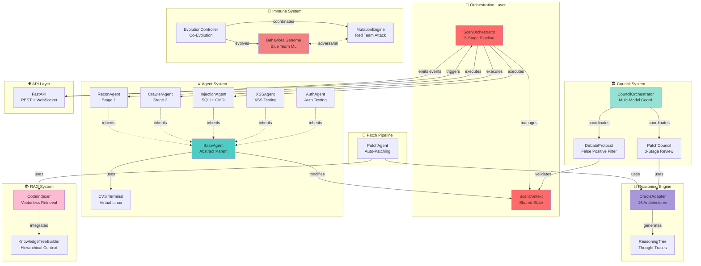
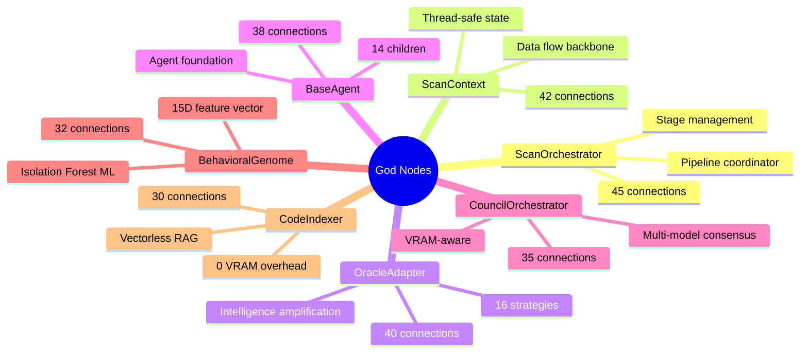
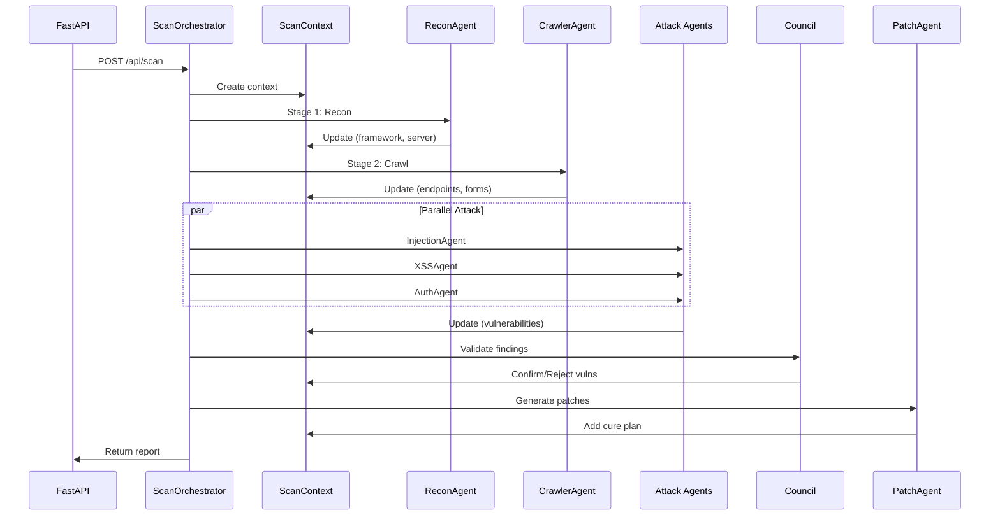
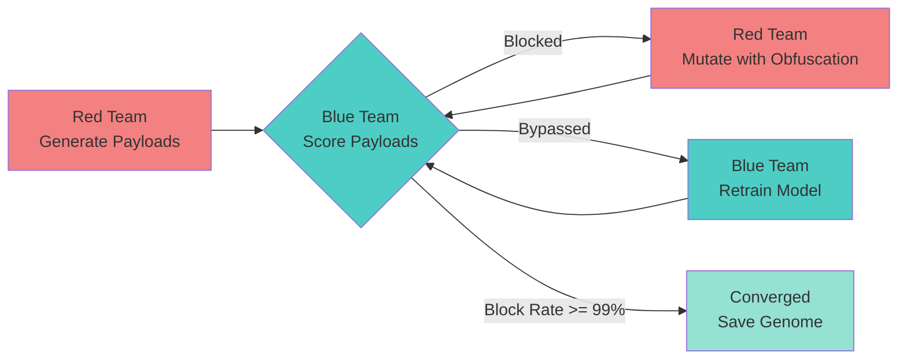
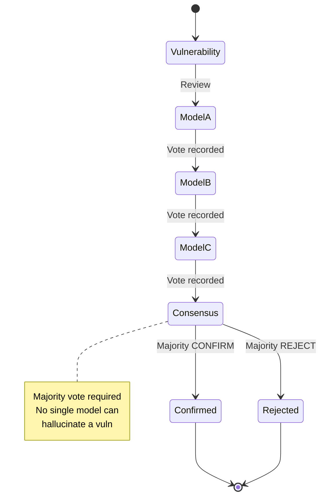
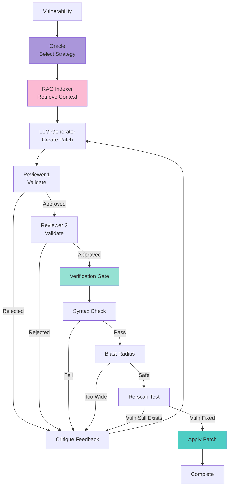
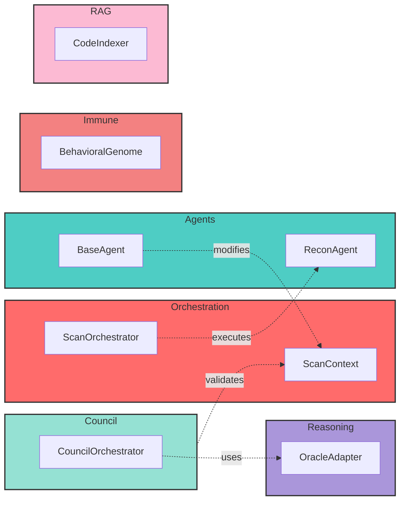

# CypheX v3 - Architecture Graph (Mermaid)

## Complete System Architecture

## God Nodes Visualization

## Data Flow Pipeline

## Immune System Evolution

## Council Debate Flow

## Patch Generation Pipeline

## Community Boundaries

---

## Legend

**Node Types:**
- 🎯 **Orchestration** - Pipeline coordination
- ⚔️ **Agents** - Attack agents (14 total)
- 🏛️ **Council** - Multi-model validation
- 🧬 **Immune** - Adversarial evolution
- 🧠 **Reasoning** - Oracle strategies
- 📚 **RAG** - Code intelligence
- 🌐 **API** - Web interface
- 🔧 **Patch** - Auto-remediation

**Edge Types:**
- Solid line: Direct dependency/call
- Dotted line: Inheritance/integration
- Dashed bidirectional: Adversarial relationship

**Colors:**
- Red (#FF6B6B): Orchestration
- Teal (#4ECDC4): Agents
- Mint (#95E1D3): Council
- Pink (#F38181): Immune
- Purple (#AA96DA): Reasoning
- Light Pink (#FCBAD3): RAG
- Yellow (#FFFFD2): API
- Light Blue (#A8D8EA): Patch
