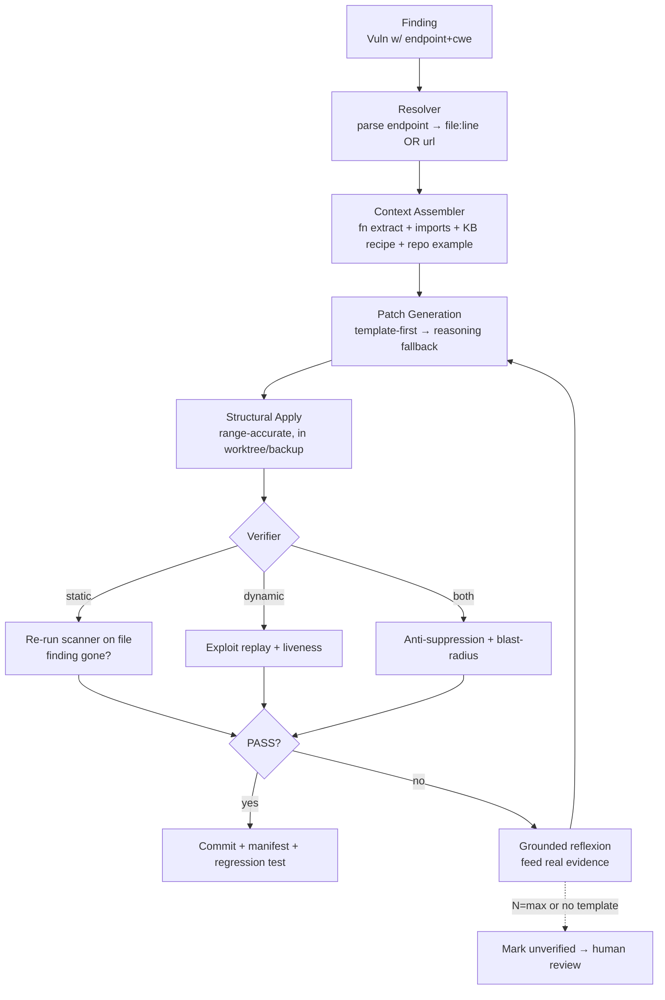

# CYPHEX Patching Overhaul — Grounded Implementation Plan

> **Status:** ready to implement. Every code reference below was verified against the
> *actual* repo (not the `d:/cyphex_v3/` draft). Field names, function signatures, and
> file paths are real.
> **Constraint:** 100% API-free, offline-capable. Cloud (Groq) is opt-in only.
> **Primary goal:** a patch is *accepted only when measured-fixed*, so vulnerabilities
> do not reappear on re-scan.

---

## 0. Ground Truth — the real data contracts (read this first)

Everything in this plan depends on these facts. The previous draft broke because it
assumed fields that don't exist.

### 0.1 The `Vuln` model — [backend/backend/models/scan.py](backend/backend/models/scan.py#L69)
```python
@dataclass
class Vuln:
    name: str
    severity: str            # "Critical" | "High" | "Medium" | "Low"
    cvss_score: float = 0.0
    description: str = ""
    endpoint: str = ""       # ← LOCATION LIVES HERE. Two forms (see 0.2)
    payload: str = ""
    confirmed: bool = False
    evidence: str = ""
    dumped_data: str = ""
    rce_output: str = ""
    cvss_vector: str = ""
    attack_chain: str = ""
    business_impact: str = ""
    fix: str = ""
    cwe: str = ""
```
**There is no `file_path`, `line_num`, `line_number`, or `method` on `Vuln`.** Any
new code must derive these from `endpoint`.

### 0.2 The two `endpoint` forms (how `_patch_workflow` already parses them)
- **Static finding:** `endpoint = "relative/path/file.js:42"` → file + line via `endpoint.split(":")`.
- **Dynamic finding:** `endpoint = "http://localhost:PORT/login"` → a live URL, no source line.
- Names are prefixed: `"[STATIC] SQL Injection"`, `"[DYNAMIC] ..."`. Strip these to get the type.

A finding is **patchable** (has a source line) iff `endpoint` is not an `http(s)://`
URL **and** contains `":"` with an int after it. Otherwise it is **dynamic-only**.
This logic already exists in [`_patch_workflow`](cli_engine.py#L1879) Phase 1 — we reuse it.

### 0.3 `StaticFinding` — [cyphex/scanner.py](cyphex/scanner.py#L24)
```python
@dataclass
class StaticFinding:
    rule_id: str
    name: str
    severity: str
    cwe: str
    file_path: str
    line_number: int
    code_snippet: str
    message: str
    fix_hint: str = ""
    source: str = "builtin"   # "semgrep" | "builtin"
```
`run_static_analysis(source_dir) -> list[StaticFinding]` and `semgrep_available()` are
the re-scan primitives we build verification on.

### 0.4 `DynamicFinding` — [cyphex/dynamic_scanner.py](cyphex/dynamic_scanner.py#L25)
Has `curl_command`, `url`, `method`, `evidence`. The dynamic agents store a reproducing
request — this is the seed for exploit-replay verification and proof-carrying tests.

### 0.5 Council call path — [backend/council/council_orchestrator.py](backend/council/council_orchestrator.py)
- `CouncilOrchestrator._call(model, system, prompt, task_name)` → parsed JSON dict,
  using `/api/chat`, `format:"json"`, `num_predict:1024`, **`num_ctx:2048`** (line ~228).
- `VRAMManager._raw_call(...)` uses `num_ctx:4096` (line ~170).
- `PatchCouncil` ([backend/council/patch_council.py](backend/council/patch_council.py)) has
  `generate_and_validate_patch(...)` and `generate_and_validate_batch(...)`.

### 0.6 Sandbox API — [backend/backend/sandbox_manager.py](backend/backend/sandbox_manager.py)
- `async deploy_sandbox(zip_path, sandbox_id=None) -> dict` (extracts a ZIP, npm/pip
  installs, starts process, returns `{sandbox_id, port, url, status, app_file}`).
- `stop_sandbox(sandbox_id)`, `_find_free_port()`, `_get_node_env()`.
- **No `restart()` exists.** We must add a restart helper (Phase 2.3) or re-deploy.
- Note: `deploy_sandbox` takes a **zip path**, but the CLI path deploys from a
  **source dir** via `cli_engine._deploy`. Verification must restart whatever the CLI
  actually started (it tracks `self.sandbox_info` / `self._static_proc` /
  `self._docker_compose_dir`).

### 0.7 The CLI engine touch points — [cli_engine.py](cli_engine.py)
- `_patch_workflow` (line ~1835): builds `patchable[]`, calls council, applies patches,
  prints before/after score.
- The destructive apply (lines ~2087): `for j in range(start_l, end_l): lines[j] = ""`
  then `lines[start_l] = fixed + "\n"`. **This is R2.**
- The assumed "after" score (lines ~2096): subtracts patched files from counts. **R4.**
- `_rule_based_patch` (line ~2214): returns comments in `fixed_code`. **R6.**

---

## 1. Architecture of the new patch pipeline



New module layout (all under `backend/patch/` and `backend/rag/`, importable from both
`cli_engine.py` and the council):
```
backend/
  patch/
    __init__.py
    resolver.py        # Vuln.endpoint → {kind, file, line, url, method}
    context.py         # function extraction + import extraction (regex, py-indent)
    applier.py         # range-accurate apply + backup/rollback
    verifier.py        # static re-scan + dynamic replay + guards
    templates.py       # deterministic CWE transforms (verified before accept)
    manifest.py        # .cyphex/patches.json read/write, durability tracking
    regression.py      # proof-carrying test generation
  rag/
    __init__.py
    code_indexer.py    # vectorless keyword index of the source tree
    security_kb.py     # loads security_kb.json, CWE → fix strategies
    security_kb.json   # the static knowledge base
    patch_memory.py    # verified-fix cache (per-project + opt-in global)
  reasoning/
    __init__.py
    reflexion.py       # grounded draft→verify→improve (≤N rounds)
    self_consistency.py# K candidates, verifier picks winner (tier-adaptive K)
```

Shared data contract returned by the verifier (every phase speaks this):
```python
# backend/patch/verifier.py
@dataclass
class VerifyResult:
    kind: str            # "static" | "dynamic" | "none"
    finding_gone: bool   # scanner no longer reports it / exploit no longer works
    builds: bool         # parse/typecheck ok (lang-dependent; True if not checkable)
    endpoint_alive: bool # benign request still works (dynamic only; True if n/a)
    no_suppression: bool # no nosemgrep/eslint-disable/# noqa/@ts-ignore added
    blast_ok: bool       # diff within size cap
    verdict: str         # "PASS" | "FAIL" | "UNVERIFIABLE"
    evidence: dict       # concrete failure detail for reflexion
```
`verdict == "PASS"` **requires** `finding_gone and builds and endpoint_alive and
no_suppression and blast_ok`. If the relevant verifier can't run (no scanner / no
sandbox), `verdict = "UNVERIFIABLE"` and the patch is labeled `applied-unverified`,
**never** counted as fixed (kills R4 honestly).

---

## Phase 0 — Emergency fixes (½ day)

Small, safe, high-impact. No new modules.

### 0.1 Raise context windows (tier-aware, not blanket 8192)
- [backend/council/council_orchestrator.py](backend/council/council_orchestrator.py#L228)
  `_call`: `num_ctx 2048 → 4096`, `num_predict 1024 → 2048`.
- Keep `_raw_call` at 4096. **Do not exceed 4096–6144**: the patch model is pinned to
  `num_ctx 4096` in [finetune/Modelfile](finetune/Modelfile#L16); larger hurts it and
  blows the `VRAMManager` budget on small machines.
- Add a single helper `ctx_for_tier()` reading `cyphex.hardware.detect_mode()` →
  `{minimal/low:4096, mid:6144, high/ultra:8192}` and use it in both call sites.

### 0.2 Block applying council-`rejected` patches
- In [`_patch_workflow`](cli_engine.py#L1955) Phase 3, before the apply prompt: if the
  council result's `patch_safety == "rejected"` **or** there were zero approvals, skip
  with a clear message. Currently a user typing `y` can apply a rejected patch.

### 0.3 Acceptance for Phase 0
- Council calls run at ≥4096 ctx; no model-pin regression on `cyphex-patch`.
- A rejected patch can never be written to disk.

---

## Phase 1 — Fix the apply pipeline bugs (1 day)

These corrupt even a *perfect* patch. All in `cli_engine.py` + new `backend/patch/`.

### 1.1 `resolver.py` — single source of truth for location
```python
@dataclass
class Location:
    kind: str           # "file" | "url"
    file: str | None    # abs path, resolved against source_dir
    rel: str | None     # repo-relative path (for display + manifest)
    line: int | None
    url: str | None
    method: str         # "GET" by default; dynamic agents may carry POST in evidence
def resolve(vuln, source_dir) -> Location | None
```
Reuses the exact parsing already in `_patch_workflow` (split `:`, abs/rel fallback for
semgrep paths). One implementation, used by applier, verifier, manifest, regression.

### 1.2 Range-accurate apply (kills R2) — `applier.py`
- Determine the **actual vulnerable line span**, not a single line and not the whole
  context window:
  - Static: the finding's line; if the snippet the model was given was N lines, replace
    exactly those N source lines (track `start_l`/`end_l` that we already compute and
    pass them through — stop collapsing to `lines[start_l]`).
  - Multi-line sinks: replace `lines[start_l:end_l]` with the fixed block split on `\n`,
    preserving trailing newline. Never blank-then-write-line-1.
- Always `backup = path.read_text()` first; expose `rollback()`.
- After write, if the file is Python, `py_compile`; if JS/TS and `node`/`tsc` available,
  parse-check. Parse failure → auto-rollback → treat as FAIL (feeds reflexion).

### 1.3 Deduplicate findings before patching (Bug #3)
- Group `patchable` by `(rel_path, line)`; keep highest severity. Prevents a second
  patch from clobbering the first's edit to the same place.

### 1.4 Per-finding resolution tracking (kills R5)
- Replace file-level "patched" matching (`p_entry in v.endpoint`) with a key
  `f"{rel}:{line}:{vuln_type}"`. The "remaining" calc and score use this set, so two
  vulns in one file are tracked independently.

### 1.5 Honest fallback (kills R6) — see Phase 5; stub now
- Change `_rule_based_patch` to **return `None`** when it would otherwise return a
  comment-as-code. Real transforms arrive in Phase 5. Until then, "no template" = mark
  `unpatched: manual`, never write.

### 1.6 Acceptance for Phase 1
- Applying a patch never blanks unrelated lines; multi-line fixes land intact.
- Two vulns in the same file are both tracked; fixing one doesn't mark the other fixed.
- No fallback ever writes a comment in place of code.

---

## Phase 2 — The Verification Gate (2–3 days) ← highest ROI

`verdict = PASS` becomes the *only* path to "fixed". Static **and** dynamic branches.

### 2.1 `verifier.py` — static branch (covers the majority of findings)
- Input: `Location(kind="file")`, the `Vuln`, `source_dir`.
- Re-run the scanner **scoped to the patched file**:
  - If `semgrep_available()`: run semgrep on just that file (reuse `cyphex.scanner`).
  - Else: run the built-in `run_static_analysis` and filter to the file.
- `finding_gone = True` iff no finding with the same `cwe` (or same `rule_id` when
  available) remains at/near the patched line (±2 lines tolerance for reflow).
- `builds` from the parse/typecheck in 1.2. `endpoint_alive = True` (n/a for static).

### 2.2 `verifier.py` — dynamic branch (replay)
- Input: `Location(kind="url")`, `Vuln.payload`, method (from evidence/`curl_command`).
- Replay the original exploit against the running sandbox URL (httpx). `_check_exploit_
  success` per CWE family: SQLi → injected boolean/error/data echo gone; XSS → payload
  not reflected unescaped; CMDi → command output absent; etc. (start with the families
  CYPHEX already confirms).
- **Liveness:** a benign request to the same endpoint must return `< 500`. Catches
  "vuln gone because the route is gone."

### 2.3 Sandbox restart helper (sandbox_manager has none)
- Add `async restart_sandbox(sandbox_info) -> dict` that:
  - native node/python: kill the tracked process group (`os.killpg` on POSIX; taskkill
    tree on Windows — pattern already in `_robust_rmtree`) and re-launch with the same
    `app_file`/port/env that `deploy_sandbox` used; re-`await asyncio.sleep` for boot.
  - docker-compose: `docker compose restart` in `self._docker_compose_dir`.
  - static server: bounce `self._static_proc`.
- Verification calls this after each apply so the running app reflects the patched file.
- **Cost control:** only restart when there *is* a dynamic finding to replay; static-only
  patches verify by re-scan with **no restart**.

### 2.4 Guards (anti-gaming — the Patch Oracle Trilemma)
- **Anti-suppression:** reject diffs adding `nosemgrep`, `eslint-disable`, `# noqa`,
  `@ts-ignore`, or deleting the whole route/handler.
- **Blast-radius:** if `len(diff_lines) > cap` (default 40, configurable) → `blast_ok=False`
  → route to human review, don't auto-accept.

### 2.5 Manifest + honest scoring (kills R4) — `manifest.py`
- `.cyphex/patches.json` keyed by `f"{rel}:{line}:{cwe}"`:
  ```json
  {"vuln_type","cwe","patched_at","original_hash","patched_hash",
   "verdict","verified","exploit_payload","evidence"}
  ```
- The before/after score in `_patch_workflow` is recomputed from **verified** entries
  only. `UNVERIFIABLE`/`applied-unverified` are excluded from the durability metric and
  shown distinctly in the UI.

### 2.6 Wire into `_patch_workflow`
- After the user approves (or in `--non-interactive`), route through:
  `applier.apply → verifier.verify → if FAIL: rollback`. Only `PASS` updates the
  patched set and the manifest.

### 2.7 Acceptance for Phase 2
- A patch that doesn't actually fix the finding is **rolled back**, not counted.
- Static findings verify with no sandbox; dynamic findings verify by replay+liveness.
- Suppression-comment "fixes" and route-deletions are rejected.
- The after-score equals a real re-scan, not an assumption.

---

## Phase 3 — Vectorless RAG + real code context (1.5 days)

Give the model the repo's own code + the canonical fix recipe. No embeddings, stdlib only.

### 3.1 `code_indexer.py`
- Walk `source_dir`. Skip `node_modules/.git/dist/build/__pycache__/.venv`; skip
  `.map/.min.js/.lock/.png/...`; cap files at 512 KB; read
  `encoding="utf-8", errors="ignore"`.
- Per file store: `routes`, `has_db`, `has_auth`, `imports`, `functions` (regex), and a
  cheap term index.
- `find_for_vuln(vuln, location) -> top-3 files` by score: route match (+10), CWE/db or
  CWE/auth relevance (+5), payload-term match (+3). Lexical *find*, not embeddings.
- `find_secure_pattern(cwe)` → an existing in-repo safe example ("fix it the way this
  repo already does it").

### 3.2 `context.py` — extract precise context (regex now, tree-sitter later)
- `extract_function(content, line, lang)`:
  - JS/TS: brace-walk to enclosing `app/router.METHOD(...)` / `function` / arrow assign.
    **Labeled approximate**; brace counting ignores braces in strings (known limitation).
  - Python: **indentation-based** (walk up to the `def`/`async def` at lower indent,
    down until indentation returns). Braces don't apply.
  - Fallback: ±15 lines if no function boundary found.
- `extract_imports(content, lang)`: top-of-file `import`/`require`/`from`.

### 3.3 `security_kb.json` + `security_kb.py`
- Ships with CYPHEX. CWE → `{name, fix_strategies[{name,pattern,applies_to}],
  anti_patterns}` for at least: CWE-89, 79, 78, 22, 798, 918, 287/306, 942, 614, 693.
- Versioned (`"kb_version"`, source citations) for auditability.

### 3.4 Context-aware prompt assembly — `PatchCouncil`
- Build the patch prompt from: KB recipe + extracted function + imports + repo's own
  secure example + the exploit that worked. Keep it **high-signal, not voluminous**.
- Output contract unchanged (JSON `fixed_code/unsafe_reason/patch_safety`) so the rest
  of the pipeline is untouched; optionally request a **unified diff** for deterministic
  apply (Phase 5 synergy).

### 3.5 Acceptance for Phase 3
- The model receives the enclosing function + imports + a CWE recipe, not 5 lines.
- Python context uses indentation; JS uses braces; neither crashes on the other.

---

## Phase 4 — Grounded reasoning layer (1.5 days)

Verifier is the judge. Built directly on `CouncilOrchestrator._call`; no external framework.

### 4.1 `reflexion.py` — grounded draft→verify→improve
- `patch_with_reflexion(vuln, location, context, verifier, max_rounds)`:
  - Round 1: generate. Apply → verify.
  - On FAIL: build feedback from **VerifyResult.evidence** (exploit still works / endpoint
    broke / suppression added / build error), instruct a **different** strategy, retry.
  - Stop on PASS or `max_rounds`. On exhaustion → `status="unverified"` (human review).
- `max_rounds` tier-adaptive: `minimal/low:1, mid:2, high/ultra:3`.

### 4.2 `self_consistency.py` — K candidates, verifier picks
- `patch_with_consistency(..., k)`: seed K candidates with **distinct KB strategies**
  (e.g. SQLi → parameterized / ORM / allowlist). Apply+verify each; keep the **smallest
  passing diff**. None pass → best attempt marked unverified.
- `k` tier-adaptive: `minimal/low:1, mid:2, high/ultra:3`. K=1 collapses to single-shot,
  so low-end hardware stays usable.
- **Short-circuit:** try the deterministic template (Phase 5) **first**; only invoke
  K-candidate reasoning when no template applies. This caps the apply-restart-verify cost.

### 4.3 Cost guardrails
- Reuse one sandbox restart per *candidate* only for dynamic findings; static candidates
  verify by re-scan (no restart). Cache the indexer + KB across findings in a run.

### 4.4 Acceptance for Phase 4
- Reflexion feedback always contains objective evidence, never "are you sure?".
- On low-tier hardware K=1/rounds=1; on high-tier K=3/rounds=3.
- Templated CWEs skip model reasoning entirely.

---

## Phase 5 — Deterministic template transforms (1 day)

100%-deterministic fixes, **still verified** before acceptance (a regex transform can be
wrong → never trust blind).

### 5.1 `templates.py`
- `TRANSFORMS[cwe][framework] = {detect: regex, transform: fn(code)->code}` for the
  high-frequency, mechanical classes:
  - CWE-798 hardcoded secret → `process.env.X` / `os.environ[...]` + `.env` note.
  - CWE-79 `dangerouslySetInnerHTML` → text child / DOMPurify (validated JSX, not the
    broken `>{\1}<` from the draft).
  - CWE-89 string-built SQL → parameterized `?` + args array (driver-aware).
  - CWE-78 `exec(\`...${x}\`)` → `execFile(cmd, [args])`.
  - CWE-22 path join with user input → `path.basename` / allowlist.
  - CWE-693 missing security headers, CWE-942 wildcard CORS.
- Each returns a real diff. **Then the verifier runs.** A failing template transform is
  rolled back and the finding falls through to reasoning (Phase 4).

### 5.2 Replace `_rule_based_patch`
- It now delegates to `templates.apply(cwe, framework, code)`. No transform → `None`
  (mark manual). Removes R6 permanently.

### 5.3 Acceptance for Phase 5
- Common CWEs are fixed with zero model calls and still pass the gate.
- A wrong template transform is caught by verification and rolled back.

---

## Phase 6 — Patch memory + proof-carrying tests (1 day)

### 6.1 `patch_memory.py`
- **Two stores, not one** (the draft conflated them):
  - **Exact cache:** key `(semantic_hash(function), cwe) → verified_diff`. Reapplied
    verbatim **then re-verified** in the current sandbox (never trusted blind).
  - **Pattern library:** key `(cwe, framework) → strategy` — feeds RAG (Phase 3/4).
- `semantic_hash` = hash of the function's AST/structure with comments + whitespace
  stripped (not raw text), so reformatting/renames don't bust the cache.
- Only **verified** patches are stored. Per-project by default; opt-in global library,
  but a global recall is a *candidate*, re-verified locally.

### 6.2 `regression.py` — proof-carrying tests
- For each verified finding, emit a security regression test from the reproducing
  request (`curl_command`/payload):
  - dynamic: "POST `payload` to `endpoint` must NOT return 200+session".
  - static: pin the rule_id+location as a check.
- Tests are committed alongside the fix (CLI: written into the repo; CI: into the PR).
  Durability becomes permanent, not per-run.

### 6.3 Acceptance for Phase 6
- A second identical sink reuses a verified fix and still re-verifies.
- Every accepted fix ships a test that fails if the vuln is reintroduced.

---

## Phase 7 — Autonomy ladder + degradation honesty (½ day, cross-cutting)

### 7.1 Confidence × blast-radius autonomy
- Map each finding → action:
  - Confirmed (static+dynamic agree) + low blast → auto-apply (verified) + test.
  - Confirmed + high blast (auth/crypto/schema) → apply in branch, **require human merge**.
  - Probable/possible → suggestion/annotation only.
- Auth/authz/crypto/DB-schema are **always** human-in-the-loop even when verified.

### 7.2 Degradation ladder (never a fake green)
- Full (Ollama+Docker+Semgrep+tests) → verified auto-patch.
- No Docker → static re-scan only → "verified-static".
- No Semgrep → AST/template transforms, marked.
- No Ollama → templates only.
- Nothing → findings-only, zero auto-apply.
- Any rung lacking a verifier emits `applied-unverified`, excluded from durability.

### 7.3 Replace `_push_to_github`
- The current `git add/commit/push` to the active branch becomes: create a branch,
  commit verified patches + tests + provenance, **open a PR** (no force-push to main).
  (Full CI/CD = deferred Track E; this is the local PR-safe version.)

---

## Phase 8 — (Deferred) CI/CD on every push

Out of scope for this overhaul; tracked in [UPGRADE_PLAN.md](UPGRADE_PLAN.md) §7. Build
only after P0–P7 are trusted: GitHub App/Action → diff-only scan → SARIF upload →
auto-fix PR → baseline gating. The verifier + manifest + regression modules built above
are exactly what the CI bot will reuse.

---

## Realistic timeline

| Phase | Scope | Estimate |
|------|-------|----------|
| 0 | Context windows, block rejected | 0.5 day |
| 1 | Resolver, range-accurate apply, dedup, per-finding tracking | 1 day |
| 2 | Verifier (static+dynamic), restart helper, guards, manifest, honest score | 2–3 days |
| 3 | Vectorless RAG, context extractor, security KB, prompt assembly | 1.5 days |
| 4 | Reflexion + self-consistency, tier-adaptive, cost guards | 1.5 days |
| 5 | Deterministic templates, replace fallback | 1 day |
| 6 | Patch memory (2 stores), proof-carrying tests | 1 day |
| 7 | Autonomy ladder, degradation honesty, PR flow | 0.5 day |
| **Total** | | **~9–10 working days** |

(The earlier "40h" estimate undercounted Phase 2 alone. This is honest.)

---

## Cross-cutting requirements (apply to every phase)

- **Tests:** each new module in `backend/patch/`, `backend/rag/`, `backend/reasoning/`
  gets unit tests under `tests/`. Verifier gets fixtures for SQLi/XSS pass+fail.
- **Idempotency self-test:** running CYPHEX on already-patched code must produce **zero
  diffs** — add as a CI check (the cleanest signal patches are stable fixpoints).
- **Prompt-injection hygiene:** retrieved code/pages are wrapped as inert evidence,
  never concatenated into the system prompt; the verifier is the backstop.
- **Determinism:** seed (`1337` already in judge mode); cache by content hash.
- **No new heavy deps for V1:** stdlib + existing `httpx`/`rich`. Tree-sitter, embeddings,
  CodeQL are explicit later upgrades, never V1 blockers.

---

## Success metrics

- **Patch durability rate** (primary): % of accepted patches whose finding does not
  reappear on the next full scan. Target > 95%.
- **Verified-patch rate:** 100% by construction once Phase 2 lands.
- **Template hit rate:** % fixed deterministically (no model). Target > 50% of mechanical CWEs.
- **Mean reflexion rounds** to PASS: target < 2.
- **Zero fake greens:** every `applied-unverified` is labeled and excluded from durability.

---

## Build order (what we implement first)

1. **Phase 0** — immediate, safe wins (context window, block rejected).
2. **Phase 1** — resolver + range-accurate apply (stop corrupting good patches).
3. **Phase 2** — the verifier gate (this is the product). Static branch first (most
   findings, no sandbox), then dynamic replay + restart.
4. **Phase 3 → 4 → 5 → 6 → 7** in order; each is independently shippable and improves a
   pipeline that is already correct after Phase 2.

> Decisions locked from review: regex extractor (JS) + indentation (Python) for V1,
> tree-sitter deferred; patch memory per-project default with re-verified global opt-in;
> CI/CD deferred until P0–P7 are trusted.
