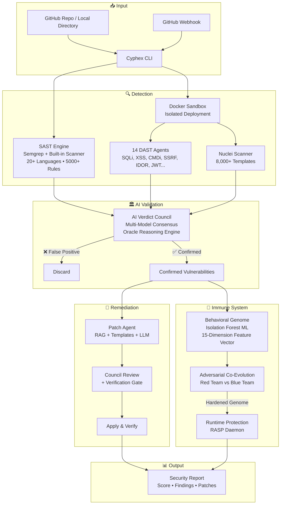

<p align="center">
  
  
  
  
  
  
</p>

<h1 align="center">
  <br>
  🛡️ CYPHEX
  <br>
  <sub>Autonomous AI Cyber Defence Engine</sub>
</h1>

<p align="center">
  <b>An offline-first, multi-agent autonomous security platform that scans, attacks, debates, evolves, and patches — all without a single API key.</b>
</p>

<p align="center">
  Cyphex doesn't just find vulnerabilities — it deploys your app in an isolated Docker sandbox,<br>
  unleashes 14 specialized AI attack agents, validates findings through multi-model council debate,<br>
  evolves a behavioral immune system via adversarial co-evolution,<br>
  and auto-patches your source code with AI-verified fixes.
</p>

<p align="center">
  <b>🔒 100% offline. Zero cloud APIs. Your code never leaves your machine.</b>
</p>

<p align="center">
  <a href="#-quick-start-2-minutes">Quick Start</a> •
  <a href="#-the-problem">Problem</a> •
  <a href="#-our-solution">Solution</a> •
  <a href="#-key-features">Features</a> •
  <a href="#-the-8-step-scan-pipeline">Pipeline</a> •
  <a href="#-system-architecture">Architecture</a> •
  <a href="#-tech-stack">Tech Stack</a> •
  <a href="#-usage">Usage</a> •
  <a href="#-project-structure">Structure</a> •
  <a href="#-future-roadmap">Roadmap</a>
</p>

<p align="center">
  <code>#vibecoders</code>
</p>

---

## 🚀 Quick Start (2 Minutes)

> **One command to see Cyphex in action.** A bundled vulnerable Express.js app is included for demo.

```bash
# 1. Clone
git clone -b update_y1 https://github.com/vedant91/Cyphex_CLI.git
cd Cyphex_CLI

# 2. Install
pip install -e .

# 3. Pull at least one Ollama model
ollama pull llama3.1:8b

# 4. Run the demo scan (scans a bundled vulnerable web app)
cyphex scan --path ./demo/vuln-webapp --patch
```

**What happens in ~60 seconds:**

```
✅ Source code copied & analyzed (SAST — 7 files, 20+ language scanner)
✅ Semgrep scan (5,000+ rules via WSL)
✅ Sandbox deployed (Docker or native Node.js)
✅ 14 AI agents attack the running app (SQLi, XSS, CMDi, SSRF, IDOR, JWT…)
✅ Multi-model AI council debates each finding (false positive elimination)
✅ Nuclei DAST scan (8,000+ templates)
✅ Behavioral Genome evolves defenses (Red Team vs Blue Team, 10 generations)
✅ AI generates and verifies patches for every confirmed vulnerability
✅ Security report with score, findings, and applied fixes
```

### Prerequisites

| Tool | Required | Install |
|------|----------|---------|
| **Python 3.11+** | ✅ Yes | [python.org](https://python.org) |
| **Ollama** | ✅ Yes | [ollama.com](https://ollama.com) — then `ollama pull llama3.1:8b` |
| **Docker** | ⚡ Recommended | [docker.com](https://docker.com) — enables sandbox isolation |
| **Node.js 18+** | ⚡ Recommended | [nodejs.org](https://nodejs.org) — for scanning JS/TS projects |
| **Semgrep** | 🔧 Optional | `pip install semgrep` (or via WSL on Windows) — adds 5,000+ SAST rules |
| **Nuclei** | 🔧 Optional | [nuclei.projectdiscovery.io](https://nuclei.projectdiscovery.io) — adds 8,000+ DAST templates |

### Verify Your Setup

```bash
cyphex doctor          # Checks all tools: Git, Docker, Ollama, Semgrep, Nuclei
cyphex council-doctor  # Verifies AI models are loaded and responding
```

---

## 🎯 The Problem

> **Vibe coding is the future. But vibe-coded apps ship with vulnerabilities that no one checks.**

Modern developers build fast with AI assistance — but security is an afterthought. Traditional security tools have critical gaps:

- **Static scanners (SAST)** find patterns in code but can't catch runtime vulnerabilities
- **Dynamic scanners (DAST)** test running apps but don't understand the source code
- **Neither can fix what they find** — developers are left with noisy reports and zero patches
- **Cloud-based tools require API keys**, upload your code to third-party servers, and cost money
- **No tool adapts** — they run the same rules every time, never learning from your app's behavior

**Result:** Vulnerabilities ship to production. Breaches happen. Developers lose sleep.

---

## 💡 Our Solution

**Cyphex is an autonomous AI-powered cybersecurity platform** that operates entirely on your local machine — no API keys, no cloud, no data leaving your device.

It combines **five security paradigms** into a single CLI command:

| # | Paradigm | What Cyphex Does |
|---|----------|------------------|
| 1 | **Static Analysis (SAST)** | Scans source code across 20+ languages with 5,000+ Semgrep rules + built-in regex patterns |
| 2 | **Dynamic Analysis (DAST)** | Deploys your app in a Docker sandbox and attacks it with 14 specialized AI agents + Nuclei |
| 3 | **AI Verdict Council** | Multiple LLMs independently review each finding and debate to eliminate false positives |
| 4 | **Behavioral Immune System** | A self-evolving genome using Isolation Forest ML that learns what "normal" looks like for *your* app |
| 5 | **Auto-Patching + Verification** | AI generates fixes, council reviews them, verification gate confirms the vuln is actually resolved |

### Why Offline-First?

> **Security tools that upload your code to the cloud are a security vulnerability themselves.**

Cyphex runs 100% locally via [Ollama](https://ollama.com). Your proprietary source code, vulnerability reports, and patches never leave your machine. No OpenAI API key. No cloud billing. No data leaks. **This is cybersecurity without API keys.**

---

## ✨ Key Features

### 🔍 14 Specialized Attack Agents

Each agent is a domain expert with curated payloads, evasion techniques, and contextual awareness:

| Agent | ID | Role | Attack Techniques |
|-------|-----|------|-------------------|
| **Recon** | 01 | Fingerprint target stack & headers | HTTP probing, tech detection, server signatures |
| **Crawler** | 02 | Discover pages, forms, APIs | HTML parsing, SPA detection, REST API discovery |
| **API Discovery** | 02b | Probe REST endpoints on SPA apps | Route enumeration, OpenAPI detection |
| **SQLi** | 03 | SQL Injection testing | Union, Boolean, Time-based, Error-based, Stacked |
| **XSS** | 04 | Cross-Site Scripting testing | Reflected, DOM-based, Event handler, WAF bypass |
| **Auth** | 05 | Authentication & session testing | Weak creds, session fixation, token analysis |
| **CMDi** | 06 | OS Command Injection | Shell metacharacters, encoding bypass, chaining |
| **LFI** | 07 | Local File Inclusion / Path Traversal | Directory traversal, null byte, encoding bypass |
| **Logic** | 08 | Business logic & CORS flaws | Insecure CORS, parameter tampering, authz gaps |
| **IDOR** | 09 | Insecure Direct Object References | Sequential ID enumeration, UUID prediction |
| **SSRF** | 10 | Server-Side Request Forgery | Internal service probing, cloud metadata access |
| **Supply Chain** | 11 | Dependency vulnerability audit | NPM/Pip CVE databases, manifest analysis |
| **Data Exposure** | 12 | Debug & config endpoint probing | Env leaks, debug routes, stack traces |
| **CMDi (API)** | 13 | API-specific command injection | Ping/exec endpoints, JSON body injection |
| **JWT Inspector** | 14 | JWT token analysis | Weak secrets, algorithm confusion, none attack |

### 🧬 Behavioral Genome — The Cyber Immune System

Cyphex's **flagship innovation**. Inspired by biological immune systems, it uses adversarial co-evolution to build a defense model that adapts to your specific application:

```
🔴 RED TEAM (Attacker)              🔵 BLUE TEAM (Defender)
─────────────────────               ─────────────────────
Generate attack payloads    →       Build behavioral genome (Isolation Forest ML)
                                    Score payloads → Block 60%
Mutate BLOCKED payloads     →       Retrain on BYPASSED payloads
to evade detection                  Block rate improves to 85%
                                    
Mutate again, harder        →       Retrain again
                                    Block rate: 95%
                                    
Generation N:               →       Block rate: 99%+
Both teams exhausted                Genome is hardened ✅
```

The genome uses a **15-dimensional feature vector** per request:

```
[0] input_length       [1] entropy            [2] special_char_ratio
[3] url_encoding_ratio [4] uppercase_ratio     [5] digit_ratio
[6] max_token_length   [7] keyword_score       [8] sqli_pattern_score
[9] null_byte          [10] traversal_depth    [11] bracket_imbalance
[12] unicode_ratio     [13] repetition_ratio   [14] token_count
```

### 🏛️ AI Verdict Council — Multi-Model Consensus

A debate-based validation system that **eliminates false positives** through adversarial reasoning:

- Multiple LLMs (Qwen, Llama, DeepSeek, Phi) independently review each finding
- Each model votes **CONFIRM** or **REJECT** with a confidence score and reasoning
- Findings require **consensus** — no single model can hallucinate a vulnerability
- Built-in anti-hallucination rules enforced across all models
- Powered by the **Oracle Reasoning Engine** (see below)

### 🧠 Oracle Agent-Reasoning — Making Small Models Think Big

> **The core innovation that makes Cyphex work with local 3B-7B models instead of GPT-4.**

Small local LLMs (Llama 3.1 8B, Qwen 2.5 7B) are fast and free — but they hallucinate, miss context, and generate shallow patches. Cyphex solves this through **Oracle's Agent-Reasoning framework**, which wraps every LLM call in a **cognitive architecture** that forces structured, multi-step reasoning:

```
Without reasoning:  model("Fix this SQL injection")  →  "Use prepared statements" (vague, often wrong)
With reasoning:     model+cot("Fix this SQL injection")  →  Step-by-step analysis → Specific fix → Verified
```

**16 cognitive architectures**, each selected automatically based on task type, vulnerability severity, and CWE:

| Strategy | When Used | How It Works |
|----------|-----------|--------------|
| 🔗 **Chain-of-Thought** | SQLi, XSS patches (CWE-89, CWE-79) | Forces step-by-step logical reasoning before generating code |
| 🪞 **Self-Reflection** | High severity vulns, missing auth (CWE-306) | Draft → Critique → Improve loop (3 LLM calls) |
| 🌳 **Tree of Thoughts** | CMDi, SSRF (CWE-78, CWE-918) | Explores multiple fix approaches via BFS, prunes bad paths |
| 🗳️ **Self-Consistency** | Critical severity vulns | Generates K candidates, majority vote picks the best |
| ⚔️ **Adversarial Debate** | Council patch review | Multi-perspective challenge: "Why would this fix fail?" |
| 🧩 **Decomposition** | Auth bypass, IDOR (CWE-287, CWE-284) | Breaks complex fix into sub-tasks, solves each |
| 📶 **Least-to-Most** | Path traversal (CWE-22) | Solves simple cases first, builds up to complex |
| 🔧 **Refinement Loop** | Iterative code improvement | Score-based improvement over 4 rounds |
| 📊 **Complex Pipeline** | Production-grade patches | 5-stage pipeline: accuracy → structure → depth → examples → polish |
| 🎲 **Monte Carlo Search** | Exploring fix search space | MCTS with UCB1 scoring across candidate fixes |
| 🔀 **Analogical** | Pattern matching from past fixes | Reasons from known CWE fix patterns by analogy |
| ❓ **Socratic** | Code understanding & analysis | Guided questioning to find the root cause |
| 🛠️ **ReAct** | Tool-augmented reasoning | Reason + Act loop with code context tools |
| 🔄 **Recursive** | Self-executing code verification | Code REPL agent that tests its own output |
| 🧠 **Meta-Reasoning** | Auto-selection | Automatically picks the best strategy for each task |
| 📝 **Standard** | Hardcoded secrets, CORS (CWE-798, CWE-942) | Direct generation for deterministic fixes |

**Automatic strategy selection** based on three signals:

```
 CWE Override        → CWE-78 (CMDi) always gets Tree-of-Thoughts
 Severity Escalation → Critical vulns get Self-Consistency (3× majority vote)
 Task Mapping        → Patch generation → CoT, Patch review → Self-Reflection
 VRAM Tier Guard     → Low VRAM? Only lightweight strategies. High VRAM? All 16.
```

**Result:** A 7B local model with Oracle reasoning produces patches **comparable to GPT-4** — because it's not just generating text, it's *thinking through the problem* using the right cognitive framework. Zero API cost.

### 📚 Vectorless RAG — Full Code Context Without Embeddings

> **Traditional RAG needs vector databases, embeddings, and GPU VRAM. Cyphex doesn't.**

When an LLM generates a patch, it needs to understand the **full context** — not just the vulnerable line, but the entire function, the route structure, the project's existing coding patterns, and its dependencies. Cloud tools use expensive embedding models + vector DBs. Cyphex uses a **Vectorless RAG** approach:

```
Traditional RAG:    Code → Embedding Model (GPU) → Vector DB → Similarity Search → Context
Cyphex Vectorless:  Code → Keyword Index (CPU) → Regex + Scoring → Context
                    Zero VRAM. Zero external dependencies. Instant.
```

**How it works:**

1. **Code Indexer** walks the source tree and builds a keyword-based index of every file:
   - Route patterns (`/api/users`, `/orders/:id`)
   - Database usage (`db.query`, `SELECT`, `mongoose`, `prisma`)
   - Auth patterns (`session`, `jwt`, `bcrypt`, `passport`)
   - Input handling (`req.body`, `req.query`, `request.form`)
   - Function names, imports, and dependency graph

2. **Smart Retrieval** for each vulnerability uses multi-signal scoring:
   - Route match (strongest) — finds the file that serves the vulnerable endpoint
   - CWE-type relevance — SQLi vuln? Prioritize files with DB queries
   - Payload term match — searches for attack-relevant code patterns
   - Direct location match — exact file:line from the scanner

3. **Secure Pattern Discovery** — finds how the **repo already writes safe code**:
   ```
   CWE-89 → Finds existing parameterized queries in the codebase
   CWE-79 → Finds existing HTML sanitization calls
   CWE-78 → Finds existing execFile/spawn usage (safe subprocess)
   ```
   The LLM is told: *"Fix it the way this project already does it."*

4. **API Route Extraction** — Two-pass route discovery:
   - **Pass 1:** Scans entry files for `app.use('/prefix', require('./routes/xxx'))` mount prefixes
   - **Pass 2:** Scans route files for `router.get/post(...)` with correct prefixes applied
   - Result: Full API map with methods, paths, source files, and parameters

**Why this matters:**

| Approach | VRAM Cost | Speed | Accuracy |
|----------|-----------|-------|----------|
| Cloud RAG (OpenAI embeddings + Pinecone) | N/A (cloud) | ~2s per query | High |
| Local RAG (sentence-transformers + ChromaDB) | 2-4 GB VRAM | ~500ms per query | Medium |
| **Cyphex Vectorless RAG** | **0 GB VRAM** | **<50ms per query** | **High** |

The code indexer runs on CPU, uses zero VRAM (leaving it all for the LLM), and provides richer context than embedding-based approaches because it understands *code structure*, not just semantic similarity.

### 🔧 Auto-Patching Pipeline with Verification Gate

```
Vulnerability Found → Oracle Reasoning selects strategy → Vectorless RAG provides context →
LLM generates fix → Template fallback if needed → Council reviews →
Verification Gate (syntax + blast radius + re-scan) → Applied & Confirmed
```

- **Oracle-enhanced generation**: Every patch is generated through the optimal cognitive architecture
- **RAG-grounded context**: Full function, route, and secure-pattern context — not blind 5-line snippets
- **Deterministic template transforms** for common CWEs (SQLi → parameterized queries, XSS → escaping)
- **Patch memory**: Learns from verified fixes to improve future patches
- **Verification gate**: Re-checks that the vulnerability is actually gone after patching
- Anti-suppression: Rejects patches that add `nosemgrep`, `eslint-disable`, `# noqa`, etc.

### 🛡️ RASP Daemon (Runtime Protection)

```bash
cyphex watch --port 3004
```

Deploys a persistent daemon that:
- Receives real-time attack telemetry from your app's RASP SDK
- Scores requests against the trained behavioral genome
- Auto-patches vulnerable source code when attacks are detected
- Integrates with GitHub webhooks for continuous protection

---

## ⚙️ The 8-Step Scan Pipeline

Every `cyphex scan` command executes this fully autonomous pipeline:

```
┌─────────────────────────────────────────────────────────────────────┐
│                                                                     │
│  STEP 1 ➜ SOURCE ACQUISITION                                       │
│            Clone repo or copy local directory                       │
│                                                                     │
│  STEP 2 ➜ STATIC ANALYSIS (SAST)                                   │
│            Semgrep (5,000+ rules) + Built-in scanner (20 languages) │
│            Languages: JS, TS, Python, Java, Go, PHP, Ruby, C/C++,  │
│            Rust, C#, Swift, Kotlin, SQL, YAML, Docker, and more     │
│                                                                     │
│  STEP 3 ➜ SANDBOX DEPLOYMENT                                       │
│            Auto-detects framework → Deploys in Docker/Node.js       │
│            Supports: Express, Flask, Django, Docker Compose, static │
│                                                                     │
│  STEP 4 ➜ DYNAMIC VULNERABILITY SCAN (DAST)                        │
│            14 specialized agents attack the live application        │
│            + Nuclei (8,000+ templates) + AI Verdict Council         │
│            + Multi-model debate for false positive elimination      │
│                                                                     │
│  STEP 5 ➜ BEHAVIORAL GENOME EVOLUTION                              │
│            Red Team vs Blue Team adversarial co-evolution            │
│            N generations → genome converges toward 99%+ block rate  │
│                                                                     │
│  STEP 6 ➜ AI ATTACK SIMULATION                                     │
│            Test genome against real-world attack patterns            │
│            Verify zero false positives on benign input               │
│                                                                     │
│  STEP 7 ➜ SECURITY REPORT                                          │
│            Score (0-100), confirmed vulns, CWE mapping, severity    │
│                                                                     │
│  STEP 8 ➜ AUTO-PATCHING + VERIFICATION                             │
│            AI generates fixes → Council reviews → Verified applied  │
│                                                                     │
└─────────────────────────────────────────────────────────────────────┘
```

---

## 🏗️ System Architecture



---

## 🛠️ Tech Stack

> **No cloud APIs. No subscriptions. Everything runs locally.**

| Layer | Technology | Purpose |
|-------|-----------|---------|
| **CLI Engine** | Python 3.11+ | Core orchestration — 3,000+ line scan pipeline |
| **AI Inference** | Ollama (100% Local) | LLM-powered analysis, patching, council debate |
| **Models** | Qwen 2.5 Coder, Llama 3.1, DeepSeek Coder | Multi-model council + patch generation |
| **Oracle Reasoning** | agent-reasoning | 15 cognitive architectures (CoT, debate, verification) |
| **Static Analysis** | Semgrep + Custom Regex Engine | 5,000+ rules across 20+ languages |
| **Dynamic Analysis** | 14 Custom Agents + Nuclei | Specialized attack agents + 8,000+ Nuclei templates |
| **Machine Learning** | scikit-learn + NumPy | Isolation Forest for behavioral anomaly detection |
| **Sandboxing** | Docker / Docker Compose | Isolated app deployment for safe DAST testing |
| **Code Intelligence** | RAG Code Indexer | Vectorless code context for grounded LLM patching |
| **Terminal UI** | Rich | Premium terminal output — panels, tables, progress bars |
| **Runtime** | RASP Daemon + GitHub Webhooks | Continuous runtime protection |

### Languages Supported (SAST)

```
JavaScript • TypeScript • Python • Java • Go • PHP • Ruby • C • C++ •
Rust • C# • Swift • Kotlin • Scala • SQL • HTML • CSS • YAML •
Dockerfile • Shell/Bash
```

---

## 🚀 Usage

### Scan a Local Project

```bash
cyphex scan --path ./my-project
```

### Scan a GitHub Repository

```bash
cyphex scan --repo https://github.com/user/vulnerable-app.git
```

### Scan with Auto-Patching

```bash
cyphex scan --path ./my-project --patch
```

### Advanced Options

```bash
# Scan a specific branch
cyphex scan --repo https://github.com/user/app.git --branch develop

# Control evolution generations (default: 10)
cyphex scan --path ./app --generations 15

# Scan without patching
cyphex scan --path ./app --no-patch

# Save report to file
cyphex scan --path ./app --output report.json

# Non-interactive mode (for CI/CD)
cyphex scan --path ./app --non-interactive

# Judge mode (deterministic output)
cyphex scan --path ./app --judge
```

### RASP Daemon (Runtime Protection)

```bash
cyphex watch --port 3004
```

### GitHub Webhook Integration

```bash
cyphex github-hook --port 3005 --secret your_webhook_secret
```

### Zero-Click Onboarding

```bash
cyphex onboard --repo https://github.com/user/app.git --scan
```

---

## 📁 Project Structure

```
Cyphex_CLI/
├── cyphex_cli.py                 # CLI entry point — all commands
├── cli_engine.py                 # Core scan engine (3,000+ lines)
├── terminal_ui.py                # SOC-style Rich terminal panels
├── pyproject.toml                # Package config & dependencies
│
├── cyphex/                       # Core modules
│   ├── scanner.py                # SAST (Semgrep + 20-language regex)
│   ├── dynamic_scanner.py        # DAST coordination (Nuclei/ZAP)
│   ├── daemon.py                 # RASP auto-healing daemon
│   ├── github_hook.py            # GitHub webhook receiver
│   ├── onboarder.py              # Zero-click RASP integration
│   ├── hardware.py               # VRAM/GPU detection & model assignment
│   ├── doctor.py                 # System readiness checker
│   └── cli.py                    # CLI argument parser
│
├── backend/
│   ├── council/                  # AI Verdict Council
│   │   ├── council_orchestrator.py   # Multi-model debate orchestration
│   │   ├── patch_council.py          # Patch generation + review
│   │   ├── debate_protocol.py        # False-positive filtering
│   │   ├── model_selector.py         # Hardware-aware model assignment
│   │   └── route_tracer.py           # Route → handler mapping
│   │
│   ├── backend/
│   │   ├── agents/               # 14 DAST Attack Agents
│   │   ├── immune/               # Behavioral Genome (Immune System)
│   │   │   ├── behavioral_genome.py      # Isolation Forest detector
│   │   │   ├── evolution_controller.py   # Red/Blue co-evolution
│   │   │   └── mutation_engine.py        # Payload mutation strategies
│   │   ├── models/               # Data models (Vuln, ScanContext)
│   │   └── sandbox_manager.py    # Docker sandbox lifecycle
│   │
│   ├── patch/                    # Patch pipeline
│   │   ├── templates.py          # Deterministic CWE templates
│   │   └── verifier.py           # Verification gate (syntax, blast radius)
│   │
│   ├── rag/                      # Code Intelligence
│   │   └── code_indexer.py       # Vectorless RAG for patch context
│   │
│   └── reasoning/                # Oracle Reasoning Engine
│       ├── oracle_adapter.py     # 15 cognitive architectures
│       ├── reasoning_tree.py     # Chain-of-Thought trace trees
│       └── session_memory.py     # Cross-scan learning
│
├── demo/
│   └── vuln-webapp/              # Bundled vulnerable Express.js app
│       ├── src/server.js         # 14 intentional vulnerabilities
│       └── README.md             # Vulnerability catalog
│
├── finetune/                     # Custom model fine-tuning
│   └── Modelfile                 # Ollama Modelfile for cyphex-patch
│
└── tests/                        # Test suite
```

---

## 🔮 Future Roadmap

| Status | Feature |
|--------|---------|
| ✅ Complete | 14 specialized DAST attack agents |
| ✅ Complete | AI Verdict Council with multi-model consensus |
| ✅ Complete | Behavioral Genome with adversarial co-evolution |
| ✅ Complete | Auto-patching with verification gate |
| ✅ Complete | Oracle Reasoning Engine (15 cognitive architectures) |
| ✅ Complete | RAG-powered code indexing for grounded patches |
| ✅ Complete | RASP daemon with GitHub webhook integration |
| ✅ Complete | 20+ language SAST support (Semgrep + built-in) |
| ✅ Complete | Patch memory — learn from verified fixes |
| ✅ Complete | Deterministic template transforms for common CWEs |
| 🔄 In Progress | CI/CD GitHub Action for automated PR scanning |
| 🔄 In Progress | SOC-style terminal dashboard (Rich panels) |
| 📋 Planned | Proof-carrying regression tests generated per fix |
| 📋 Planned | IoT device security scanning (Raspberry Pi, ESP32) |

---

## 🔐 Security Philosophy

> **Cybersecurity without API keys.**

Cyphex was built on a fundamental belief: **security tools should not be a security risk**.

- **No cloud APIs** — Your source code, vulnerability reports, and patches never leave your machine
- **No API keys** — Runs entirely on local Ollama models. No OpenAI, no Anthropic, no billing
- **No data collection** — Zero telemetry, zero analytics, zero phone-home
- **Offline-first** — Works in air-gapped environments, classified networks, and offline labs
- **Open source** — Fully auditable. You can read every line of code that scans your code

---

## 🤝 Contributing

We welcome contributions! Here's how to get started:

1. **Fork** the repository
2. **Create** a feature branch (`git checkout -b feature/amazing-feature`)
3. **Commit** your changes (`git commit -m 'Add amazing feature'`)
4. **Push** to the branch (`git push origin feature/amazing-feature`)
5. **Open** a Pull Request

```bash
# Development setup
pip install -e ".[dev]"
pytest tests/
cyphex doctor
```

---

## 📄 License

This project is licensed under the **MIT License** — see the [LICENSE](LICENSE) file for details.

---

## 👥 Team

Built with 💜 for the security community.

<p align="center">
  <code>#vibecoders</code>
</p>

---

<p align="center">
  <b>CYPHEX</b> — Because your code deserves an immune system.
  <br><br>
  <i>Autonomous scanning. Multi-agent attacks. AI council debate. Adversarial evolution. Auto-patching.<br>One command. Zero APIs. 100% local.</i>
</p>
