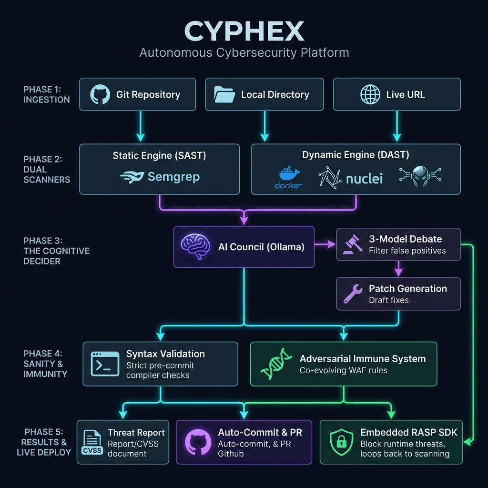
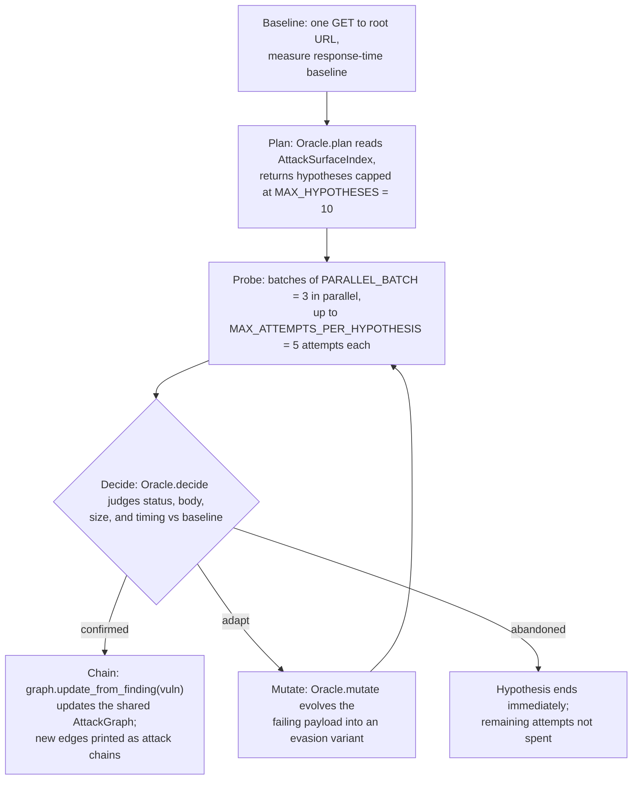
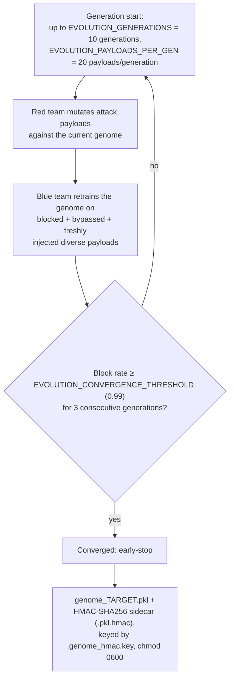

<p align="center">
  
  
  
  
  
  
  
</p>

<h1 align="center">CYPHEX</h1>

<p align="center">
  <b>Point CYPHEX at a repo. It deploys the app in a sandbox, attacks it with local-LLM agents,<br/>
  patches what it confirms, and re-scans to prove the fix. No cloud LLM, no API keys, no billing.</b>
</p>

> **Two subsystems carry the weight of that claim; everything else exists to feed or verify them.**
> **[DeepAgents](#1-deepagents--an-oracle-guided-attack-swarm)** — 13 attack agents that run no fixed script. Each asks a local LLM what to try next, tests it live, and mutates on failure, chaining confirmed exploits into multi-step attack paths.
> **[Behavioural Genome](#the-behavioural-immune-system)** — a per-endpoint anomaly detector that trains itself by fighting its own AI-generated attacks across generations, then proves the result: 91.3% recall, 97.7% precision, 3.3% false-positive rate.

<p align="center">
  <a href="#quick-start">Quick Start</a> · <a href="#what-a-scan-actually-does">Sample Run</a> ·
  <a href="#the-verify-gate">Verify Gate</a> · <a href="#how-it-works--the-8-step-pipeline">Pipeline</a> ·
  <a href="#usage">Usage</a> · <a href="#configuration">Config</a> ·
  <a href="#troubleshooting">Troubleshooting</a> · <a href="#what-cyphex-cant-do-yet">Limitations</a>
</p>

---

## Table of Contents

| | |
|---|---|
| **[Why CYPHEX exists](#why-cyphex-exists)** | The gap it fills |
| **[Quick Start](#quick-start)** · [Prerequisites](#prerequisites) · [Hardware tiers](#hardware-tiers) | Getting running |
| **[What a scan actually does](#what-a-scan-actually-does)** · [Artifacts](#artifacts-it-leaves-behind) | Measured output |
| **[The Verify Gate](#the-verify-gate)** | The honesty guarantee |
| **[The 8-step pipeline](#how-it-works--the-8-step-pipeline)** · [FP scoring](#false-positive-scoring) | End-to-end mechanics |
| **[DeepAgents](#1-deepagents--an-oracle-guided-attack-swarm)** · [Oracle](#2-the-oracle--local-model-reasoning-spent-where-it-pays) · [RAG](#3-vectorless-rag--knowledge-tree--context-without-a-vector-db) · [Council](#4-the-council--multi-model-validation) | The four subsystems |
| **[Immune system](#the-behavioural-immune-system)** · [Benchmark](#benchmarked-quality) | Anomaly detection |
| **[Network scanning](#network-scanning-optional)** · [RASP + auto-heal](#rasp--auto-heal-daemon) | Beyond the codebase |
| **[Usage](#usage)** · [Configuration](#configuration) · [CI](#using-cyphex-in-ci) | Operating it |
| **[Repository layout](#repository-layout)** · [Testing](#testing) · [Troubleshooting](#troubleshooting) | Working on it |
| **[Limitations](#what-cyphex-cant-do-yet)** · [Security & ethics](#security--ethics) | What to know before trusting it |

---

## Why CYPHEX Exists

Most security tooling stops short.

- **SAST** flags a line but can't tell if it's reachable, attacker-controlled, or a false positive.
- **DAST** proves exploitability but not which line caused it — a URL, not a fix.
- **Neither writes the patch.**
- **Cloud AI tools** will patch it — after uploading your source to their servers, on their billing.

CYPHEX closes the loop locally: **find → attack → verify → fix → prove**. Findings correlate to `file:line`, a local model patches with real code context, and the patch only counts if a re-scan confirms the finding is gone — all against your own Ollama on `127.0.0.1`.

It refuses to overclaim: an unverifiable patch reports UNVERIFIABLE, not success; the 76-sample benchmark is directional, not certified; unresolved gaps [say so](#what-cyphex-cant-do-yet).

---

## Quick Start

```bash
# 1. Clone
git clone https://github.com/Punya23/Cyphex_CLI.git
cd Cyphex_CLI

# 2. Install (extras: '.[memory]' cognee graph · '.[reasoning]' · '.[dev]')
pip install -e .

# 3. Pull at least one local model
ollama pull qwen2.5-coder:7b     # patcher / oracle
ollama pull llama3.1:8b          # reviewer / analyst

# 4. Verify your machine, then scan the bundled vulnerable Express app
cyphex doctor
cyphex scan ./vuln-webapp
```

Run `cyphex doctor` first — it checks binaries, Ollama, pulled models, and hardware tier before you sink 18 minutes into a scan.

> **Does it edit my code?** No — not during a scan. `cyphex scan <path|--repo>` copies your tree into a sandbox and patches *that copy*; your working tree is untouched. Only the opt-in `/watch` auto-heal daemon writes to real source.

### Prerequisites

| Tool | Required | Why |
|---|---|---|
| **Python 3.11+** | Required | Runtime |
| **Ollama** | Required | Local models — all inference hits `127.0.0.1:11434` |
| **Docker** | Recommended | Hardened sandbox; falls back to a capped subprocess without it |
| **Node.js 18+** | Recommended | Deploy + syntax-check JS/TS; without it, JS patches verify as UNVERIFIABLE |
| **Semgrep / Nuclei** | Optional | Extra SAST/DAST rules; `cyphex setup` installs both, SHA256-verified |
| **numpy / scikit-learn** | Optional | Isolation-Forest layer of the immune system; falls back to heuristics if missing |
| **tsc** | Optional | TypeScript syntax validation for `.ts`/`.tsx` patches |

### Hardware tiers

CYPHEX detects usable VRAM and picks the largest models that fit — small models produce poor patches.

| Tier | VRAM | Code model | General model |
|---|---|---|---|
| `ultra` | 24+ GB | `qwen2.5-coder:14b` | `llama3.1:14b` |
| `high` | 12+ GB | `qwen2.5-coder:7b` | `llama3.1:8b` |
| `mid` | 6+ GB | `deepseek-coder:6.7b` | `phi3:medium` |
| `low` | 4+ GB | `deepseek-coder:1.3b` | `phi3:mini` |
| `minimal` | 2+ GB | `deepseek-coder:1.3b` | — |
| `cloud` | < 2 GB | cloud API | cloud API |

Tier also gates reasoning strategies — a low-VRAM machine skips expensive ones. See [The Oracle](#2-the-oracle--local-model-reasoning-spent-where-it-pays).

---

## What a Scan Actually Does

Measured run, 2026-08-11 — deliberately-vulnerable Express app (8 files), standard scan + auto-patch, Apple Silicon, 7B/8B models, exit 0.

| Stage | Measured result |
|---|---|
| **Static** | 8 files scanned; Semgrep contributed **+3** findings over the built-in rules (2× SQLi CWE-89, 1× CMDi CWE-78 in `src/routes/orders.js`) |
| **Council validation** | 2 findings confirmed, 0 discarded as false positives (SQLi 3/3 votes; Sensitive Data Exposure 1/3) |
| **Genome** | 15 endpoints profiled; adversarial co-evolution converged to a **100% block rate by generation 3** (gen 0: 90.0%, 27/30); hardened against 20 attack patterns |
| **Attack arena** | Defense rate **7/8 (88%)**, **0** false positives on benign traffic |
| **Vectorless RAG** | 12 files indexed · 4 function-level extractions · 1 window fallback · 4 CWE-KB fix strategies applied · Knowledge-Tree recipe enrichment active |
| **Meta-reasoning** | 9 of 16 reasoning strategies enabled; reflexion loop re-tried 2 council-rejected patches |
| **Patching** | 5 attempted → **4 applied *and* verified**; 1 rejected by the Verify Gate for invalid syntax and auto-rolled-back |
| **Memory** | 4/4 verified fixes persisted to the cognee cross-project knowledge graph |
| **Security Posture Score** | **51/100 → 67/100** (computed from verified fixes only) |
| **Wall clock** | **~1093 s (~18 min)** |

18 minutes is honest for a full patching run on 7B/8B — mostly LLM time. `--no-patch` runs are much quicker.

### How the Security Posture Score is computed

A log-scaled penalty per severity bucket, subtracted from 100 and clamped to `[0, 100]`:

```
penalty = 0
if critical: penalty += 20 + 10 · log₂(1 + n_critical)
if high:     penalty += 10 +  8 · log₂(1 + n_high)
if medium:   penalty +=  3 +  4 · log₂(1 + n_medium)
if low/info: penalty +=  1 +  2 · log₂(1 + n_low)

score = clamp(100 − penalty, 0, 100)
```

Log scaling means the first Critical costs 30 points, the tenth costs a few — it distinguishes "has Criticals" from "has none", not a full ranking. The **after** score uses the same coefficients, with a hard guard: **zero applied patches ⇒ `score_after = score_before`**, so a no-op run never shows improvement.

### Artifacts it leaves behind

| Path | Contents |
|---|---|
| `report.json` (scan dir) | Findings, severities, `file:line`, posture score, duration |
| `cyphex_judge_artifacts/report.{json,md,sarif}` | Deterministic report set, written under `--judge` |
| `.cyphex/patches.json` | Patch manifest — every applied patch and its verdict |
| `.cyphex/patch_memory.json` | Verified-fix cache, reused on later scans with zero AI calls |
| `.cyphex/sessions/<id>.json` | Reasoning trace / session memory for the run |
| `.cyphex/knowledge_tree.json` | Cached Knowledge Tree for the target |
| `benchmark_report.json` | Immune-system metrics (from `--json`) |
| genome storage dir | `genome_<target>.pkl` + `.hmac` sidecar — evolution resumes here next scan |

```jsonc
// excerpt from a real report.json
{ "scan_id": "cli_82a5c0f4", "score": 14,
  "summary": { "critical": 2, "high": 16, "medium": 1, "total_vulns": 19, "duration_seconds": 214.8 },
  "vulnerabilities": [
    { "name": "[STATIC] SQL Injection (Template Literal)", "severity": "Critical", "endpoint": "app.js:405" },
    { "name": "[STATIC] Container Running as Root",        "severity": "Medium",   "endpoint": "Dockerfile:20" }
  ] }
```

---

## The Verify Gate

*A patch counts as "fixed" only if a re-scan proves it.* This is the single most important thing in the codebase — everything else produces candidates, and this decides which are real.

Every candidate must clear all of:

- the finding is **gone on re-scan**;
- the file still **compiles** (`node --check` / `py_compile` / `tsc --noEmit`);
- **no suppression comments** were added (`nosemgrep`, `eslint-disable`, `# noqa`, `@ts-ignore`, `@ts-expect-error`, `noinspection`, `pragma: no cover`);
- **no more than 70%** of the file's non-blank lines were deleted;
- the diff stays inside a **severity-scaled blast radius** — Critical 80 lines · High 60 · Medium 40 · Low 30 — with the target line range validated before any splice.

### The three verdicts

| Verdict | Meaning | Effect |
|---|---|---|
| **PASS** | Every check ran and passed | Counts toward the score; stores a reusable `CWE:strategy` pattern + a cross-project memory entry |
| **FAIL** | A check ran and failed | **Rolled back** to the original bytes; writes a "try a different remediation approach" lesson into session memory |
| **UNVERIFIABLE** | A check could not be run at all | Patch stays applied but **never counts toward the score** |

`finding_gone` and `builds` are tri-state (`True`/`False`/`None`) — `None` means *unmeasured*, and is never coerced into a PASS. A check that ran and failed always outranks one that never ran.

### Why comment-matching flips during verification

Ordinary scans ignore a regex match inside a code comment — a commented-out query isn't a vulnerability. If verification did the same, a patch that simply **comments the vulnerable line out** would read as "finding gone" and PASS.

So the re-scan flips comment-matching back on: commenting-out still fails and rolls back. Meanwhile *parameterised-SQL* suppression stays active both ways, because adding placeholders genuinely is a fix and must verify as one. Deliberate asymmetry, covered by tests.

---

## How It Works — the 8-Step Pipeline

<p align="center"></p>

| # | Waypoint | What happens |
|---|---|---|
| 1 | **Get Source** | Copy/clone the target into a per-scan sandbox copy; detect framework. Clone URLs are restricted to `https://` / `git@` / `ssh://`. |
| 2 | **Static Analysis** | Semgrep (`--metrics=off`, never `--config auto`) + a built-in 16-ruleset regex scanner — 12 languages plus Dockerfile/YAML/SQL/`.env` — merged and de-duplicated, then [confidence-scored](#false-positive-scoring). |
| 3 | **Deploy Sandbox** | Docker container from an auto-generated Dockerfile (`--cap-drop ALL`, `--memory 512m`, `--cpus 1`, `--pids-limit 200`, `no-new-privileges`, non-root user, port on `127.0.0.1` only), or a resource-capped native subprocess fallback. |
| 3b | **Network Scan** *(opt)* | Host/port sweep + per-device network genome. |
| 4 | **Dynamic Scan** | Crawler + API discovery, then Nuclei/ZAP (`/scan`) **or** the **13 Oracle-guided DeepAgents** (`/deep`, `/full`) — mutually exclusive. A multi-model council debates findings and drops false positives. |
| 5 | **Build Genome** | Learn "normal" per endpoint, run adversarial co-evolution to convergence. Genomes load from disk for the same target, so evolution *continues* across scans. |
| 6 | **Attack Arena** | BEFORE/AFTER defence demo — defence rate plus false positives on benign traffic. |
| 7 | **Security Report** | The AI council writes it; a **second model fact-checks** it for invented findings. |
| 8 | **Patch + Verify + Score** | Per vuln: **memory cache** → deterministic **template** → **council** (RAG + Knowledge-Tree context, multi-model vote) → **[Verify Gate](#the-verify-gate)** → score from PASS-verified fixes only. |

### The patch ladder (step 8, in order)

Cheapest rung tried first:

1. **Patch-memory cache** — semantic hash of the enclosing function, keyed by CWE. A hit reuses a previously *verified* fix with **zero model calls**.
2. **Deterministic template** — regex transform for the four CWEs that have one, no model, no variance:

   | CWE | Transform |
   |---|---|
   | CWE-89 | `` db.query(`...${id}`) `` → `db.query("...?", [id])` |
   | CWE-78 | `` execSync(`ping ${host}`) `` → `execFileSync("ping", [host])` — removes the shell entirely |
   | CWE-798 | `const password = "hunter2"` → `const password = process.env.PASSWORD` |
   | CWE-942 | `cors({ origin: "*" })` → `cors({ origin: [process.env.ALLOWED_ORIGIN ...] })` |

3. **Council generation** — LLM path, RAG + Knowledge-Tree context, multi-model vote.
4. **Verify Gate** — on FAIL, a **reflexion** retry feeds the failure evidence back into the next prompt.

### False-positive scoring

Every finding carries a `confidence` (Semgrep 0.90, built-in regex 0.85) and, if marked down, an `fp_reason`. Findings ≤ `FP_DROP_THRESHOLD` (0.15) are dropped from ordinary scans.

| Signal | Effect |
|---|---|
| SQL call is already parameterised (`?` / `$1` / params array / `prepare(`) | dropped outright — on **every** path, verification included |
| Match sits inside a code comment | confidence 0.0 — dropped from scans, but **visible to the verifier** |
| File is test / fixture / mock code | −0.45, kept but marked |

On `vuln-webapp` this drops 2 Critical false positives — the scanner matching its own comment text: `query (should` inside `// Safe: parameterized query (should NOT be flagged)`.

Semgrep never runs `--config auto` (uploads project metadata on every run). Ladder: a local `cyphex/semgrep_rules.yml` if present (fully offline) → the static `p/owasp-top-ten` pack, cached after the first fetch.

---

## The Four Subsystems

### 1. DeepAgents — an Oracle-guided attack swarm

**13 specialized AI attack agents**, one per vulnerability class, that don't run a fixed script — they *adapt*.

| Agent | Targets | Agent | Targets |
|---|---|---|---|
| `DeepSQLiAgent` | SQL Injection | `DeepXXEAgent` | XML External Entity |
| `DeepXSSAgent` | Cross-Site Scripting | `DeepBusinessLogicAgent` | Business-Logic Flaws |
| `DeepCMDiAgent` | Command Injection | `DeepPromptInjectionAgent` | Prompt Injection / LLM safety bypass (CWE-1336, OWASP LLM01) |
| `DeepAuthAgent` | Auth Bypass / Priv-Esc | `DeepRaceConditionAgent` | Race Condition / TOCTOU (CWE-362) |
| `DeepIDORAgent` | Insecure Direct Object Ref | `DeepMassAssignmentAgent` | Mass Assignment / Parameter Pollution (CWE-915) |
| `DeepSSRFAgent` | SSRF — incl. the AWS metadata endpoint `169.254.169.254` | `DeepSSTIAgent` | Template Injection |
| `DeepPathTraversalAgent` | Path Traversal / LFI | | |

**The loop each agent runs:**

1. **Baseline** — one GET to root, establishes a response-time baseline for timing-based inference (blind SQLi, sleep payloads).
2. **Plan** — the Oracle reads the attack-surface summary, returns ranked hypotheses. Capped at `MAX_HYPOTHESES = 10`.
3. **Probe** — hypotheses execute in parallel batches of `PARALLEL_BATCH = 3`, up to `MAX_ATTEMPTS_PER_HYPOTHESIS = 5` probes each.
4. **Decide** — the Oracle judges the response as *confirmed / adapt / abandoned*. Abandoned ends the hypothesis immediately.
5. **Mutate** — on *adapt*, the Oracle evolves the payload into an evasion variant and the loop repeats.
6. **Chain** — a confirmed exploit updates the shared **attack graph**; new edges surface as multi-step attack paths (`unauth data leak → admin takeover`).



A dead-route guard skips endpoints that don't exist; crawler, API-discovery and network-recon agents feed the attack-surface index the Oracle plans against.

### 2. The Oracle — local-model reasoning, spent where it pays

The local-LLM brain behind every DeepAgent has three entry points:

- **`plan()`** — returns 5–8 ranked attack hypotheses (highest impact / cheapest to test first).
- **`decide()`** — judges status, body, size and timing vs. baseline; returns confirmed/adapt/abandoned + confidence + evidence.
- **`mutate()`** — evolves a failing payload into evasion variants.

A **meta-reasoning router** then picks a *patch-generation* strategy per finding, from a bank of 16 (**9 enabled**):

| Router | Availability | Routing |
|---|---|---|
| **Built-in** | Always on | Critical **or** a hard CWE (78, 918, 89, 94, 77, 22) → **Self-Consistency** K-vote · High → **Chain-of-Thought** · everything else → direct generation |
| **`.[reasoning]` extra** | Optional install | CWE override first, then severity: Critical → Self-Consistency · High → **Self-Reflection** (draft → critique → improve) · Medium/Low → CoT. CMDi/SSRF → **Tree-of-Thoughts**, auth-bypass/IDOR → **Decomposition**, path traversal → **Least-to-Most**. Expensive strategies gated off on low-VRAM tiers. |

Every patch keeps its reasoning tree for audit. → [PRD §11.20](CYPHEX_PRD.md)

### 3. Vectorless RAG + Knowledge Tree — context without a vector DB

Small models need good context. No embeddings, no vector store — a regex code-tree index extracts, per vulnerability, the enclosing function, imports, a CWE fix recipe, and an in-repo secure example so patches match the codebase's own style.

On top: a **PageIndex-style Knowledge Tree** (`backend/rag/`) — `code_tree` + `knowledge_tree` + a deterministic `cwe_index`, built from your repo plus a bundled security corpus, cached under `.cyphex/knowledge_tree.json`.

Fast path is **0-LLM**: `CWE + file:line` → function, fix recipe, secure example. Measured on `vuln-webapp`: CWE-89 returns a 502-char recipe, 543-char function, 547-char in-repo example. The deep path shows the model only branch *summaries*, never the whole tree.

> No embeddings in the RAG path. The optional `[memory]` extra (cognee) is the exception — `nomic-embed-text`, 768 dims, local LanceDB.

### 4. The Council — multi-model validation

One model grading its own patch is a single point of failure. CYPHEX assigns three roles — `detector`, `validator`, `patcher` — and scores every Ollama model for each.

Scoring is deliberately blunt: **parameter count drives it**, code specialisation is only a 15% bonus. An 8B general model beats a 7B code model at most tasks, including code — the extra parameters buy better reasoning.

The **debate protocol**: the patcher proposes, validators vote with reasons, the finding is confirmed, sent back, or dropped as a false positive. A separate **fact-check pass** has a second model re-read the report hunting for findings the first model invented.

`cyphex council-doctor` reports which model landed in which role.

---

## The Behavioural Immune System

CYPHEX learns what *normal* looks like for *your* app and blocks the anomalies, instead of matching known signatures.

**The 15-dimension feature vector**, extracted per input string:

| # | Feature | # | Feature |
|---|---|---|---|
| 1 | `input_length` | 9 | `sqli_pattern_score` (24-pattern injection bank) |
| 2 | `entropy` (Shannon) | 10 | `null_byte_present` |
| 3 | `special_char_ratio` | 11 | `path_traversal_depth` |
| 4 | `url_encoding_ratio` | 12 | `bracket_imbalance` |
| 5 | `uppercase_ratio` | 13 | `unicode_ratio` |
| 6 | `digit_ratio` | 14 | `repetition_ratio` |
| 7 | `max_token_length` | 15 | `token_count` |
| 8 | `sql_keyword_score` | | |

- **Scoring** — `max(isolation-forest, heuristic)`; heuristic is 15 threshold rules over those features (one fed by the 24-pattern injection bank), plus an agreement boost when both fire. **BLOCK ≥ 0.7** (`GENOME_BLOCK_THRESHOLD`). Heuristic alone still scores without numpy/scikit-learn.
- **Coverage** — past SQLi/XSS: SSTI, NoSQLi, SSRF/cloud-metadata, LDAP injection, CRLF header injection, XXE (100% detection on each in the benchmark corpus).
- **Adversarial co-evolution** — red team mutates attacks, blue team retrains on blocked + bypassed + fresh diverse payloads. Defaults: 10 generations × 20 payloads, early-stop at ≥99% block rate for 3 consecutive generations. Not strictly monotonic run to run.
- **Persistence** — genomes saved with an **HMAC sidecar** (`.pkl` + `.pkl.hmac`, key mode `0600`); refuse to load an unsigned or tampered file. Attack history round-trips too, so run *N+1* keeps hardening from run *N*'s bypasses.

The co-evolution loop, visualised:



Sample scores (`/search` endpoint, untrained genome):

| Payload | Score | Verdict |
|---|---|---|
| `' OR 1=1--` | 1.00 | BLOCK |
| `<script>alert(1)</script>` | 1.00 | BLOCK |
| `; cat /etc/passwd` | 1.00 | BLOCK |
| `http://169.254.169.254/latest/meta-data/` | 0.80 | BLOCK |
| `{{7*7}}` | 0.80 | BLOCK |
| `normal search query` | 0.00 | allow |

### Benchmarked quality

**91.3% recall · 97.7% precision · 94.4% F1 · 3.3% FPR · ~0.04 ms/sample** on a 76-sample corpus (46 attack / 30 benign). Small *n* — directional, not certified. Co-evolution rates are in-distribution, not a generalization claim.

```bash
python3 cyphex_benchmark.py                       # exits non-zero if recall < 80% or FPR > 10% → CI gate
python3 cyphex_benchmark.py --data cic-ids2018.csv --threshold 0.6 --json out.json
./cx benchmark --data cic-ids2018.csv             # same engine from the launcher (reports the gate
                                                  # verdict, but does NOT set an exit code)
```

Output includes the confusion matrix, per-class detection rates, and every miss/false positive — current misses: `admin'--`, `" OR ""="`, `| whoami`, a Windows-style traversal path. `--data` accepts any labelled CSV with `payload,label[,attack]` columns.

---

## Network Scanning (optional)

`--network` / `/net` adds host discovery, port sweep, service/device-type inference from banners, and a per-host risk score weighted on high-risk ports (21, 23, 25, 135, 139, 445, 1433, 3306, 3389, 5432…) and cleartext protocols (21, 23, 25, 80, 110, 143, 8080). `NetworkVulnMapper` correlates open services against known weaknesses.

A separate **25-dimension network genome** covers traffic-level anomalies (ARP rate, ICMP rate, SYN-without-ACK rate), HMAC-signed. `/netwatch` runs it live.

> `/net <cidr>` attacks the range you name **directly** — no sandbox, no authorization check. See [Security & Ethics](#security--ethics).

---

## RASP + Auto-Heal Daemon

A **zero-dependency Express shield** (`sdks/node/cyphex-rasp.js`, a single `app.use()` — or let `python3 cyphex_cli.py onboard --path <app>` inject it) inspects query strings, JSON bodies, and cookie/referer/UA headers. Blocks with a **403** above a tunable `confidenceThreshold` (default 0.7), or runs **detect-only** (`blockMode: false`) for a staged rollout.

Events ship to the **`/watch` auto-heal daemon** on `127.0.0.1:3004`, which applies its own 70% floor before the AI council **patches your real source in place**. `GET /api/status` and `GET /api/heal-log` expose the healing history. API-key auth is enforced — **the same `CYPHEX_API_KEY` must be set on both sides** or telemetry is silently dropped.

> **Stack-trace caveat.** Mounted globally via `app.use()`, the RASP fires *before* any route handler runs, so no `file:line` is resolved. **Mount it per-route** (`app.get('/x', cyphexRasp(opts), handler)`) to get the exact vulnerable line.

---

## Usage

**Non-interactive CLI** — `cyphex <command>`:

```bash
cyphex scan ./my-app                    # bare positional target (path or URL) also works
cyphex scan --repo https://github.com/user/app.git --deepagents --network
cyphex scan --path ./vuln-webapp --deep --format sarif      # --deep aliases --deepagents
cyphex scan --path ./my-app --judge                         # deterministic JSON/MD/SARIF artifacts
cyphex setup | doctor | council-doctor | version
cyphex                                  # no args → slash-command workspace (also: repl / workspace / shell)
```

| Flag | Effect |
|---|---|
| `--path` / `--repo` / bare positional | Target: local dir, git URL, or live URL |
| `--deepagents` (alias `--deep`) | Oracle-guided swarm instead of Nuclei/ZAP |
| `--network` | Add the host/port sweep |
| `--no-patch` | Scan and report only — no remediation |
| `--format {table,json,sarif,markdown}` | Output format (default `table`) |
| `--judge` | Deterministic artifact set for benchmarking |
| `--mode {full,standard,lite,cloud}` | **Declared but not yet read by the engine** — see limitations |

**REPL / workspace** — these are slash commands *inside* `cyphex`, not shell commands:

```
/scan <target> [--network] [--deepagents] [--full] [--no-patch]
/deep <target>     · /full <target>     # DeepAgents swarm · + network sweep
/net [host]        · /netaudit · /netwatch
/watch                                  # RASP auto-heal daemon
/benchmark [--threshold N] [--json out.json]
/setup /doctor /models /version /history /clear /help /exit
<bare path or URL>                      # auto-scans it; Tab completes commands
```

**`./cx` launcher** — same engine, non-interactively: `cx scan`, `cx deep`, `cx net`, `cx benchmark`, `cx doctor`, `cx models`, `cx --version`, or `cx <path|url>` to auto-scan.

**Legacy** (`python3 cyphex_cli.py <cmd>`): `watch`, `github-hook`, `onboard`, `netmap`, `netwatch`, `netaudit`, `scan --branch` — not yet ported to the `cyphex` binary.

---

## Configuration

Defaults live in `backend/backend/config.py`; environment variables override them.

| Variable | Default | Purpose |
|---|---|---|
| `OLLAMA_URL` | `http://localhost:11434` | Local model endpoint |
| `OLLAMA_MODEL` | `qwen2.5-coder:7b` | Default model when the selector has nothing better |
| `CYPHEX_API_KEY` | — | Shared secret between the RASP SDK and the `/watch` daemon. **Must match on both sides** |
| `CYPHEX_API_HOST` / `CYPHEX_API_PORT` | `127.0.0.1` / `8000` | Local API bind address |
| `CYPHEX_GIT_ALLOWED_HOSTS` | — | Allow-list for `--repo` clone hosts |
| `GITHUB_TOKEN` | — | Only for the opt-in `github-hook` PR flow |
| `GITHUB_WEBHOOK_SECRET` | — | Verifies inbound webhook signatures |
| `COGNEE_EMBEDDING_MODEL` | `nomic-embed-text` | Optional `[memory]` extra only |
| `COGNEE_RECALL_TIMEOUT_S` | `20.0` | Memory recall budget |
| `COGNEE_REMEMBER_TIMEOUT_S` | `300.0` | `cognify()` runs an LLM extraction pass — hence the wide budget |

Notable non-env knobs:

| Setting | Default | Purpose |
|---|---|---|
| `SCAN_TIMEOUT_SECONDS` | `1800` | Hard ceiling on a single scan |
| `COMMAND_TIMEOUT_SECONDS` | `60` | Per-command default |
| `MAX_PARALLEL_AGENTS` | `6` | Concurrency cap for the agent suite |
| `GENOME_BLOCK_THRESHOLD` | `0.7` | Anomaly score at/above which a payload is blocked |
| `EVOLUTION_GENERATIONS` | `10` | Co-evolution generations per run |
| `EVOLUTION_PAYLOADS_PER_GEN` | `20` | Payloads bred per generation |
| `EVOLUTION_CONVERGENCE_THRESHOLD` | `0.99` | Early-stop block rate |

> `config.py` also carries `GROQ_*`/`CEREBRAS_*`/`AI_BACKEND_MODE` for a cloud fallback path. Default is `AI_BACKEND_MODE = "local"`; a cloud key sends your code off-box.

---

## Using CYPHEX in CI

The immune benchmark is the gate — exits non-zero if recall drops below 80% or FPR climbs above 10%:

```yaml
- name: Immune-system regression gate
  run: python3 cyphex_benchmark.py

- name: Security scan (report only, no patching)
  run: cyphex scan . --no-patch --format sarif > results.sarif

- uses: github/codeql-action/upload-sarif@v3
  with:
    sarif_file: results.sarif
```

Use `--no-patch` in CI — a full patching run needs Ollama and ~18 minutes. `--judge` gives deterministic artifacts for diffing scan-over-scan.

---

## Repository Layout

```
cyphex/                     # The pip-installed package — CLI entry point
  cli.py                    #   argparse surface, `cyphex <cmd>`
  scanner.py                #   static analysis: Semgrep + 16 built-in rulesets + FP scoring
  dynamic_scanner.py        #   Nuclei / ZAP integration
  docker_sandbox.py         #   hardened container deployment
  daemon.py                 #   /watch auto-heal daemon (127.0.0.1:3004)
  doctor.py  hardware.py    #   environment checks, VRAM tiering, model selection
  onboarder.py              #   zero-click RASP injection into a target app
  github_hook.py            #   opt-in PR flow (the one path that leaves your machine)

backend/
  deepagents/               # 13 Oracle-guided attack agents + attack graph + surface index
  council/                  # multi-model debate, model selection, reasoning strategies
  rag/                      # vectorless code index, Knowledge Tree, security KB, cognee memory
  reasoning/                # reflexion, self-consistency, session memory, reasoning trees
  patch/                    # resolver → applier → verifier → templates → manifest → regression
  network/                  # discovery, network genome, topology, vuln mapping
  backend/immune/           # behavioural genome + adversarial evolution controller
  backend/agents/           # the classic (non-Deep) agent suite
  sandboxes/                # per-scan working copies (gitignored)

sdks/node/cyphex-rasp.js    # the runtime shield
cli_engine.py               # pipeline orchestrator — wires all of the above together
cyphex_benchmark.py         # immune-system benchmark + CI gate
tests/                      # 136 tests
vuln-webapp/                # bundled deliberately-vulnerable Express app
```

---

## Testing

```bash
pip install -e ".[dev]"
pytest                      # 136 tests, ~7s
pytest -m integration       # slow tests that drive real local models (needs Ollama)
```

Integration tests are excluded by default (`addopts = "-m 'not integration'"`) — `test_cross_project_recall` runs cognee's `cognify()` through a local LLM and takes minutes.

The Verify Gate tests are worth reading to understand the system's guarantees — mutation-checked, meaning each invariant was deliberately broken to confirm the suite catches it.

---

## Troubleshooting

| Symptom | Cause & fix |
|---|---|
| `ModuleNotFoundError` on `cyphex` | Editable install didn't take. Re-run `pip install -e .` from the repo root |
| `cyphex doctor` reports 0 GB VRAM | No detectable GPU. CYPHEX still runs on CPU, just slowly; `--mode` is declared but not yet wired |
| Scan finds nothing on a real repo | Check `cyphex doctor` for Semgrep. Without it you're on the 16 built-in regex rulesets only |
| Every patch comes back UNVERIFIABLE | The re-scan or syntax check couldn't run — usually missing `node` for a JS target. Install Node 18+ |
| Patches are slow | Expected: ~18 min for a full patching run on 7B/8B. Use `--no-patch` to scan only |
| RASP telemetry never reaches the daemon | `CYPHEX_API_KEY` must match on both sides; use the current `sdks/node/cyphex-rasp.js` (older copies send no `X-API-Key`) |
| RASP reports no `file:line` | It's mounted globally. Mount per-route to get an app frame on the stack |
| Sandbox deploy fails | Docker missing or the target needs its own Dockerfile. CYPHEX falls back to a resource-capped subprocess |
| `pytest` hangs | You ran integration tests. Default `pytest` excludes them |

---

## What CYPHEX Can't Do (Yet)

- **Not a substitute for human review or a formal pentest.** It's a fast, verified first pass.
- **A full run takes ~18 minutes** on 7B/8B models — mostly LLM latency.
- **Nuclei/ZAP and the DeepAgents never run in the same scan** — `--deepagents` replaces them.
- **The built-in scanner is regex-based** (16 rulesets, broad but shallow); Semgrep does the deep work. Confidence scoring is itself heuristic — a "test file" mark can still be real.
- **`p/owasp-top-ten` needs one online fetch** before caching. Air-gapped runs need a local `cyphex/semgrep_rules.yml`; none bundled.
- **Only 4 CWEs have deterministic templates** (89, 78, 798, 942). Everything else goes through the LLM path, with the variance that implies.
- **Sandbox deployment is strongest on Node/Express** targets; other stacks may need your own Dockerfile. The RASP shield is **Express-only** today.
- **Benchmark numbers come from a 76-sample corpus.** Directional, not certified.
- **Hardware detection keys off GPU VRAM** — no GPU reports 0 GB; `--mode` override is declared but unread by the engine.
- **Applier gaps**: its path-containment guard is inert (CLI doesn't pass `source_dir`; enforced a layer up instead), a legacy non-atomic write path exists as fallback, and atomic writes via `os.replace` drop original permission bits and hard links.
- **No bracket-balance guard in the applier** — the council prompt asks for balanced braces, nothing enforces it; `node --check` catches the damage and auto-rolls-back.
- **Older vendored RASP copies predate daemon auth** — no `X-API-Key`, telemetry silently dropped. Use the current `sdks/node/cyphex-rasp.js`.

---

## Tech Stack

| Layer | Tech |
|---|---|
| **Local AI** | Ollama — `qwen2.5-coder:7b` (patcher/oracle), `llama3.1:8b` (analyst/reviewer), `deepseek-coder:6.7b` (reviewer), `nomic-embed-text` (optional cognee memory only) |
| **SAST** | Semgrep + built-in 16-ruleset regex scanner (12 languages + Dockerfile/YAML/SQL/`.env`) with confidence scoring |
| **DAST** | Crawler + API discovery, then Nuclei & OWASP ZAP **or** 13 DeepAgents |
| **Sandbox** | Docker (auto-Dockerfile, cap-drop, non-root, loopback-only) / resource-capped native subprocess |
| **Immune System** | 15-rule heuristic over a 24-pattern injection bank + scikit-learn Isolation Forest (CPU-only, degrades gracefully) |
| **Memory** | patch-memory cache · Knowledge Tree · cognee cross-project graph · cross-scan session memory |
| **Core** | Python 3.11+ · httpx · rich · numpy |

---

## Security & Ethics

- **Local-first AI** — every model call hits your own Ollama at `127.0.0.1:11434`. No cloud LLM, no API key, no billing.
- **Not network-isolated** — deploy runs `npm`/`pip`/`docker build` against public registries; `cyphex setup` downloads Semgrep/Nuclei; cognee fetches a tokenizer from HuggingFace once; `github-hook` pushes a PR via `api.github.com`. Only that PR flow sends code off-box; air-gapped runs should pre-warm caches and skip it.
- **Offense goes wherever you point it** — `cyphex scan <path>`/`--repo` stay sandboxed, but `scan http://…` and `/net <cidr>` attack the target **directly, no sandbox, no authorization check**. Only use against systems you're permitted to test.
- **Hardened against the code it scans** — `npm install --ignore-scripts` blocks postinstall RCE; env is an explicit allow-list (never `os.environ.copy()`); archives get path-traversal guards + a 1 GB zip-bomb cap; the target is force-rebound to `127.0.0.1`.
- **Quiet by default** — Nuclei with `-duc -ni`, Semgrep with `--metrics=off` and never `--config auto`. Local API binds `127.0.0.1`, compares tokens with `hmac.compare_digest`.
- **Fail-closed patching** — symlinks refused, line ranges validated, atomic writes, auto-rollback on syntax failure, HMAC-signed genome caches. *(See [limitations](#what-cyphex-cant-do-yet) for gaps.)*
- **Graceful degradation** — missing Docker / scikit-learn / Semgrep / Nuclei → CYPHEX degrades and tells you, rather than crashing.

---

## Full Documentation

Everything below lives in **[CYPHEX_PRD.md](CYPHEX_PRD.md)**:

| Your question | Section |
|---|---|
| What files does a scan write? | §13 Data Model & Artifacts |
| What *can't* it do? | §5 Goals & Non-Goals · §18 Implementation Status & Known Gaps |
| What hardware / VRAM do I need? | §11.4 Local Models, Hardware Tiers & VRAM |
| Which CWEs are covered? | Appendix B CWE Coverage |
| Every command and flag | §11.2 Commands · Appendix C Command Cheat-Sheet |
| How does patching actually work? | §11.17 AI Remediation Pipeline |
| How is the posture score computed? | §11.23 Security Posture Score |
| Architecture & end-to-end walkthrough | §9 System Overview · §12 Pipeline Walkthrough |
| Where's the code for X? | Appendix D Key File Map |

---

## License

MIT — see [LICENSE](LICENSE).

<p align="center"><br><b>CYPHEX</b> — find → attack → verify → fix → harden, on your own machine.<br>
<i>Oracle-guided attacks · AI council debate · Adversarial evolution · Auto-patching that has to prove itself.</i></p>
