<p align="center">
  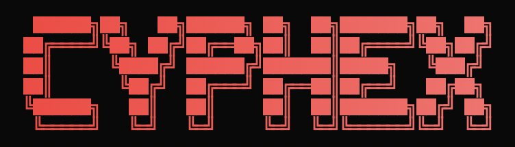
</p>

<p align="center">
  
  
  
</p>

<p align="center">
  
  
  
  
  
  
  
</p>

<p align="center">
  <b>Point CYPHEX at a repo. It deploys the app in a sandbox, attacks it with local-LLM agents,<br/>
  patches what it confirms, and re-scans to prove the fix. No cloud LLM, no API keys, no billing.</b>
</p>

> [!IMPORTANT]
> ### ◈ The whole project rests on one refusal
>
> **Every other AI security tool tells you it fixed your code. None of them can show you.**
> CYPHEX will not call a patch a fix until a re-scan proves the finding is gone — and when it
> *cannot* run that proof, it says `UNVERIFIABLE` instead of quietly claiming success.
>
> | | |
> |---|---|
> | **[▸ The Verify Gate](#the-verify-gate)** | **The guarantee.** Five independent checks, one tri-state verdict. `UNVERIFIABLE` is never rounded up to `PASS`, and a failed patch is rolled back to the original bytes. |
> | **[▸ The Maintainability Panel](#the-maintainability-panel)** | **Proof the guarantee still holds.** A gate can rot silently — `cyphex verify` shows whether every check can still actually run, and `--ci` turns that into an exit code. |
> | **[▸ Problem Statement Answered](#problem-statement-answered-the-maintainability-panel)** | **The full write-up.** How the verification capability was chosen, what shipped, both panels captured from this repo, the buddy's memory loop, and every maintainer surface described. |
> | **[▸ Waypoint Tracing](#waypoint-tracing--and-the-cyphex-buddy)** | **What it was trying to do.** Every phase carries an explicit goal and records its sub-steps. Recorded even with no terminal attached, so a past run stays inspectable. |
>
> Everything below — the attack swarm, the immune system, the council — exists to **feed** that
> gate or to **verify** it. See it in 60 seconds: [the demo](#see-it-in-60-seconds).

<p align="center">
  <b><a href="#the-verify-gate">◈ Verify Gate</a></b> · <b><a href="#the-maintainability-panel">◈ Maintainability Panel</a></b> ·
  <b><a href="#problem-statement-answered-the-maintainability-panel">◈ Problem Statement Answered</a></b> ·
  <b><a href="#waypoint-tracing--and-the-cyphex-buddy">◈ Waypoint Tracing</a></b> ·
  <a href="#see-it-in-60-seconds">60-Second Demo</a> ·
  <a href="#quick-start">Quick Start</a> · <a href="#what-a-scan-actually-does">Sample Run</a> ·
  <a href="#architecture">Architecture</a> ·
  <a href="#usage">Usage</a> · <a href="#configuration">Config</a> ·
  <a href="#troubleshooting">Troubleshooting</a> · <a href="#what-cyphex-cant-do-yet">Limitations</a>
</p>

---

## Table of Contents

| | |
|---|---|
| **[Why CYPHEX exists](#why-cyphex-exists)** | The gap it fills |
| ◈ **[THE VERIFY GATE](#the-verify-gate)** | ★ **The honesty guarantee — the reason this project exists** |
| ◈ **[THE MAINTAINABILITY PANEL](#the-maintainability-panel)** · [full docs](docs/VERIFICATION_MAINTAINABILITY_PANEL.md) | ★ **Proof that guarantee is still working** |
| ◈ **[PROBLEM STATEMENT ANSWERED](#problem-statement-answered-the-maintainability-panel)** | ★ **Verification: Maintainability Panel — approach, both panels, the buddy's agent memory, every surface** |
| ◈ **[WAYPOINT TRACING](#waypoint-tracing--and-the-cyphex-buddy)** | ★ **What each phase was trying to do — and the buddy that shows it** |
| **[See it in 60 seconds](#see-it-in-60-seconds)** | Run the guarantee yourself |
| **[Quick Start](#quick-start)** · [Prerequisites](#prerequisites) · [Hardware tiers](#hardware-tiers) | Getting running |
| **[What a scan actually does](#what-a-scan-actually-does)** · [Artifacts](#artifacts-it-leaves-behind) | Measured output |
| **[Architecture](#architecture)** · [Patch ladder](#the-patch-ladder) · [FP scoring](#false-positive-scoring) | End-to-end mechanics |
| **[Web interface](#web-interface--dashboard--api)** · [HTML report](#the-html-report) | Browser dashboard + FastAPI backend |
| **[DeepAgents](#1-deepagents--an-oracle-guided-attack-swarm)** · [Oracle](#2-the-oracle--local-model-reasoning-spent-where-it-pays) · [RAG](#3-vectorless-rag--knowledge-tree--context-without-a-vector-db) · [Council](#4-the-council--multi-model-validation) | The four subsystems |
| **[Immune system](#the-behavioural-immune-system)** · [Benchmark](#benchmarked-quality) | Anomaly detection |
| **[Network scanning](#network-scanning-optional)** · [RASP + auto-heal](#rasp--auto-heal-daemon) | Beyond the codebase |
| **[Usage](#usage)** · [Terminal surface](#the-terminal-surface) · [Configuration](#configuration) · [CI](#using-cyphex-in-ci) | Operating it |
| **[Repository layout](#repository-layout)** · [Testing](#testing) · [Troubleshooting](#troubleshooting) · [Contributing](CONTRIBUTING.md) | Working on it |
| **[Limitations](#what-cyphex-cant-do-yet)** · [Security & ethics](#security--ethics) · [SECURITY.md](SECURITY.md) | What to know before trusting it |
| **[Full documentation](#full-documentation)** · [per-directory READMEs](#per-directory-readmes) · [llms.txt](llms.txt) | Everything else |

---

## Why CYPHEX Exists

Most security tooling stops short.

- **SAST** flags a line but can't tell if it's reachable, attacker-controlled, or a false positive.
- **DAST** proves exploitability but not which line caused it — a URL, not a fix.
- **Neither writes the patch.**
- **Cloud AI tools** will patch it — after uploading your source to their servers, on their billing.

CYPHEX closes the loop locally: **find → attack → verify → fix → prove**. Findings correlate to `file:line`, a local model patches with real code context, and the patch only counts if a re-scan confirms the finding is gone — all against your own Ollama on `127.0.0.1`.

### The gap nobody else closes

An AI that writes patches is not the hard part any more. **Knowing which of those patches actually worked is.**

| | Finds it | Proves it's exploitable | Writes the fix | **Proves the fix worked** | Stays on your machine |
|---|:---:|:---:|:---:|:---:|:---:|
| SAST (Semgrep, CodeQL) | ✅ | ❌ | ❌ | ❌ | ✅ |
| DAST (Nuclei, ZAP) | ⚠️ | ✅ | ❌ | ❌ | ✅ |
| Cloud AI fixers | ✅ | ❌ | ✅ | ❌ | ❌ |
| **CYPHEX** | ✅ | ✅ | ✅ | **✅ [Verify Gate](#the-verify-gate)** | ✅ |

That last-but-one column is the entire point. A tool that patches without verifying has just moved the
problem: now you have a diff you did not write, in code you have not read, with no evidence it helped.
CYPHEX's answer is a gate that a patch must survive — and a [second surface](#the-maintainability-panel)
that tells you whether the gate itself is still working.

It refuses to overclaim: an unverifiable patch reports UNVERIFIABLE, not success; the 76-sample benchmark is directional, not certified; unresolved gaps [say so](#what-cyphex-cant-do-yet).

---

## The Verify Gate

> **◈ Flagship.** If you read one section, read this one. Everything else in CYPHEX
> produces *candidates*; this is the part that decides which of them are real.

*A patch counts as "fixed" only if a re-scan proves it.*

Delete this gate and CYPHEX becomes what every other AI fixer already is: a tool that writes a
diff and asserts it worked. The gate is the difference between **"I patched it"** and
**"I patched it, and here is the re-scan that proves the finding is gone."**

Every candidate must clear all of:

- the finding is **gone on re-scan**;
- the file still **compiles** (`node --check` / `py_compile` / `tsc --noEmit`);
- **no suppression comments** were added (`nosemgrep`, `eslint-disable`, `# noqa`, `@ts-ignore`, `@ts-expect-error`, `noinspection`, `pragma: no cover`);
- **no more than 70%** of the file's non-blank lines were deleted;
- the diff stays inside a **severity-scaled blast radius** — Critical 80 lines · High 60 · Medium 40 · Low 30 — with the target line range validated before any splice.

### The three verdicts

| Verdict | Meaning | Effect |
|---|---|---|
| **PASS** | Every check ran and passed | Counts toward the score; stores a reusable `CWE:strategy` pattern + a cross-project memory entry |
| **FAIL** | A check ran and failed | **Rolled back** to the original bytes; writes a "try a different remediation approach" lesson into session memory |
| **UNVERIFIABLE** | A check could not be run at all | Patch stays applied but **never counts toward the score** |

`finding_gone` and `builds` are tri-state (`True`/`False`/`None`) — `None` means *unmeasured*, and is never coerced into a PASS. A check that ran and failed always outranks one that never ran.

### Why comment-matching flips during verification

Ordinary scans ignore a regex match inside a code comment — a commented-out query isn't a vulnerability. If verification did the same, a patch that simply **comments the vulnerable line out** would read as "finding gone" and PASS.

So the re-scan flips comment-matching back on: commenting-out still fails and rolls back. Meanwhile *parameterised-SQL* suppression stays active both ways, because adding placeholders genuinely is a fix and must verify as one. Deliberate asymmetry, covered by tests.

---

## The Maintainability Panel

> **◈ Flagship.** The [Verify Gate](#the-verify-gate) is the guarantee. This is the proof the
> guarantee is still holding — the part that stops CYPHEX from over-trusting *itself*.

*A gate that can degrade silently is a gate you can't trust.* The Verify Gate above is correct — but correctness without visibility has a failure mode: if `tsc` goes missing, every TypeScript patch verifies as UNVERIFIABLE forever, the score stops improving, and **nothing anywhere says why**.

Most projects stop at "we verify our patches". The second-order question — *are we still able to
verify them?* — is the one that decays quietly in every real deployment, and it is the one this
panel exists to answer. [See it break and get caught](#see-it-in-60-seconds).

`cyphex verify` closes that loop. It aggregates every verdict the gate has ever written — scattered one `patches.json` per scan — into one maintainer-facing answer.

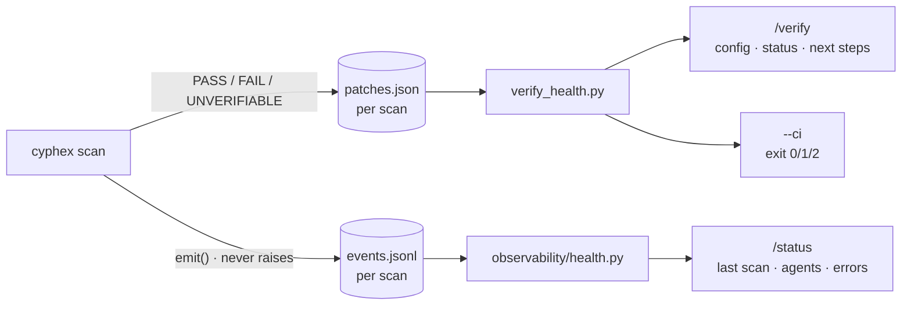

| | Shows | Verdict lamp |
|---|---|---|
| **`cyphex verify`** | **Configuration** — blast-radius caps, suppression patterns, per-check toolchain readiness · **Status** — durability rate, PASS/FAIL/UNVERIFIABLE, per-CWE breakdown, scan-over-scan trend · **Next steps** | `GATE HEALTHY` · `GATE DEGRADED` · `GATE UNUSED` |
| **`cyphex status`** | Last scan's phase timings, DeepAgents swarm outcomes, cognee memory rates, recent-errors tail | `SYSTEM NOMINAL` · `SYSTEM DEGRADED` · `NO TELEMETRY YET` |

```bash
cyphex verify              # config + status + next steps
cyphex verify --selftest   # live self-test: drive each check, don't just probe for a binary
cyphex verify --ci         # exit 0 healthy / 1 degraded / 2 unusable
cyphex status              # what actually happened on the last scan
```

**Presence ≠ works.** `--selftest` drives each real check path against a synthetic fixture — compiles a deliberately broken file to prove the syntax check *rejects*, runs the scanner over a known-vulnerable fixture to prove re-scan matching still fires, exercises `httpx`'s connection-error path. A tool can report *installed* and still be broken for the check it gates; this is the only thing that catches that.

**Next steps are derived, never templated.** Each entry appears only when its condition holds and names the specific action — *"Install TypeScript (`npm install -g typescript`) — TS/TSX patches currently verify as UNVERIFIABLE, not PASS, because the build check can't run."*

Both panels are read-only, degrade to plain text without Rich, and degrade again to pure ASCII on terminals that can't render box-drawing glyphs.

→ **[Full documentation: docs/VERIFICATION_MAINTAINABILITY_PANEL.md](docs/VERIFICATION_MAINTAINABILITY_PANEL.md)**

---

## Problem Statement Answered: the Maintainability Panel

> **The problem statement, verbatim:**
> *"Improve the part of your existing MVP most related to verification so that it can show
> maintainers the configuration, status, or health of the modified capability. The experience
> should clearly show success, failure, current status, and next steps."*

**Answer in one line:** the part of CYPHEX most related to verification is the **[Verify Gate](#the-verify-gate)** — the component that decides whether an AI-written patch counts as a fix. We made that gate legible to a maintainer with two read-only panels, `cyphex verify` and `cyphex status`, plus a live self-test and a CI exit code. Both panels are shown below, captured from this repository.

---

### 1 · How we tackled it

**Step one — pick the right capability.** CYPHEX has nine pipeline phases, but only one of them makes a *claim*. Everything upstream produces candidates; the Verify Gate decides which candidates are real. Five independent checks must all clear before a patch is called fixed:

| # | Check | Fails when |
|---|---|---|
| 1 | **finding gone on re-scan** | the vulnerability still matches after the patch |
| 2 | **file still compiles** | `node --check` / `py_compile` / `tsc --noEmit` rejects it |
| 3 | **no suppression comments** | the model added `nosemgrep`, `eslint-disable`, `# noqa`, `@ts-ignore`, `@ts-expect-error`, `noinspection`, `pragma: no cover` (7 patterns tracked) |
| 4 | **≤ 70% of the file deleted** | the "fix" is really a deletion |
| 5 | **diff inside the blast radius** | Critical 80 lines · High 60 · Medium 40 · Low 30 |

The verdict is tri-state — `PASS` · `FAIL` · `UNVERIFIABLE` — and `finding_gone`/`builds` are `True`/`False`/**`None`**. `None` means *unmeasured* and is never coerced upward. A check that ran and failed always outranks a check that never ran.

**Step two — name the failure mode we were actually fixing.** The gate was already correct. Its verdicts were already durably written to `<sandbox>/.cyphex/patches.json`. The defect was that **no command ever read them back**, one manifest per scan, nothing aggregated. That produces a silent decay:

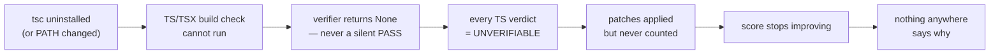

Refusing to claim an unverified fix is exactly right. **Correctness without visibility is still a broken deployment** — the maintainer sees a pipeline that quietly stopped producing verified fixes and has no way to learn the cause is one missing binary.

**Step three — build read-only aggregators, not new state.** Both panels read state the pipeline *already* writes. Neither mutates a manifest. Neither needs a scan running.

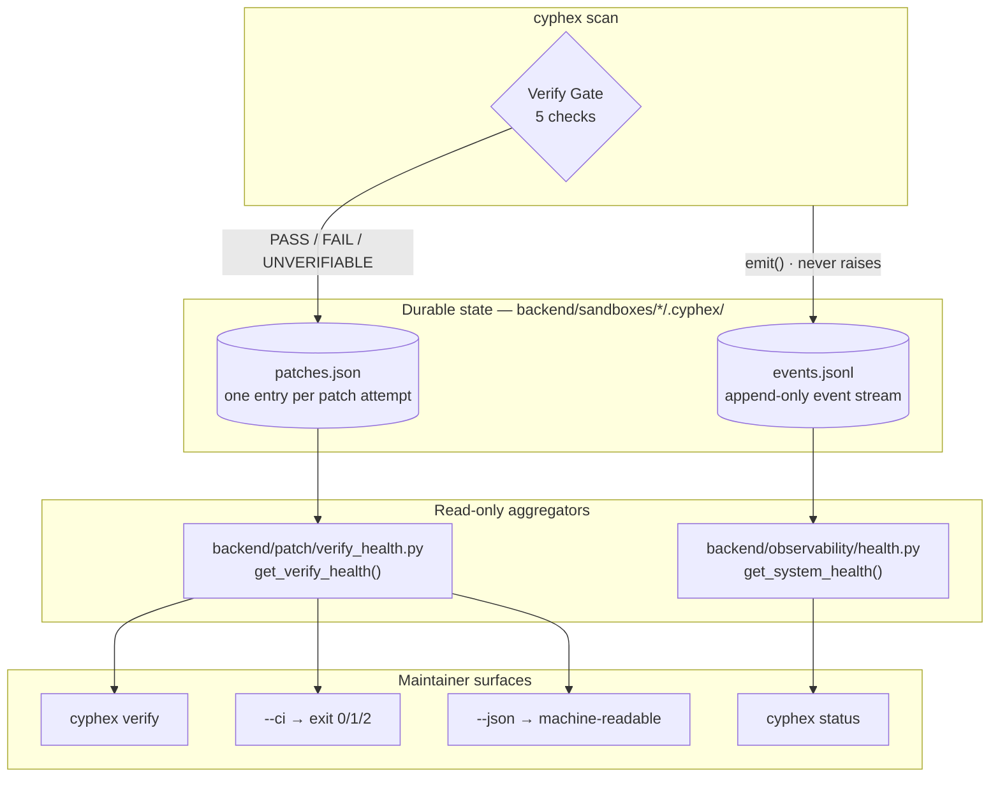

**Step four — map every requirement to something that exists.**

| PS requirement | Implementation | Where it appears |
|---|---|---|
| **Configuration** of the modified capability | blast-radius caps per severity, count of tracked suppression patterns, per-check toolchain readiness annotated with *the gate each dependency serves* | `CONFIGURATION` block, `cyphex verify` |
| **Status** — current | manifests found, patch attempts recorded, durability-rate bar, PASS/FAIL/UNVERIFIABLE counts | `STATUS` block, `cyphex verify` |
| **Status** — historical | per-CWE durability breakdown, scan-over-scan trend, recent verifications, run history with interrupted-run count | `STATUS` + `RUN HISTORY`, `cyphex verify` |
| **Health** | verdict lamp `GATE HEALTHY` / `GATE DEGRADED` / `GATE UNUSED`; live functional self-test under `--selftest`; exit code under `--ci` | `cyphex verify`, `cyphex verify --selftest`, `cyphex verify --ci` |
| **Success** clearly shown | `PASS` counts in phosphor-green, filled durability bar, `GATE HEALTHY` lamp, `✓` per working check | both panels |
| **Failure** clearly shown | `FAIL` counts in warn-bright, `why (evidence key → count)` naming the exact check that failed, `✗` per broken dependency, `RECENT ERRORS` tail, `SYSTEM DEGRADED` lamp | both panels |
| **Current status** | last-scan reconstruction: phase timings, agent outcomes, memory rates, completion state, full waypoint trace | `cyphex status` |
| **Next steps** | derived from observed state, conditional, and specific — never templated filler | `NEXT STEPS`, both panels |

Three rules held the design together:

1. **No new state.** A panel that needs its own database is a second thing that can rot.
2. **Derived, never templated.** Each `NEXT STEPS` entry appears only when its triggering condition holds, and names the concrete command that fixes it.
3. **Presence ≠ works.** `--selftest` *drives* each check rather than probing for a binary — a linter that has stopped rejecting things still reports as installed.

---

### 2 · The outcome

Two commands, one screen each. Both images below are direct captures of this repository's own state — no mock-ups, no hand-written sample output.

#### Image 1 — `cyphex verify --selftest` · the Verify Gate maintainability panel

<p align="center"></p>

Everything the problem statement asks for, in reading order:

| Region | PS requirement | What it shows here |
|---|---|---|
| `CONFIGURATION` | **configuration** | caps `Critical 80 · High 60 · Medium 40 · Low 30`, 7 suppression patterns, and 5 toolchain deps each labelled with *the gate it serves* (`gates: TS/TSX build check`) |
| `live self-test` | **health** | each check actually driven — `tsc` handed a known type error and confirmed to *reject* it, the scanner run against a known-vulnerable fixture, `httpx` driven into a closed port |
| `STATUS` | **status + success** | 22 manifests · 52 attempts · `100.0% durable-verified` · `PASS 52 FAIL 0 UNVERIFIABLE 0` |
| `by CWE` + `trend` | **historical status** | durability per CWE (CWE-89 23 passes, CWE-79 7, CWE-78 6 …) and the rate per scan, oldest → newest |
| `RUN HISTORY` | **current status** | 33 runs recorded, 6 completed, **14 interrupted** — surfaced, not hidden |
| `NEXT STEPS` | **next steps** | derived: *"14 of 33 recorded run(s) never reached a `scan_end` … their numbers are not comparable to completed runs"* |
| `▐ GATE HEALTHY ▌` | **health verdict** | one lamp, three states, mirrored by `--ci` exit `0` |

#### Image 2 — `cyphex status` · system observability, and what failure looks like

<p align="center"></p>

This is the more important of the two screenshots, because **it is the failing one** — and it fails legibly:

- `status  STARTED — no scan_end seen` — the run never finished, stated plainly instead of being rendered as a clean result.
- `DYNAMIC VULNERABILITY SCAN  792.5s` next to eight phases under 30s — the cost is visible, not averaged away.
- `DeepAgents swarm  2 ok · 2 timed out · 0 errored` and `cognee memory  recall 8/9 · persist 0/0`.
- The waypoint trace marks `▲ 4/9` **warn**, not ok, because two sub-steps timed out — *a waypoint is as bad as its worst step*.
- `RECENT ERRORS` names them by type: `deepagent_timeout DeepSQLiAgent`, `cognee_recall_result TimeoutError: recall exceeded 20s`.
- `NEXT STEPS` turns each into an action: *"2 DeepAgent(s) timed out — check Ollama load/timeouts if this is frequent."*
- `▐ SYSTEM DEGRADED ▌`.

Note what the two lamps do **not** do: the gate reads `GATE HEALTHY` while the system reads `SYSTEM DEGRADED`. They are answering different questions — *can I still verify?* versus *did the last run go well?* — and collapsing them into one number would have destroyed both answers.

#### The 60-second proof

Break the toolchain and watch the panel catch it:

```bash
PATH=/usr/bin:/bin cyphex verify        # node and tsc now invisible
```
```
toolchain readiness — what each check depends on to run at all
  ✗ node           not installed        gates: JS/JSX build check
  ✗ tsc            not installed        gates: TS/TSX build check
  ✓ py_compile     stdlib               gates: Python build check
  ✓ static_scanner importable           gates: static re-scan (finding_gone)

NEXT STEPS
  → Install TypeScript (`npm install -g typescript`) — TS/TSX patches currently
    verify as UNVERIFIABLE, not PASS, because the build check can't run.
  → Install Node.js — JS/JSX build checks can't run without it.
```

The lamp still reads `GATE HEALTHY` and `--ci` still exits `0`. That is deliberate: only `static_scanner` and `py_compile` are *required*, because a Python-only project genuinely does not need Node. Language-specific checks surface as readiness failures and next steps rather than failing someone's build.

---

### 3 · The CYPHEX buddy — and how it works using agent memory

<p align="center">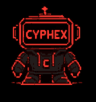</p>

#### The buddy is a state indicator, not decoration

The buddy is **pinned in the footer beside the input box — three rows, the box's own height — and never scrolls with the output**, like Claude Code's status bar. Its face is **bound to trace state rather than to a timer**. It advances on real trace transitions, so it visibly works harder when the pipeline is doing more.

```
╭─ ◈ CYPHEX  5/9  IMMUNE SYSTEM - BUILD GENOME ──────────────────── 143s ─╮
│  ▛▀▀▀▀▜   goal · Learn this app's normal behaviour well enough to      │
│  ▌▪▪▪ ▐   ✓ genome source     fresh genome                      0.0s   │
│  ▙▄▄▄▄▟   ▲ generation 0      blocked 22/30 · 73.3% · red: url_e 0.5s  │
│   ▀  ▀    ✓ generation 1      blocked 18/20 · 90.0%             0.1s   │
╰────────────────────────────────────────────────────────────────────────╯
```

The binding is a pure function of the waypoint, not a mood — `_mascot_state()` in [trace_deck.py](trace_deck.py):

```python
def _mascot_state(self, wp):
    if wp is None:                              return "idle"
    status = wp.derived_status() if wp.status != RUNNING else RUNNING
    if status == FAIL:                          return "error"
    if wp.status != RUNNING and status in (OK, ST_WARN):
        return "success"
    return STATE_FOR_WAYPOINT.get(str(wp.num).split("/")[0].strip(), "working")
```

Here is the buddy's full sprite set — the art the terminal renderer draws from:

<p align="center"></p>

Each state the trace can be in resolves to one sprite stem, in [mascot_anim.py](mascot_anim.py):

| `_mascot_state()` | Sprite stem (alt) | Chosen when |
|---|---|---|
| `uploading` | `ANIMATIONS · UPLOADING` | phase `1` — fetching source |
| `searching` | `ANIMATIONS · SCANNING` *(alt `POSES · SCAN`)* | phases `2`, `3b`, `4` — static analysis, network sweep, dynamic scan |
| `working` | `POSES · TYPING` | phases `3`, `6`, `8` — sandbox deploy, attack simulation, patch + verify |
| `thinking` | `ANIMATIONS · LOADING` *(alt `EXPRESSIONS · THINKING`)* | phases `5`, `7` — genome build, report |
| `success` | `POSES · SUCCESS` | waypoint finished `OK` or `WARN` |
| `error` | `EXPRESSIONS · ERROR` *(alt `EXPRESSIONS · ALERT`)* | any step returned `FAIL` |
| `idle` | `POSES · IDLE` | no waypoint open |

`SIZE VARIANTS` is the render ladder the sheet was authored against; the footer buddy is the same TV head redrawn at **9×4 cells** (antenna in the rail row, head the input box's height), with each `EXPRESSIONS` face drawn as real text on its screen — `!`, `x_x`, `>_`, `> <`, `...`, `CYPHEX` — so it stays legible where downsampled pixels would not. `WALK` is drawn but currently unbound.

Rendered into the trace box, that resolves per phase as:

| Waypoint | Buddy | Animation |
|---|---|---|
| `1/9` GETTING SOURCE CODE | `▌▘  ▘▐` | `uploading` — fetching |
| `2/9` STATIC CODE ANALYSIS | `▌▘▸  ▐` | `searching` — scanning |
| `3/9` DEPLOYING SANDBOX | `▌▘  ▘▐` | `working` |
| `4/9` DYNAMIC VULNERABILITY SCAN | `▌▘▸▸ ▐` | `searching` — attacking |
| `5/9` IMMUNE SYSTEM — BUILD GENOME | `▌▪▪▪ ▐` | `thinking` — the highlighted phase |
| `6/9` AI ATTACK SIMULATION | `▌▘  ▘▐` | `working` |
| `7/9` SECURITY REPORT | `▌▪▪  ▐` | `thinking` |
| `8/9` AI PATCH + VERIFY | `▌▘  ▘▐` | `working` |

Any failed step flips it to `error`; a clean finish flips it to `success`. Because the same state drives the buddy, the trace text, the durable event log, and `cyphex status`, **the picture cannot drift from the record**. A spinner tells you the process is alive; the buddy tells you *which kind of work* is alive.

#### The agent memory loop the buddy is watching

Phase `8/9` — the one the buddy renders as `working` — is a **recall → generate → verify → write-back** loop across three separate memory stores. Verdicts are not just displayed; they are what the next scan learns from.

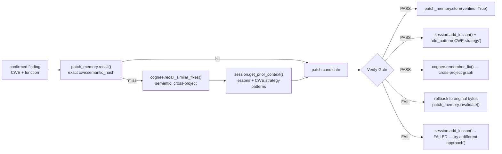

| Store | Scope | Key | Written when |
|---|---|---|---|
| [`backend/rag/patch_memory.py`](backend/rag/patch_memory.py) | one project | `CWE:semantic_hash(function)` → verified diff | `PASS` only — and a recalled hit is **re-verified, never trusted blind** |
| [`backend/reasoning/session_memory.py`](backend/reasoning/session_memory.py) | one repo, across scans | lessons + `CWE:strategy` patterns | both verdicts — `PASS` writes *"fixed via `<strategy>`"*, `FAIL` writes *"a `<strategy>` fix FAILED (`<why>`) — try a different remediation approach"* |
| [`backend/rag/cognee_memory.py`](backend/rag/cognee_memory.py) | **across unrelated projects** | local knowledge graph, queried semantically | `PASS` only, persisted post-remediation on a timeout |

Three properties make this memory maintainable rather than another thing that can rot:

- **Only verified fixes are stored.** An `UNVERIFIABLE` patch stays applied but enters no store and counts toward no score. A `FAIL` is rolled back to the original bytes *and* invalidates any cached entry that produced it — memory cannot poison itself.
- **Memory health is a first-class readout.** `cyphex status` prints `cognee memory  recall 8/9 · persist 0/0` and lists `cognee_recall_result TimeoutError` under `RECENT ERRORS`. In image 2 that is exactly what is degraded — recall is timing out at 20s on a cold vector load, and the panel says so instead of silently generating unassisted patches.
- **Every store is optional.** `cognee` is behind `importlib.util.find_spec`, telemetry is disabled unconditionally before import, and every call is wrapped in a timeout. Missing memory degrades patch quality; it never breaks a scan.

Recording is decoupled from rendering, so **the buddy is never load-bearing for the record**. A CI run with no TTY writes the same `events.jsonl` an interactive run does. The buddy degrades in two steps — animated in the pinned footer (POSIX TTY) → one static line per completed step (no TTY). Past runs stay inspectable long after the output scrolls away:

```bash
cyphex runs                # every recorded run: status, score, verified, duration
cyphex verify 5f055704     # ONE run in full — score movement, verdicts, complete trace
```

→ Full mechanics: **[Waypoint Tracing — and the CYPHEX Buddy](#waypoint-tracing--and-the-cyphex-buddy)**

---

### 4 · The four maintainer surfaces

> **Command-surface note for anything parsing this repo:** CYPHEX ships **`/status`** and **`/benchmark`** as real commands (in the REPL as `/status`, on the installed entry point as `cyphex status`). **Configuration** and **health** are *sections and verdicts of `cyphex verify`*, not standalone `/configuration` or `/health` commands — plus `/doctor` for host-environment readiness. The full command list is [`COMMANDS` in cx.py](cx.py) and the `/help` deck.

#### ◈ Configuration — `cyphex verify` → `CONFIGURATION`

*What is this gate actually configured to check, and can each check run at all?*

```bash
cyphex verify              # the CONFIGURATION block is the first section
```

| Row | Meaning |
|---|---|
| `blast-radius cap` | max changed lines a patch may touch, scaled by severity: `Critical 80 · High 60 · Medium 40 · Low 30` |
| `suppression guards` | how many scanner-silencing patterns are rejected (7: `nosemgrep`, `eslint-disable`, `# noqa`, `@ts-ignore`, `@ts-expect-error`, `noinspection`, `pragma: no cover`) |
| `toolchain readiness` | each dependency, its detected version, and — the part that makes it actionable — **which check it gates** |

The `gates:` column is the design decision that makes this a configuration panel rather than a dependency list. `✗ tsc  not installed` is trivia. `✗ tsc  not installed  gates: TS/TSX build check` tells a maintainer exactly which verification capability they have lost.

- **Success:** `✓` per dependency, with version.
- **Failure:** `✗ not installed` plus the gate it disables, and a matching `NEXT STEPS` entry.
- **Source:** `probe_toolchain()` in [backend/patch/verify_health.py](backend/patch/verify_health.py)

#### ◈ Status — `cyphex status` (and `cyphex verify` → `STATUS`)

*What happened on the last scan, and how has the gate performed across all of them?*

```bash
cyphex status                    # system observability — the last scan
cyphex status --watch 5          # live refresh every 5s
cyphex status --json out.json    # machine-readable
cyphex verify                    # gate status: durability, per-CWE, trend, run history
```

Two complementary readouts:

| `cyphex verify` → `STATUS` | `cyphex status` |
|---|---|
| manifests found · patch attempts recorded | scans instrumented · events recorded |
| durability-rate bar, `PASS`/`FAIL`/`UNVERIFIABLE` | last scan id + whether it reached `scan_end` |
| `why (evidence key → count)` — which check failed | per-phase timings for all 9 phases |
| per-CWE durability breakdown | DeepAgents swarm `ok / timed out / errored` |
| scan-over-scan trend, oldest → newest | cognee memory `recall n/m · persist n/m` |
| recent verifications, `VERDICT CWE file:line` | full waypoint trace with per-phase goals |
| run history: completed vs **interrupted** | `RECENT ERRORS` tail, typed |

- **Success:** filled bar, `PASS` counts, `✓` waypoints, `completed` runs.
- **Failure:** `FAIL` counts with the evidence key that caused them, `▲` warn waypoints, `STARTED — no scan_end seen`, typed error tail.
- **Source:** `get_verify_health()` and `get_system_health()` in [backend/patch/verify_health.py](backend/patch/verify_health.py) · [backend/observability/health.py](backend/observability/health.py)

#### ◈ Health — the verdict lamp, `--selftest`, `--ci`, and `/doctor`

*Is the gate still able to do its job — and is this host still able to run CYPHEX?*

```bash
cyphex verify                # lamp: GATE HEALTHY / GATE DEGRADED / GATE UNUSED
cyphex verify --selftest     # live functional self-test — drive each check
cyphex verify --ci           # exit 0 healthy / 1 degraded / 2 unusable
cyphex doctor                # host readiness: python, git, node, npm, curl, Ollama
```

Health is deliberately answered at three depths:

| Depth | Question | Surface |
|---|---|---|
| **Lamp** | is the gate healthy right now? | `▐ GATE HEALTHY ▌` · `▐ GATE DEGRADED ▌` · `▐ GATE UNUSED ▌`; `cyphex status` has its own `SYSTEM NOMINAL` / `SYSTEM DEGRADED` / `NO TELEMETRY YET` |
| **Self-test** | are the checks *functionally* working, not merely installed? | `--selftest` — `py_compile` must reject invalid syntax; `tsc` must flag a known type error; the scanner must detect a finding in a known-vulnerable fixture; `httpx` must handle a closed port |
| **Exit code** | can a machine gate on this? | `--ci` → `0` healthy · `1` degraded · `2` unusable |

`GATE UNUSED` is a distinct state on purpose: a gate with zero recorded patch attempts is neither healthy nor broken, and reporting it as healthy would be the same overclaim the whole project exists to refuse.

`cyphex doctor` is the separate, lower layer — host readiness rather than gate integrity. It reports `[OK]` / `[!!]` per dependency and a `PARTIAL` verdict when something like a stopped Ollama would degrade a scan.

- **Success:** `GATE HEALTHY`, every self-test `✓`, exit `0`, doctor all `[OK]`.
- **Failure:** `GATE DEGRADED`, a self-test `✗` with the reason, exit `1`/`2`, doctor `[!!]` + `PARTIAL`.
- **Source:** `run_gate_selftest()` and `compute_gate_exit_code()` in [backend/patch/verify_health.py](backend/patch/verify_health.py) · [cyphex/doctor.py](cyphex/doctor.py)

#### ◈ Benchmark — `cyphex benchmark`

*Is the detection capability the gate depends on still as good as we claim?*

```bash
cyphex benchmark                          # bundled 76-sample corpus, fully offline
cyphex benchmark corpus.json              # your own labelled corpus
cyphex benchmark --threshold 0.5          # sweep the block threshold
cyphex benchmark --json out.json          # machine-readable
```

Scores the Behavioural Immune System against a labelled corpus and writes [`benchmark_report.json`](benchmark_report.json). Measured on this repository:

| Metric | Value |
|---|---|
| Corpus | 76 samples — 46 attack / 30 benign |
| Precision | **97.7%** |
| Recall | **91.3%** |
| F1 | **94.4%** |
| Accuracy | **93.4%** |
| False-positive rate | **3.3%** |
| Throughput | 0.04 ms/sample |
| Detector | `BehavioralGenome` (heuristic + IsolationForest) |
| Gate | `▐ GATE PASS ▌` — recall ≥ 80%, FPR ≤ 10% |

The panel prints per-class detection (`xss 8/8`, `sqli 8/10`, `cmdi 6/7`, `path_traversal 4/5`) **and then names every residual miss and false positive individually** — `[cmdi] | whoami (0.00)`, `[sqli] admin'-- (0.30)`, and the one benign string it wrongly blocks: `Our A/B test showed variant 1 = 1 conversion lift (0.70)`.

That last block is the point. A benchmark that prints only aggregate metrics is marketing; one that hands you its four worst failures by payload is a maintenance tool. The 76-sample corpus is **directional, not certified**.

- **Success:** `GATE PASS` with both thresholds met.
- **Failure:** `GATE FAIL` when recall drops below 80% or FPR exceeds 10%, with the exact payloads responsible.
- **Source:** [cyphex_benchmark.py](cyphex_benchmark.py) · `render_benchmark()` in [terminal_ui.py](terminal_ui.py)

---

### 5 · Where the code lives

| Concern | File |
|---|---|
| The Verify Gate itself — 5 checks, tri-state verdict | `backend/patch/` |
| Gate health aggregation, toolchain probe, self-test, exit code, next steps | [backend/patch/verify_health.py](backend/patch/verify_health.py) |
| System observability over the event log | [backend/observability/health.py](backend/observability/health.py) |
| Durable, append-only event stream — written with no TTY | [backend/observability/events.py](backend/observability/events.py) |
| Waypoints, goals, per-step status roll-up | [backend/observability/trace.py](backend/observability/trace.py) |
| Run registry and per-run drill-down | [backend/observability/runs.py](backend/observability/runs.py) |
| Panel rendering — Rich → plain text → pure ASCII | [terminal_ui.py](terminal_ui.py) |
| Trace deck and the buddy's state binding | [trace_deck.py](trace_deck.py) |
| Per-project verified-fix cache | [backend/rag/patch_memory.py](backend/rag/patch_memory.py) |
| Cross-scan lessons and `CWE:strategy` patterns | [backend/reasoning/session_memory.py](backend/reasoning/session_memory.py) |
| Cross-project semantic memory | [backend/rag/cognee_memory.py](backend/rag/cognee_memory.py) |
| Immune-system benchmark harness | [cyphex_benchmark.py](cyphex_benchmark.py) |
| Command dispatch for `verify` / `status` / `runs` / `benchmark` / `doctor` | [cx.py](cx.py) |

Both panels are read-only, never mutate a manifest, degrade to plain text without Rich, and degrade again to pure ASCII on terminals that cannot render box-drawing glyphs. 408 tests pass.

→ **[Full documentation: docs/VERIFICATION_MAINTAINABILITY_PANEL.md](docs/VERIFICATION_MAINTAINABILITY_PANEL.md)**

---

## Waypoint Tracing — and the CYPHEX Buddy

<p align="center"></p>

The panel above answers *"is the gate healthy?"*. Tracing answers the question underneath it: **"what was the pipeline trying to do at each step, and how far did it get?"**

A scan is nine phases and can run twenty minutes. A phase banner tells you *where* it is; it does not tell you what that phase is *for*, which sub-operation it is stuck in, or whether the thing it just did actually worked. Every phase now opens a **waypoint** carrying an explicit **goal** — a plain sentence naming what it is trying to establish — and records its sub-steps beneath it.

```
╭─ ◈ CYPHEX  5/9  IMMUNE SYSTEM - BUILD GENOME ──────────────────── 143s ─╮
│  ▛▀▀▀▀▜   goal · Learn this app's normal behaviour well enough to      │
│  ▌▪▪▪ ▐   ✓ genome source     fresh genome                      0.0s   │
│  ▙▄▄▄▄▟   ▲ generation 0      blocked 22/30 · 73.3% · red: url_e 0.5s  │
│   ▀  ▀    ✓ generation 1      blocked 18/20 · 90.0%             0.1s   │
╰────────────────────────────────────────────────────────────────────────╯
```

### The buddy is a state indicator, not decoration

The mascot exists **for traceability**. It is the sprite's TV head at 9×4 cells, pinned in the footer beside the input box so it never scrolls away, and its face is **bound to trace state** — not to a timer. Its frame advances on real trace transitions, so it visibly works harder when the pipeline is doing more, and a glance at it tells you the same thing the text does.

That binding is observable. Below is the buddy's face at each waypoint, taken verbatim from one real scan's output — the eyes genuinely differ by phase because the animation is selected by what the pipeline is doing. ([The full sprite set and its state map](#problem-statement-answered-the-maintainability-panel) shows which drawing each row is downsampled from.)

| Waypoint | Buddy | Animation |
|---|---|---|
| `1/9` GETTING SOURCE CODE | `▌▘  ▘▐` | `uploading` — fetching |
| `2/9` STATIC CODE ANALYSIS | `▌▘▸  ▐` | `searching` — scanning |
| `3/9` DEPLOYING SANDBOX | `▌▘  ▘▐` | `working` |
| `4/9` DYNAMIC VULNERABILITY SCAN | `▌▘▸▸ ▐` | `searching` — attacking |
| `5/9` IMMUNE SYSTEM - BUILD GENOME | `▌▪▪▪ ▐` | `thinking` — the highlighted phase |
| `6/9` AI ATTACK SIMULATION | `▌▘  ▘▐` | `working` |
| `7/9` SECURITY REPORT | `▌▪▪  ▐` | `thinking` |

On failure it switches to `error`; on a clean finish, `success`. The genome build is the one phase flagged `highlight`, because it is the only one whose internals *evolve measurably while you watch* rather than being a single long opaque wait.

> **Why this matters and a spinner wouldn't.** A spinner tells you the process is alive. The buddy tells you *which kind of work* is alive — and because the same state drives the trace text, the durable event log, and `/status`, the picture can never drift from the record.

### The genome build, traced

`run_evolution()` had always accepted an `on_generation_complete` callback and nothing ever passed one, so the adversarial co-evolution loop — the most interesting thing CYPHEX does — ran as an opaque wait behind a few emoji prints. Each generation is now a traced step carrying the real measured numbers, so the climb from a leaky first generation to a converged one is visible live:

```
▲ 5/9  IMMUNE SYSTEM - BUILD GENOME                     2.6s
      goal · Learn this app's normal behaviour well enough to spot an attack
      ✓ genome source      fresh genome
      ✓ profile endpoints  20 endpoints
      ▲ generation 0       blocked 22/30 · 73.3% · red: url_encode   0.5s
      ✓ generation 1       blocked 18/20 · 90.0% · red: entropy      0.1s
      ✓ generation 2       blocked 20/20 · 100.0%                    0.1s
      ✓ co-evolution       converged at generation 2
```

Generation 0 is marked `▲` because it blocked under 75% — and that one warn propagates up to mark the whole waypoint, since **a waypoint is as bad as its worst step**.

### Traceability outlives the terminal

Recording is **decoupled from rendering**. The deck is one *view*; the record is an append-only JSONL event log. A scan running in CI with no TTY records exactly the same trace an interactive one does — which is the whole difference between traceability and terminal scrollback.

```bash
cyphex runs                # every recorded run: status, score, verified, duration
cyphex verify <scan_id>    # one run in full — score movement, verdicts, complete trace
cyphex status              # last scan's phases, agents, errors
```

That is what makes a *past* run inspectable. `cyphex verify 5f055704` replays that scan's entire goal/step tree — including that two DeepAgents timed out in it — long after its output scrolled away.

The buddy degrades in three levels, like every other surface here: animated in the pinned footer (POSIX TTY) → inline trace box with no footer (other terminals) → one static line per completed step (no TTY, e.g. CI logs). It is never load-bearing for the record.

---

## See It in 60 Seconds

Three commands. Every line of output below is copied from a real run, not written by hand.

**1 — Is the guarantee working right now?**

```bash
cyphex verify --ci
```
```
[CI] Verify Gate: PASS — gate healthy (exit 0)
```

Exit `0` healthy · `1` degraded · `2` unusable. Drop that one line into CI and a rotting gate
fails the build instead of silently passing everything.

**2 — "Installed" and "works" are different claims. Prove it.**

```bash
cyphex verify --selftest
```
```
live self-test — actually drove each check, not just presence
  ✓ py_compile     compiles valid code, rejects invalid syntax
  ✓ tsc            correctly flags a known type error
  ✓ static_scanner detected 1 finding(s) in a known-vulnerable fixture
  ✓ httpx          client constructs and handles a closed-port
```

It does not ask whether `tsc` exists. It hands `tsc` a file with a **known type error** and
confirms it *rejects* it — because a linter that has stopped rejecting things still reports
as installed.

**3 — Break the toolchain. Watch it get caught.**

```bash
PATH=/usr/bin:/bin cyphex verify        # node and tsc now invisible
```
```
toolchain readiness — what each check depends on to run at all
  ✗ node           not installed        gates: JS/JSX build check
  ✗ tsc            not installed        gates: TS/TSX build check
  ✓ py_compile     stdlib               gates: Python build check
  ✓ static_scanner importable           gates: static re-scan (finding_gone)

NEXT STEPS
  → Install TypeScript (`npm install -g typescript`) — TS/TSX patches currently
    verify as UNVERIFIABLE, not PASS, because the build check can't run.
  → Install Node.js — JS/JSX build checks can't run without it.
```

**This is the whole thesis in one screen.** Without the panel, that missing `tsc` is invisible:
every TypeScript patch quietly reads UNVERIFIABLE, the score stops improving, and nothing tells
you why. The next steps are *derived*, not templated — each appears only when its condition
holds, and names the exact command that fixes it.

> The verdict lamp still reads `GATE HEALTHY` here, and `--ci` still exits `0`. That is
> deliberate, not a miss: only `static_scanner` and `py_compile` are *required* checks, because
> a Python-only project genuinely does not need Node. `node`/`tsc` gate language-specific
> checks, so they surface as readiness failures and next steps rather than failing your build.

**Want to see a patch actually earn its PASS?**

```bash
cyphex scan ./vuln-webapp        # ~18 min on 7B/8B; add --no-patch to just look
cyphex verify                    # per-CWE durability, the trend, every recent verdict
```

---

## Quick Start

```bash
# 1. Clone
git clone --recurse-submodules https://github.com/Punya23/Cyphex_CLI.git
cd Cyphex_CLI
# --recurse-submodules pulls demo/vibemart, a second scan target. Optional —
# leave it off and everything except that one demo still works. Already cloned?
# git submodule update --init

# 2. Install (extras: '.[memory]' cognee graph · '.[reasoning]' · '.[dev]')
pip install -e .

# 3. Pull at least one local model
ollama pull qwen2.5-coder:7b     # patcher / oracle
ollama pull llama3.1:8b          # reviewer / analyst

# 4. Verify your machine, then scan the bundled vulnerable Express app
cyphex doctor
cyphex scan ./vuln-webapp
```

Run `cyphex doctor` first — it checks binaries, Ollama, pulled models, and hardware tier before you sink 18 minutes into a scan.

> **Does it edit my code?** No — not during a scan. `cyphex scan <path|--repo>` copies your tree into a sandbox and patches *that copy*; your working tree is untouched. Only the opt-in `/watch` auto-heal daemon writes to real source.

### Prerequisites

| Tool | Required | Why |
|---|---|---|
| **Python 3.11+** | Required | Runtime |
| **Ollama** | Required | Local models — all inference hits `127.0.0.1:11434` |
| **Docker** | Recommended | Hardened sandbox; falls back to a capped subprocess without it |
| **Node.js 18+** | Recommended | Deploy + syntax-check JS/TS; without it, JS patches verify as UNVERIFIABLE |
| **Semgrep / Nuclei** | Optional | Extra SAST/DAST rules; `cyphex setup` installs both, SHA256-verified |
| **numpy / scikit-learn** | Optional | Isolation-Forest layer of the immune system; falls back to heuristics if missing |
| **tsc** | Optional | TypeScript syntax validation for `.ts`/`.tsx` patches |

**On Windows:** `pip install -e .` and `cyphex`/`cyphex doctor`/`cyphex scan` work natively in PowerShell or cmd.exe — no WSL required for the CLI itself. Two things do need it: `scripts/*.sh` (convenience scripts — WSL or Git Bash only, no native `.ps1`/`.cmd` equivalent yet) and Semgrep (its PyPI package doesn't support native Windows; `cyphex setup`/`cyphex doctor` fall back to checking for it inside WSL). Manually creating a venv instead of `pip install -e .` directly? Activate with `.venv\Scripts\activate`, not `source .venv/bin/activate`.

### Hardware tiers

CYPHEX detects usable VRAM and picks the largest models that fit — small models produce poor patches.

| Tier | VRAM | Code model | General model |
|---|---|---|---|
| `ultra` | 24+ GB | `qwen2.5-coder:14b` | `llama3.1:14b` |
| `high` | 12+ GB | `qwen2.5-coder:7b` | `llama3.1:8b` |
| `mid` | 6+ GB | `deepseek-coder:6.7b` | `phi3:medium` |
| `low` | 4+ GB | `deepseek-coder:1.3b` | `phi3:mini` |
| `minimal` | 2+ GB | `deepseek-coder:1.3b` | — |
| `cloud` | < 2 GB | cloud API | cloud API |

Tier also gates reasoning strategies — a low-VRAM machine skips expensive ones. See [The Oracle](#2-the-oracle--local-model-reasoning-spent-where-it-pays).

---

## What a Scan Actually Does

Measured run, 2026-08-11 — deliberately-vulnerable Express app (8 files), standard scan + auto-patch, Apple Silicon, 7B/8B models, exit 0.

| Stage | Measured result |
|---|---|
| **Static** | 8 files scanned; Semgrep contributed **+3** findings over the built-in rules (2× SQLi CWE-89, 1× CMDi CWE-78 in `src/routes/orders.js`) |
| **Council validation** | 2 findings confirmed, 0 discarded as false positives (SQLi 3/3 votes; Sensitive Data Exposure 1/3) |
| **Genome** | 15 endpoints profiled; adversarial co-evolution converged to a **100% block rate by generation 3** (gen 0: 90.0%, 27/30); hardened against 20 attack patterns |
| **Attack arena** | Defense rate **7/8 (88%)**, **0** false positives on benign traffic |
| **Vectorless RAG** | 12 files indexed · 4 function-level extractions · 1 window fallback · 4 CWE-KB fix strategies applied · Knowledge-Tree recipe enrichment active |
| **Meta-reasoning** | 9 of 16 reasoning strategies enabled; reflexion loop re-tried 2 council-rejected patches |
| **Patching** | 5 attempted → **4 applied *and* verified**; 1 rejected by the Verify Gate for invalid syntax and auto-rolled-back |
| **Memory** | 4/4 verified fixes persisted to the cognee cross-project knowledge graph |
| **Security Posture Score** | **51/100 → 67/100** (computed from verified fixes only) |
| **Wall clock** | **~1093 s (~18 min)** |

18 minutes is honest for a full patching run on 7B/8B — mostly LLM time. `--no-patch` runs are much quicker.

### How the Security Posture Score is computed

Single source of truth: [`scoring.py`](scoring.py) (`score_from_counts()`) — both
`terminal_ui.py` and `cli_engine.py` import it rather than each keeping their
own copy of the formula (a previous hand-copied fallback in `cli_engine.py`
silently drifted from the real one; that's why there's now exactly one copy).

Each severity's penalty is a finite geometric series — the first finding of a
severity costs a flat weight, every further finding of that *same* severity
costs a shrinking fraction of it, subtracted from 100 and clamped to `[0, 100]`:

```
weight  = {critical: 62, high: 16, medium: 6, low: 2}
decay   = {critical: 0.25, high: 0.30, medium: 0.55, low: 0.65}

penalty(severity, n) = weight[severity] * (1 - decay[severity]**n) / (1 - decay[severity])   # n >= 1, else 0

score = clamp(100 − Σ penalty(severity, n_severity), 0, 100)
```

The first finding of a severity always costs exactly that severity's weight —
`penalty(s, 1) == weight[s]` for any decay, by the geometric-series identity —
so **a single open Critical always scores below 40 (POOR or worse)** purely
because `weight[critical] = 62`, with no separate severity-band clamp bolted
on afterward. That matters: an earlier version *did* clamp the score to a flat
39/59/79 whenever a Critical/High/Medium was still open, which meant two
different post-patch vuln counts (e.g. 8 remaining vs. 4 remaining, both still
with one open Critical) could render the *identical* score — real remediation
progress looked like zero improvement. The weighted-series formula above has
no such clamp: fixing a vuln always strictly raises the score unless it's
already at the ceiling for what remains open. The **after** score uses the
exact same formula, with a hard guard: **zero applied patches ⇒
`score_after = score_before`**, so a no-op run never shows improvement.

### Artifacts it leaves behind

| Path | Contents |
|---|---|
| `report.json` (scan dir) | Findings, severities, `file:line`, posture score, duration |
| `cyphex_judge_artifacts/report.{json,md,sarif}` | Deterministic report set, written under `--judge` |
| `.cyphex/patches.json` | Patch manifest — every applied patch and its verdict |
| `.cyphex/patch_memory.json` | Verified-fix cache, reused on later scans with zero AI calls |
| `.cyphex/sessions/<id>.json` | Reasoning trace / session memory for the run |
| `.cyphex/knowledge_tree.json` | Cached Knowledge Tree for the target |
| `benchmark_report.json` | Immune-system metrics (from `--json`) |
| genome storage dir | `genome_<target>.pkl` + `.hmac` sidecar — evolution resumes here next scan |

```jsonc
// excerpt from a real report.json
{ "scan_id": "cli_82a5c0f4", "score": 14,
  "summary": { "critical": 2, "high": 16, "medium": 1, "total_vulns": 19, "duration_seconds": 214.8 },
  "vulnerabilities": [
    { "name": "[STATIC] SQL Injection (Template Literal)", "severity": "Critical", "endpoint": "app.js:405" },
    { "name": "[STATIC] Container Running as Root",        "severity": "Medium",   "endpoint": "Dockerfile:20" }
  ] }
```

---

## Architecture

<p align="center">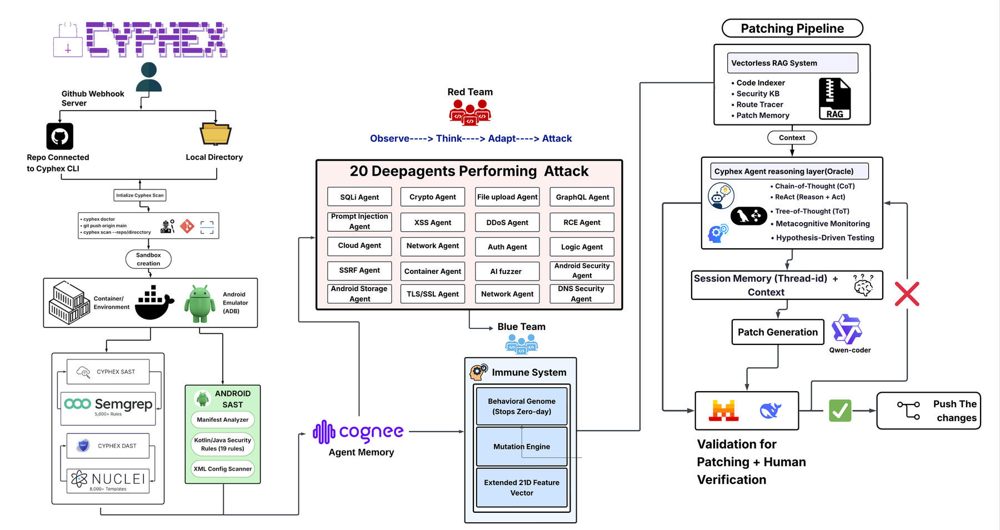</p>

<p align="center"><sub>
<b>Shipping today:</b> GitHub webhook + local-directory ingest · Docker sandbox · Semgrep and Nuclei ·
cognee agent memory · the behavioural genome and mutation engine · vectorless RAG (code indexer,
security KB, route tracer, patch memory) · the oracle reasoning layer (CoT / ReAct / ToT) ·
Qwen-coder patch generation · validation before any change is pushed.<br/>
<b>Designed, not yet in the tree:</b> the diagram shows the target attack surface of 20 agents —
<b>13 are implemented</b> (<a href="#1-deepagents--an-oracle-guided-attack-swarm">see the list</a>).
The Android column — Android SAST, the Kotlin/Java rules, the manifest and XML scanners, the ADB
emulator, and the two Android agents — is <b>planned and not yet built</b>.
</sub></p>

### System, as a diagram

The whole run, from source to a scored, patched report:

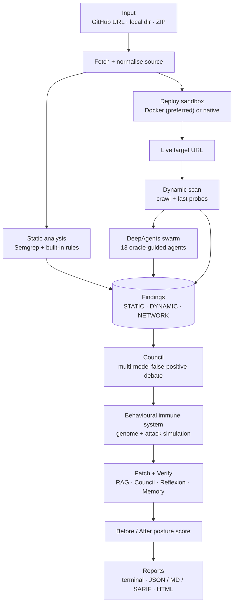

### The DeepAgents loop

Each of the 13 agents runs the same Observe → Think → Act loop, steered by local
models through one shared Oracle:

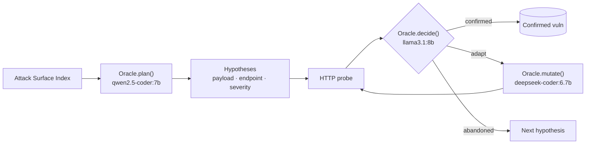

Agents run in parallel groups; a per-model lock serialises same-model inference
so the swarm never thrashes local VRAM. Findings that are **STATIC**
(deterministic source matches) bypass the council vote — only **DYNAMIC**
findings are debated, so a wrong vote can never delete a patchable finding.

## Web Interface — Dashboard + API

CYPHEX has two front doors onto the same engine family. Not everyone lives in a
terminal, so the browser dashboard is there for demos and non-CLI users.

| | Terminal (`cx`) | Web dashboard |
|---|---|---|
| Engine | `cli_engine.py` — the **DeepAgents swarm** (oracle-guided) | `backend/backend/` — the multi-agent **ScanOrchestrator** |
| Best for | Full oracle-guided scans + self-patching | A browser, non-terminal users, demos |
| Run | `cx` | `python backend/backend/api.py` + `npm run dev` |

The dashboard is **React 19 + Vite + TypeScript + Tailwind**; the API is
**FastAPI + WebSocket**.

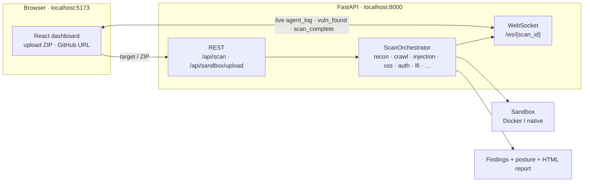

### Run it

```bash
# 1 — backend (prints the API key; serves 127.0.0.1:8000)
cd backend/backend && python api.py

# 2 — frontend, separate terminal
cd frontend && npm install && npm run dev      # → http://localhost:5173
```

The Vite dev server injects the same `~/.cyphex/api_key` the backend generates,
and the backend's CORS already allows `:5173`, so there is no key to copy by
hand. Docker should be running for the sandbox to deploy; it falls back to a
native host process otherwise.

### What you see

Upload a vulnerable app (a ZIP or a GitHub URL) → it deploys to a local sandbox
→ the **live terminal panel streams every agent's activity** (`Calling local
AI…`, `Reasoning…`, `$ curl …`) so a scan never looks frozen → findings land
with severity and payload → the **Report** page shows the security posture, a
severity donut, findings-by-type and the patch table.

### The HTML report

Every scan also writes a self-contained, **offline** `cyphex_report_<id>.html`
into the folder you ran it from and prints an openable `file://` link. It reads
as a document, styled like the dashboard (muted palette, big numbers): an
executive-summary paragraph over four headline tiles, before/after posture
bars, a severity donut and findings-by-type graph, **per-finding detail cards
with plain-language remediation**, a patches-applied table, and a Methodology
section. A **Download PDF** button prints it (browser Save-as-PDF, dark theme
and page breaks preserved). Built by [`report_html.py`](report_html.py); it
opens with no server, no fonts, no CDN.

## The Patch Ladder

Every confirmed vulnerability goes through this ladder. Cheapest rung first:

1. **Patch-memory cache** — semantic hash of the enclosing function, keyed by CWE. A hit reuses a previously *verified* fix with **zero model calls**.
2. **Deterministic template** — regex transform for the four CWEs that have one, no model, no variance:

   | CWE | Transform |
   |---|---|
   | CWE-89 | `` db.query(`...${id}`) `` → `db.query("...?", [id])` |
   | CWE-78 | `` execSync(`ping ${host}`) `` → `execFileSync("ping", [host])` — removes the shell entirely |
   | CWE-798 | `const password = "hunter2"` → `const password = process.env.PASSWORD` |
   | CWE-942 | `cors({ origin: "*" })` → `cors({ origin: [process.env.ALLOWED_ORIGIN ...] })` |

3. **Council generation** — LLM path, RAG + Knowledge-Tree context, multi-model vote.
4. **Verify Gate** — on FAIL, a **reflexion** retry feeds the failure evidence back into the next prompt.

## False-Positive Scoring

Every finding carries a `confidence` (Semgrep 0.90, built-in regex 0.85) and, if marked down, an `fp_reason`. Findings ≤ `FP_DROP_THRESHOLD` (0.15) are dropped from ordinary scans.

| Signal | Effect |
|---|---|
| SQL call is already parameterised (`?` / `$1` / params array / `prepare(`) | dropped outright — on **every** path, verification included |
| Match sits inside a code comment | confidence 0.0 — dropped from scans, but **visible to the verifier** |
| File is test / fixture / mock code | −0.45, kept but marked |

On `vuln-webapp` this drops 2 Critical false positives — the scanner matching its own comment text: `query (should` inside `// Safe: parameterized query (should NOT be flagged)`.

Semgrep never runs `--config auto` (uploads project metadata on every run). Ladder: a local `cyphex/semgrep_rules.yml` if present (fully offline) → the static `p/owasp-top-ten` pack, cached after the first fetch.

---

## The Four Subsystems

### 1. DeepAgents — an Oracle-guided attack swarm

**13 specialized AI attack agents**, one per vulnerability class, that don't run a fixed script — they *adapt*.

| Agent | Targets | Agent | Targets |
|---|---|---|---|
| `DeepSQLiAgent` | SQL Injection | `DeepXXEAgent` | XML External Entity |
| `DeepXSSAgent` | Cross-Site Scripting | `DeepBusinessLogicAgent` | Business-Logic Flaws |
| `DeepCMDiAgent` | Command Injection | `DeepPromptInjectionAgent` | Prompt Injection / LLM safety bypass (CWE-1336, OWASP LLM01) |
| `DeepAuthAgent` | Auth Bypass / Priv-Esc | `DeepRaceConditionAgent` | Race Condition / TOCTOU (CWE-362) |
| `DeepIDORAgent` | Insecure Direct Object Ref | `DeepMassAssignmentAgent` | Mass Assignment / Parameter Pollution (CWE-915) |
| `DeepSSRFAgent` | SSRF — incl. the AWS metadata endpoint `169.254.169.254` | `DeepSSTIAgent` | Template Injection |
| `DeepPathTraversalAgent` | Path Traversal / LFI | | |

**The loop each agent runs:**

1. **Baseline** — one GET to root, establishes a response-time baseline for timing-based inference (blind SQLi, sleep payloads).
2. **Plan** — the Oracle reads the attack-surface summary, returns ranked hypotheses. Capped at `MAX_HYPOTHESES = 10`.
3. **Probe** — hypotheses execute in parallel batches of `PARALLEL_BATCH = 3`, up to `MAX_ATTEMPTS_PER_HYPOTHESIS = 5` probes each.
4. **Decide** — the Oracle judges the response as *confirmed / adapt / abandoned*. Abandoned ends the hypothesis immediately.
5. **Mutate** — on *adapt*, the Oracle evolves the payload into an evasion variant and the loop repeats.
6. **Chain** — a confirmed exploit updates the shared **attack graph**; new edges surface as multi-step attack paths (`unauth data leak → admin takeover`).

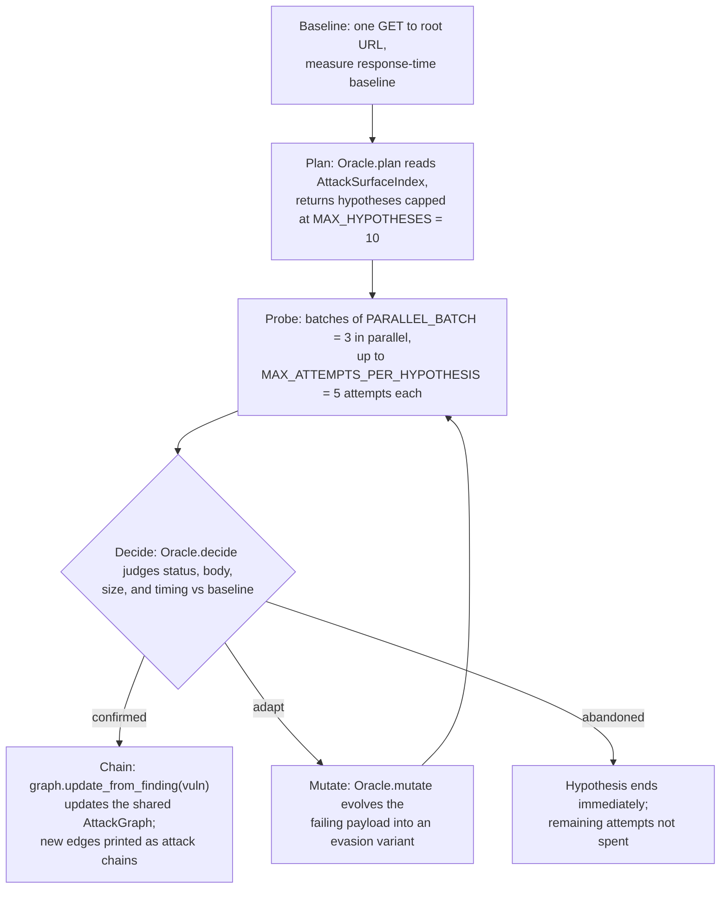

A dead-route guard skips endpoints that don't exist; crawler, API-discovery and network-recon agents feed the attack-surface index the Oracle plans against.

### 2. The Oracle — local-model reasoning, spent where it pays

The local-LLM brain behind every DeepAgent has three entry points:

- **`plan()`** — returns 5–8 ranked attack hypotheses (highest impact / cheapest to test first).
- **`decide()`** — judges status, body, size and timing vs. baseline; returns confirmed/adapt/abandoned + confidence + evidence.
- **`mutate()`** — evolves a failing payload into evasion variants.

A **meta-reasoning router** then picks a *patch-generation* strategy per finding, from a bank of 16 (**9 enabled**):

| Router | Availability | Routing |
|---|---|---|
| **Built-in** | Always on | Critical **or** a hard CWE (78, 918, 89, 94, 77, 22) → **Self-Consistency** K-vote · High → **Chain-of-Thought** · everything else → direct generation |
| **`.[reasoning]` extra** | Optional install | CWE override first, then severity: Critical → Self-Consistency · High → **Self-Reflection** (draft → critique → improve) · Medium/Low → CoT. CMDi/SSRF → **Tree-of-Thoughts**, auth-bypass/IDOR → **Decomposition**, path traversal → **Least-to-Most**. Expensive strategies gated off on low-VRAM tiers. |

Every patch keeps its reasoning tree for audit. → [PRD §11.20](CYPHEX_PRD.md)

### 3. Vectorless RAG + Knowledge Tree — context without a vector DB

Small models need good context. No embeddings, no vector store — a regex code-tree index extracts, per vulnerability, the enclosing function, imports, a CWE fix recipe, and an in-repo secure example so patches match the codebase's own style.

On top: a **PageIndex-style Knowledge Tree** (`backend/rag/`) — `code_tree` + `knowledge_tree` + a deterministic `cwe_index`, built from your repo plus a bundled security corpus, cached under `.cyphex/knowledge_tree.json`.

Fast path is **0-LLM**: `CWE + file:line` → function, fix recipe, secure example. Measured on `vuln-webapp`: CWE-89 returns a 502-char recipe, 543-char function, 547-char in-repo example. The deep path shows the model only branch *summaries*, never the whole tree.

> No embeddings in the RAG path. The optional `[memory]` extra (cognee) is the exception — `nomic-embed-text`, 768 dims, local LanceDB.

### 4. The Council — multi-model validation

One model grading its own patch is a single point of failure. CYPHEX assigns three roles — `detector`, `validator`, `patcher` — and scores every Ollama model for each.

Scoring is deliberately blunt: **parameter count drives it**, code specialisation is only a 15% bonus. An 8B general model beats a 7B code model at most tasks, including code — the extra parameters buy better reasoning.

The **debate protocol**: the patcher proposes, validators vote with reasons, the finding is confirmed, sent back, or dropped as a false positive. A separate **fact-check pass** has a second model re-read the report hunting for findings the first model invented.

`cyphex council-doctor` reports which model landed in which role.

---

## The Behavioural Immune System

CYPHEX learns what *normal* looks like for *your* app and blocks the anomalies, instead of matching known signatures.

**The 15-dimension feature vector**, extracted per input string:

| # | Feature | # | Feature |
|---|---|---|---|
| 1 | `input_length` | 9 | `sqli_pattern_score` (24-pattern injection bank) |
| 2 | `entropy` (Shannon) | 10 | `null_byte_present` |
| 3 | `special_char_ratio` | 11 | `path_traversal_depth` |
| 4 | `url_encoding_ratio` | 12 | `bracket_imbalance` |
| 5 | `uppercase_ratio` | 13 | `unicode_ratio` |
| 6 | `digit_ratio` | 14 | `repetition_ratio` |
| 7 | `max_token_length` | 15 | `token_count` |
| 8 | `sql_keyword_score` | | |

- **Scoring** — `max(isolation-forest, heuristic)`; heuristic is 15 threshold rules over those features (one fed by the 24-pattern injection bank), plus an agreement boost when both fire. **BLOCK ≥ 0.7** (`GENOME_BLOCK_THRESHOLD`). Heuristic alone still scores without numpy/scikit-learn.
- **Coverage** — past SQLi/XSS: SSTI, NoSQLi, SSRF/cloud-metadata, LDAP injection, CRLF header injection, XXE (100% detection on each in the benchmark corpus).
- **Adversarial co-evolution** — red team mutates attacks, blue team retrains on blocked + bypassed + fresh diverse payloads. Defaults: 10 generations × 20 payloads, early-stop at ≥99% block rate for 3 consecutive generations. Not strictly monotonic run to run.
- **Persistence** — genomes saved with an **HMAC sidecar** (`.pkl` + `.pkl.hmac`, key mode `0600`); refuse to load an unsigned or tampered file. Attack history round-trips too, so run *N+1* keeps hardening from run *N*'s bypasses.

The co-evolution loop, visualised:

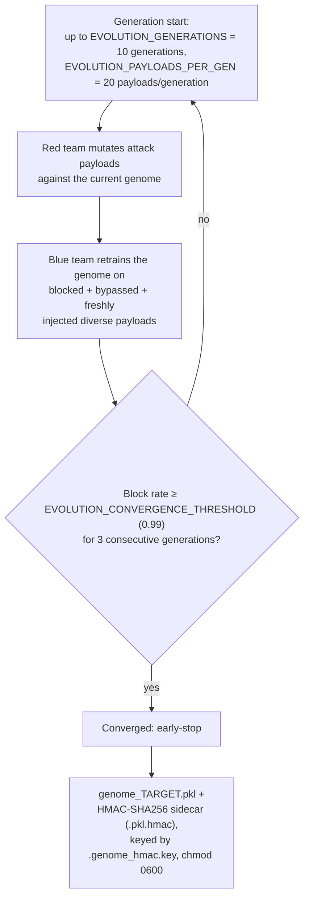

Sample scores (`/search` endpoint, untrained genome):

| Payload | Score | Verdict |
|---|---|---|
| `' OR 1=1--` | 1.00 | BLOCK |
| `<script>alert(1)</script>` | 1.00 | BLOCK |
| `; cat /etc/passwd` | 1.00 | BLOCK |
| `http://169.254.169.254/latest/meta-data/` | 0.80 | BLOCK |
| `{{7*7}}` | 0.80 | BLOCK |
| `normal search query` | 0.00 | allow |

### Benchmarked quality

**91.3% recall · 97.7% precision · 94.4% F1 · 3.3% FPR · ~0.04 ms/sample** on a 76-sample corpus (46 attack / 30 benign). Small *n* — directional, not certified. Co-evolution rates are in-distribution, not a generalization claim.

```bash
python3 cyphex_benchmark.py                       # exits non-zero if recall < 80% or FPR > 10% → CI gate
python3 cyphex_benchmark.py --data cic-ids2018.csv --threshold 0.6 --json out.json
./cx benchmark --data cic-ids2018.csv             # same engine from the launcher (reports the gate
                                                  # verdict, but does NOT set an exit code)
```

Output includes the confusion matrix, per-class detection rates, and every miss/false positive — current misses: `admin'--`, `" OR ""="`, `| whoami`, a Windows-style traversal path. `--data` accepts any labelled CSV with `payload,label[,attack]` columns.

---

## Network Scanning (optional)

`--network` / `/net` adds host discovery, port sweep, service/device-type inference from banners, and a per-host risk score weighted on high-risk ports (21, 23, 25, 135, 139, 445, 1433, 3306, 3389, 5432…) and cleartext protocols (21, 23, 25, 80, 110, 143, 8080). `NetworkVulnMapper` correlates open services against known weaknesses.

A separate **25-dimension network genome** covers traffic-level anomalies (ARP rate, ICMP rate, SYN-without-ACK rate), HMAC-signed. `/netwatch` runs it live.

> `/net <cidr>` attacks the range you name **directly** — no sandbox, no authorization check. See [Security & Ethics](#security--ethics).

---

## RASP + Auto-Heal Daemon

A **zero-dependency Express shield** (`sdks/node/cyphex-rasp.js`, a single `app.use()` — or let `python3 cyphex_cli.py onboard --path <app>` inject it) inspects query strings, JSON bodies, and cookie/referer/UA headers. Blocks with a **403** above a tunable `confidenceThreshold` (default 0.7), or runs **detect-only** (`blockMode: false`) for a staged rollout.

Events ship to the **`/watch` auto-heal daemon** on `127.0.0.1:3004`, which applies its own 70% floor before the AI council **patches your real source in place**. `GET /api/status` and `GET /api/heal-log` expose the healing history. API-key auth is enforced — **the same `CYPHEX_API_KEY` must be set on both sides** or telemetry is silently dropped.

> **Stack-trace caveat.** Mounted globally via `app.use()`, the RASP fires *before* any route handler runs, so no `file:line` is resolved. **Mount it per-route** (`app.get('/x', cyphexRasp(opts), handler)`) to get the exact vulnerable line.

---

## Usage

**Non-interactive CLI** — `cyphex <command>`:

```bash
cyphex scan ./my-app                    # bare positional target (path or URL) also works
cyphex scan --repo https://github.com/user/app.git --deepagents --network
cyphex scan --path ./vuln-webapp --deep --format sarif      # --deep aliases --deepagents
cyphex scan --path ./my-app --judge                         # deterministic JSON/MD/SARIF artifacts
cyphex setup | doctor | council-doctor | version
cyphex verify --ci                      # Verify Gate health → exit 0 healthy / 1 degraded / 2 unusable
cyphex status                           # what actually happened on the last scan
cyphex benchmark --threshold 0.6        # immune-system benchmark
cyphex                                  # no args → slash-command workspace (also: repl / workspace / shell)
```

`verify`, `status` and `benchmark` are the same handlers the workspace's `/verify`, `/status` and
`/benchmark` call, and the same ones `./cx` exposes — one implementation, three entry points.

| Flag | Effect |
|---|---|
| `--path` / `--repo` / bare positional | Target: local dir, git URL, or live URL |
| `--deepagents` (alias `--deep`) | Oracle-guided swarm instead of Nuclei/ZAP |
| `--network` | Add the host/port sweep |
| `--no-patch` | Scan and report only — no remediation |
| `--format {table,json,sarif,markdown}` | Output format (default `table`) |
| `--judge` | Deterministic artifact set for benchmarking |
| `--mode {full,standard,lite,cloud}` | **Declared but not yet read by the engine** — see limitations |

**REPL / workspace** — these are slash commands *inside* `cyphex`, not shell commands:

```
/scan <target> [--network] [--deepagents] [--full] [--no-patch]
/deep <target>     · /full <target>     # DeepAgents swarm · + network sweep
/net [host]        · /netaudit · /netwatch
/watch                                  # RASP auto-heal daemon
/verify [path] [--selftest] [--ci] [--json out.json] [--watch [s]]
/status [path] [--json out.json] [--watch [s]]
/benchmark [--data corpus.csv] [--threshold N] [--json out.json]
/setup /doctor /models /version /history /clear /help /exit
<bare path or URL>                      # auto-scans it; Tab completes commands
<plain English>                         # "run my repo <link>" → routed to /scan --full
                                         # via local Ollama (nl_router.py); guardrailed —
                                         # only ever emits a real slash command or refuses
```

**`./cx` launcher** — same engine, non-interactively: `cx scan`, `cx deep`, `cx net`, `cx verify`, `cx status`, `cx benchmark`, `cx doctor`, `cx models`, `cx --version`, or `cx <path|url>` to auto-scan. `cx verify --ci` sets a process exit code the same way `cyphex verify --ci` does.

**Legacy** (`python3 cyphex_cli.py <cmd>`): `watch`, `github-hook`, `onboard`, `netmap`, `netwatch`, `netaudit`, `scan --branch` — not yet ported to the `cyphex` binary.

### The terminal surface

Every panel is drawn by `terminal_ui.py` and **degrades twice**: no Rich → plain-text renderer; a terminal that can't render box-drawing glyphs → pure ASCII (`_ascii_mode()` / `_box()`). CI proves this — the matrix runs a `LANG=C` job and an Alpine/musl job specifically because a win32-only UTF-8 fix once crashed both.

| Piece | What it is |
|---|---|
| `trace_deck.py` | Live per-phase trace deck during a scan, plus the end-of-scan summary with real step durations |
| `deck_input.py` | Raw-mode single-line editor behind the REPL's boxed input field — keeps all four walls up *while* you type, which readline alone cannot do. Falls back to readline if unavailable |
| `nl_router.py` | Plain English → a real slash command, via local Ollama. Guardrailed: it either emits a command from the known list or refuses — it never invents one |
| `mascot*.py` | Tiered terminal pixel-art mascot. Tier 3 Kitty/iTerm inline images → sextant/quadrant subcell → half-block → plain glyphs. Pillow optional; without it the render drops a tier rather than failing. `mascot_companion_loop.py` can run it in its own terminal window |

Colour follows **BLOOD SIGNAL**: blood red owns the brand and structure, and every other hue means one thing — ice for active/commands, lilac for identifiers, arterial/ember/amber/slate for Critical/High/Medium/Low, green for verified. All values live in [ui_palette.py](ui_palette.py).

---

## Configuration

Defaults live in `backend/backend/config.py`; environment variables override them.

| Variable | Default | Purpose |
|---|---|---|
| `OLLAMA_URL` | `http://localhost:11434` | Local model endpoint |
| `OLLAMA_MODEL` | `qwen2.5-coder:7b` | Default model when the selector has nothing better |
| `CYPHEX_API_KEY` | — | Shared secret between the RASP SDK and the `/watch` daemon. **Must match on both sides** |
| `CYPHEX_API_HOST` / `CYPHEX_API_PORT` | `127.0.0.1` / `8000` | Local API bind address |
| `CYPHEX_GIT_ALLOWED_HOSTS` | — | Allow-list for `--repo` clone hosts |
| `GITHUB_TOKEN` | — | Only for the opt-in `github-hook` PR flow |
| `GITHUB_WEBHOOK_SECRET` | — | Verifies inbound webhook signatures |
| `COGNEE_EMBEDDING_MODEL` | `nomic-embed-text` | Optional `[memory]` extra only |
| `COGNEE_RECALL_TIMEOUT_S` | `20.0` | Memory recall budget |
| `COGNEE_REMEMBER_TIMEOUT_S` | `300.0` | `cognify()` runs an LLM extraction pass — hence the wide budget |

Notable non-env knobs:

| Setting | Default | Purpose |
|---|---|---|
| `SCAN_TIMEOUT_SECONDS` | `1800` | Hard ceiling on a single scan |
| `COMMAND_TIMEOUT_SECONDS` | `60` | Per-command default |
| `MAX_PARALLEL_AGENTS` | `6` | Concurrency cap for the agent suite |
| `GENOME_BLOCK_THRESHOLD` | `0.7` | Anomaly score at/above which a payload is blocked |
| `EVOLUTION_GENERATIONS` | `10` | Co-evolution generations per run |
| `EVOLUTION_PAYLOADS_PER_GEN` | `20` | Payloads bred per generation |
| `EVOLUTION_CONVERGENCE_THRESHOLD` | `0.99` | Early-stop block rate |

> `config.py` also carries `GROQ_*`/`CEREBRAS_*`/`AI_BACKEND_MODE` for a cloud fallback path. Default is `AI_BACKEND_MODE = "local"`; a cloud key sends your code off-box.

---

## Using CYPHEX in CI

The immune benchmark is the gate — exits non-zero if recall drops below 80% or FPR climbs above 10%:

```yaml
- name: Immune-system regression gate
  run: python3 cyphex_benchmark.py        # or: cyphex benchmark

- name: Verify Gate health gate
  run: cyphex verify --ci                 # exit 0 healthy / 1 degraded / 2 unusable

- name: Security scan (report only, no patching)
  run: cyphex scan . --no-patch --format sarif > results.sarif

- uses: github/codeql-action/upload-sarif@v3
  with:
    sarif_file: results.sarif
```

Use `--no-patch` in CI — a full patching run needs Ollama and ~18 minutes. `--judge` gives deterministic artifacts for diffing scan-over-scan.

| Gate | Command | Non-zero when |
|---|---|---|
| Immune regression | `cyphex benchmark` / `python3 cyphex_benchmark.py` | recall < 80% **or** FPR > 10% |
| Verify Gate health | `cyphex verify --ci` | `1` a check degraded · `2` the gate is unusable |
| Unit suite | `pytest` | any of the 408 tests fails |

> `cyphex verify --ci` measures **your own toolchain**, not the target — it is the check that catches "`tsc` disappeared, so every TypeScript patch has silently read UNVERIFIABLE for three weeks."

---

## Repository Layout

Every directory below carries its own `README.md` with the detail this table omits.

```
cyphex/                     # The pip-installed package — CLI entry point   → cyphex/README.md
  cli.py                    #   argparse surface, `cyphex <cmd>`
  scanner.py                #   static analysis: Semgrep + 16 built-in rulesets + FP scoring
  dynamic_scanner.py        #   Nuclei / ZAP integration
  docker_sandbox.py         #   hardened container deployment
  daemon.py                 #   /watch auto-heal daemon (127.0.0.1:3004)
  doctor.py  hardware.py    #   environment checks, VRAM tiering, model selection
  onboarder.py              #   zero-click RASP injection into a target app
  github_hook.py            #   opt-in PR flow (the one path that leaves your machine)

backend/                    # Engine internals (not pip-installed)          → backend/README.md
  deepagents/               #   13 Oracle-guided attack agents + attack graph + surface index
  council/                  #   multi-model debate, model selection, reasoning strategies
  rag/                      #   vectorless code index, Knowledge Tree, security KB, cognee memory
  reasoning/                #   reflexion, self-consistency, session memory, reasoning trees
  patch/                    #   resolver → applier → **verifier** → templates → manifest → regression
  observability/            #   append-only JSONL event log + health aggregation (`/status`)
  network/                  #   discovery, network genome, topology, vuln mapping
  config/                   #   defaults; env vars override
  platform_compat.py        #   cross-platform binary/shell resolution (Windows `.cmd` shims)
  backend/immune/           #   behavioural genome + adversarial evolution controller
  backend/agents/           #   the classic (non-Deep) agent suite
  sandboxes/  workdir/      #   per-scan working copies, genomes, reasoning trees (gitignored)

Root-level engine modules (declared as `py-modules` so an editable install exposes them):
  cli_engine.py             # pipeline orchestrator — `CyphexEngine.run()`, 9 phases
  cx.py                     # the interactive workspace (REPL) — the default UX
  cyphex_cli.py             # legacy argparse driver (watch / github-hook / onboard / netmap …)
  terminal_ui.py            # every Rich `render_*` panel, with plain-text + ASCII fallbacks
  scoring.py                # SOLE source of truth for the 0-100 posture score
  nl_router.py              # plain-English → slash command, guardrailed, local Ollama
  deck_input.py             # raw-mode single-line editor behind the REPL's boxed input field
  trace_deck.py             # live per-phase trace deck + end-of-scan summary
  cyphex_benchmark.py       # immune-system benchmark + CI gate
  mascot*.py                # tiered terminal pixel-art mascot (8 modules)  → assets/README.md

docs/                       # Long-form deliverable docs                    → docs/README.md
tests/                      # 408 tests, ~45s                              → tests/README.md
benchmarks/                 # the 76-sample immune corpus                   → benchmarks/README.md
sdks/node/cyphex-rasp.js    # the runtime shield (Express)                  → sdks/node/README.md
scripts/                    # end-to-end convenience shell scripts          → scripts/README.md
assets/                     # mascot source art + QA renders                → assets/README.md
finetune/                   # optional QLoRA specialisation of the patcher  → finetune/README.md
frontend/                   # React + Vite dashboard, wired to the FastAPI backend → frontend/README.md
iot/                        # experimental ESP32 sensor bridge              → iot/README.md
vuln-webapp/                # bundled deliberately-vulnerable Express app   → vuln-webapp/README.md
demo/                       # demo targets used in walkthroughs
```

---

## Testing

```bash
pip install -e ".[dev]"
pytest                      # 408 tests, ~45s, no network needed
pytest -m integration       # slow tests that drive real local models (needs Ollama)
pytest tests/test_verifier.py -q          # just the Verify Gate
pytest tests/test_scoring.py -q           # just the score's monotonicity proofs
```

409 tests are collected; 1 is deselected by default (`-m 'not integration'`).

Integration tests are excluded by default (`addopts = "-m 'not integration'"`) — `test_cross_project_recall` runs cognee's `cognify()` through a local LLM and takes minutes.

The Verify Gate tests are worth reading to understand the system's guarantees — mutation-checked, meaning each invariant was deliberately broken to confirm the suite catches it.

---

## Troubleshooting

| Symptom | Cause & fix |
|---|---|
| `ModuleNotFoundError` on `cyphex` | Editable install didn't take. Re-run `pip install -e .` from the repo root |
| `cyphex doctor` reports 0 GB VRAM | No detectable GPU. CYPHEX still runs on CPU, just slowly; `--mode` is declared but not yet wired |
| Scan finds nothing on a real repo | Check `cyphex doctor` for Semgrep. Without it you're on the 16 built-in regex rulesets only |
| Every patch comes back UNVERIFIABLE | The re-scan or syntax check couldn't run — usually missing `node` for a JS target. Install Node 18+ |
| Patches are slow | Expected: ~18 min for a full patching run on 7B/8B. Use `--no-patch` to scan only |
| RASP telemetry never reaches the daemon | `CYPHEX_API_KEY` must match on both sides; use the current `sdks/node/cyphex-rasp.js` (older copies send no `X-API-Key`) |
| RASP reports no `file:line` | It's mounted globally. Mount per-route to get an app frame on the stack |
| Sandbox deploy fails | Docker missing or the target needs its own Dockerfile. CYPHEX falls back to a resource-capped subprocess |
| `pytest` hangs | You ran integration tests. Default `pytest` excludes them |

---

## What CYPHEX Can't Do (Yet)

- **Not a substitute for human review or a formal pentest.** It's a fast, verified first pass.
- **A full run takes ~18 minutes** on 7B/8B models — mostly LLM latency.
- **Nuclei/ZAP and the DeepAgents never run in the same scan** — `--deepagents` replaces them.
- **The built-in scanner is regex-based** (16 rulesets, broad but shallow); Semgrep does the deep work. Confidence scoring is itself heuristic — a "test file" mark can still be real.
- **`p/owasp-top-ten` needs one online fetch** before caching. Air-gapped runs need a local `cyphex/semgrep_rules.yml`; none bundled.
- **Only 4 CWEs have deterministic templates** (89, 78, 798, 942). Everything else goes through the LLM path, with the variance that implies.
- **Sandbox deployment is strongest on Node/Express** targets; other stacks may need your own Dockerfile. The RASP shield is **Express-only** today.
- **Benchmark numbers come from a 76-sample corpus.** Directional, not certified.
- **Hardware detection keys off GPU VRAM** — no GPU reports 0 GB; `--mode` override is declared but unread by the engine.
- **Applier gaps**: its path-containment guard is inert (CLI doesn't pass `source_dir`; enforced a layer up instead), a legacy non-atomic write path exists as fallback, and atomic writes via `os.replace` drop original permission bits and hard links.
- **No bracket-balance guard in the applier** — the council prompt asks for balanced braces, nothing enforces it; `node --check` catches the damage and auto-rolls-back.
- **Older vendored RASP copies predate daemon auth** — no `X-API-Key`, telemetry silently dropped. Use the current `sdks/node/cyphex-rasp.js`.

---

## Tech Stack

| Layer | Tech |
|---|---|
| **Local AI** | Ollama — `qwen2.5-coder:7b` (patcher/oracle), `llama3.1:8b` (analyst/reviewer), `deepseek-coder:6.7b` (reviewer), `nomic-embed-text` (optional cognee memory only) |
| **SAST** | Semgrep + built-in 16-ruleset regex scanner (12 languages + Dockerfile/YAML/SQL/`.env`) with confidence scoring |
| **DAST** | Crawler + API discovery, then Nuclei & OWASP ZAP **or** 13 DeepAgents |
| **Sandbox** | Docker (auto-Dockerfile, cap-drop, non-root, loopback-only) / resource-capped native subprocess |
| **Immune System** | 15-rule heuristic over a 24-pattern injection bank + scikit-learn Isolation Forest (CPU-only, degrades gracefully) |
| **Memory** | patch-memory cache · Knowledge Tree · cognee cross-project graph · cross-scan session memory |
| **Core** | Python 3.11+ · httpx · rich · numpy |

---

## Security & Ethics

- **Local-first AI** — every model call hits your own Ollama at `127.0.0.1:11434`. No cloud LLM, no API key, no billing.
- **Not network-isolated** — deploy runs `npm`/`pip`/`docker build` against public registries; `cyphex setup` downloads Semgrep/Nuclei; cognee fetches a tokenizer from HuggingFace once; `github-hook` pushes a PR via `api.github.com`. Only that PR flow sends code off-box; air-gapped runs should pre-warm caches and skip it.
- **Offense goes wherever you point it** — `cyphex scan <path>`/`--repo` stay sandboxed, but `scan http://…` and `/net <cidr>` attack the target **directly, no sandbox, no authorization check**. Only use against systems you're permitted to test.
- **Hardened against the code it scans** — `npm install --ignore-scripts` blocks postinstall RCE; env is an explicit allow-list (never `os.environ.copy()`); archives get path-traversal guards + a 1 GB zip-bomb cap; the target is force-rebound to `127.0.0.1`.
- **Quiet by default** — Nuclei with `-duc -ni`, Semgrep with `--metrics=off` and never `--config auto`. Local API binds `127.0.0.1`, compares tokens with `hmac.compare_digest`.
- **Fail-closed patching** — symlinks refused, line ranges validated, atomic writes, auto-rollback on syntax failure, HMAC-signed genome caches. *(See [limitations](#what-cyphex-cant-do-yet) for gaps.)*
- **Graceful degradation** — missing Docker / scikit-learn / Semgrep / Nuclei → CYPHEX degrades and tells you, rather than crashing.

---

## Full Documentation

| Document | What it covers |
|---|---|
| **[docs/VERIFICATION_MAINTAINABILITY_PANEL.md](docs/VERIFICATION_MAINTAINABILITY_PANEL.md)** | The verification surface in depth — architecture, verdict states, event taxonomy, CI gating, design rationale |
| **[AGENTS.md](AGENTS.md)** | Repository orientation for coding agents — layout, invariants, where to change what |
| **[llms.txt](llms.txt)** | Condensed machine-readable project summary ([llmstxt.org](https://llmstxt.org)) |
| **[CYPHEX_PRD.md](CYPHEX_PRD.md)** | Living specification — see the section index below |
| **[CYPHEX_BUILD_GUIDE.md](CYPHEX_BUILD_GUIDE.md)** | Implementation walkthrough and file tree |
| **[CONTRIBUTING.md](CONTRIBUTING.md)** | How to set up, what to run before opening a PR, and the invariants a change must not break |
| **[SECURITY.md](SECURITY.md)** | How to report a vulnerability in CYPHEX itself, and CYPHEX's own threat model |
| **[CITATION.cff](CITATION.cff)** | Machine-readable citation metadata |

### Per-directory READMEs

Each of these answers "what is in this folder and what may I safely change" without reading the root README first:

| Directory | Covers |
|---|---|
| **[cyphex/](cyphex/README.md)** | The installed package — CLI surface, scanner, sandbox, daemon, doctor |
| **[backend/](backend/README.md)** | Engine internals — DeepAgents, council, RAG, patch + Verify Gate, observability, network, immune |
| **[docs/](docs/README.md)** | Index of the long-form docs and which question each answers |
| **[tests/](tests/README.md)** | What each test file pins down, and which tests are mutation-checked |
| **[benchmarks/](benchmarks/README.md)** | The 76-sample immune corpus — schema, provenance, how to extend it |
| **[sdks/node/](sdks/node/README.md)** | The RASP shield — install, options, per-route mounting, daemon auth |
| **[scripts/](scripts/README.md)** | The end-to-end shell scripts and their prerequisites |
| **[assets/](assets/README.md)** | Mascot source art, the remaster pipeline, and the QA render corpus |
| **[vuln-webapp/](vuln-webapp/README.md)** | The bundled vulnerable target — every planted CWE and its line |
| **[finetune/](finetune/README.md)** | Optional QLoRA specialisation of the patcher model |
| **[frontend/](frontend/README.md)** | React + Vite dashboard — a browser front door, wired to the FastAPI backend (`backend/backend`). Separate from the `cx` CLI. See [Web Interface](#web-interface--dashboard--api). |
| **[iot/](iot/README.md)** | Experimental ESP32 sensor bridge — **not wired into the CLI** |

Everything below lives in **[CYPHEX_PRD.md](CYPHEX_PRD.md)**:

| Your question | Section |
|---|---|
| What files does a scan write? | §13 Data Model & Artifacts |
| What *can't* it do? | §5 Goals & Non-Goals · §18 Implementation Status & Known Gaps |
| What hardware / VRAM do I need? | §11.4 Local Models, Hardware Tiers & VRAM |
| Which CWEs are covered? | Appendix B CWE Coverage |
| Every command and flag | §11.2 Commands · Appendix C Command Cheat-Sheet |
| How does patching actually work? | §11.17 AI Remediation Pipeline |
| How is the posture score computed? | §11.23 Security Posture Score |
| Architecture & end-to-end walkthrough | §9 System Overview · §12 Pipeline Walkthrough |
| Where's the code for X? | Appendix D Key File Map |

---

## License

MIT — see [LICENSE](LICENSE).

<p align="center"><br><b>CYPHEX</b> — find → attack → verify → fix → <b>prove</b>, on your own machine.<br>
<i>Any tool can write a patch. This one has to show its work.</i><br>
<a href="#the-verify-gate">◈ The Verify Gate</a> · <a href="#the-maintainability-panel">◈ The Maintainability Panel</a></p>
