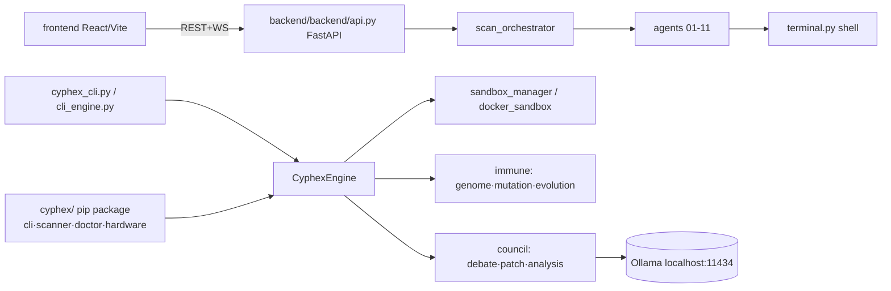

I'll perform a full audit of the CYPHEX CLI tool. Let me start by mapping the structure and then dive into the code.  

Read 

Created 7 todos

Let me explore the major code areas in parallel using subagents while I read the core files.   

Search complete: Explore backend code

Searched codebase for "FastAPI API server architecture scanning agents sandboxing immune evolution council debate AI", 25 results

Searched for files matching `**/backend/**`, 49 matches

Searched for files matching `**/backend/backend/**`, 33 matches

Searched for regex `FastAPI|api.py|main.py` (`**/backend/**`), 19 results

Searched for regex `scan_orchestrator|sandbox_manager|immune|council` (`**/backend/**`), 49 results

Searched for files matching `**/backend/backend/agents/**`, 17 matches

Searched for files matching `**/backend/backend/immune/**`, 4 matches

Searched for files matching `**/backend/backend/models/**`, 4 matches

Searched for files matching `**/backend/council/**`, 7 matches

Searched for regex `docker.*sandbox|sandbox.*docker|container.*scan` (`**/backend/**`), 7 results

Search complete: Explore cyphex CLI package

Searched codebase for "cyphex CLI entry point commands scanning docker sandboxing hardware detection", 13 results

Searched for files matching `**/cyphex/**`, 8 matches

Searched for files matching `**/cyphex_cli.py`, 1 match

Searched for files matching `**/cli_engine.py`, 1 match

Searched for files matching `**/docker_sandbox.py`, 1 match

Searched for files matching `**/dynamic_scanner.py`, 1 match

Searched for files matching `**/hardware.py`, 1 match

Searched for files matching `**/scanner.py`, 1 match

Searched for files matching `**/doctor.py`, 1 match

Searched for files matching `**/formatters.py`, 1 match

Searched for files matching `**/cyphex/**`, 8 matches

Read 

Read , lines 1 to 260

Read , lines 500 to 620

Read , lines 70 to 190

Read , lines 90 to 170

Read , lines 1 to 220

Read , lines 1 to 220

Read 

Read , lines 1 to 260

Search complete: Explore frontend app

Searched codebase for "frontend tech stack structure components API calls backend", 22 results

Searched codebase for "code quality issues security concerns unsafe API usage configuration problems", 21 results

Searched for files matching `**/frontend/**`, 46 matches

Searched for files matching `**/src/**`, 34 matches

Searched for regex `vite|react|typescript`, 200 results

Searched for regex `backend.*api|api.*call|fetch.*backend|axios.*instance`, 25 results

Searched for files matching `**/package.json`, 2 matches

Searched for regex `XSS|cross-site|security|secret|token|auth`, 200 results

Read 

Read 

Read 

Read 

Read 

Read 

Read , lines 1 to 200

Read 

Read 

Read , lines 1 to 260

Read , lines 1 to 260

Read 

Read , lines 1 to 260

Read , lines 1 to 260

Read 

Read 

The backend explorer failed. Let me read the key backend files directly and the config/package files.   

Read , lines 1 to 250

Read 

Read 

Read , lines 250 to 383

Read , lines 1 to 200

Let me read the council, immune, and agent base files in parallel.      

Read , lines 1 to 120

Read , lines 1 to 100

Read , lines 1 to 120

Let me check frontend integration, dependencies, secret handling, and the command-execution shell.        

Read 

Read , lines 1 to 120

Read 

Read 

Read 

Let me scan for hardcoded secrets and dangerous code patterns across the codebase.   

Searched for regex `(api[_-]?key|secret|token|password)\s*=\s*["'][A-Za-z0-9_\-]{12,}["']`, 5 results

Searched for regex `\b(eval|exec)\s*\(|shell=True|os\.system\(` (`**/*.py`), 20 results

Searched for regex `dangerouslySetInnerHTML|innerHTML|eval\(` (`**/frontend/**`), no results

Let me check test coverage, the scan orchestrator, and leftover runtime artifacts.      

Searched for regex `def test_` (`**/tests/**`), 20 results

Read , lines 1 to 60

Read , lines 200 to 240

Completed: *Map full workspace structure* (1/7)

# CYPHEX CLI — Full Audit

A local-first AI security scanner: a CLI (cyphex package + root cli_engine.py), a FastAPI backend with an 11-agent exploitation pipeline + LLM "council", an immune/genome anomaly system, and a React frontend.

## Architecture Overview

## Critical security findings

1. **Unauthenticated, world-exposed API that runs shell commands** — api.py sets `CORS allow_origins=["*"]` together with `allow_credentials=True` (an invalid, insecure combination browsers reject), no auth, and the entrypoint binds `host="0.0.0.0"` with `reload=True`. Every scan spawns agents that execute real shell commands, so an exposed instance is effectively remote command/SSRF surface.
2. **Zip Slip / path traversal (CWE-22)** — sandbox_manager.py calls `zipfile.extractall(sandbox_dir)` on the uploaded ZIP with no member-path sanitization. A crafted ZIP with `../` entries can write outside the sandbox dir. The upload endpoint is unauthenticated and then runs `npm install` + `node` on the contents.
3. **Command injection into the host shell** — agents build shell strings via f-strings from crawled, target-controlled data without `shlex.quote`, e.g. agent_06_cmdi.py interpolates `form.action`/`data_str` into `curl`/`commix` commands run with `shell=True` (terminal.py, sandbox_manager.py). A malicious target page could inject commands onto the host.
4. **Unbounded upload** — the docstring claims a 500 MB cap but api.py streams chunks with no size enforcement (DoS via disk exhaustion).
5. **No secrets leaked** (good) — only placeholders (`gsk_YOUR_KEY_HERE`) and test fixtures matched; real keys come from env via config.py. .gitignore correctly excludes `.env` and sandboxes.

## Code quality / maintainability

- **God file**: cli_engine.py is ~2,300 lines in one `CyphexEngine` class mixing UI, scanning, patching, Docker, and reporting — hard to test/maintain.
- **Three overlapping implementations**: the cyphex pip package, the root cyphex_cli.py/cli_engine.py monolith, and the backend web app duplicate logic (`_find_free_port`, app-type detection, sandboxing exist in both docker_sandbox.py and sandbox_manager.py).
- **Fragile imports**: `sys.path.insert` hacks throughout and inconsistent roots — terminal.py imports `from backend.backend.agents.cvs_shell` while base_agent.py uses `from agents.terminal`. The nested backend layout aggravates this.
- **Silent failure**: many `except Exception: pass` blocks swallow errors (terminal, sandbox cleanup, council loading), hiding real failures.
- **Dead/legacy code**: Cerebras is marked "currently broken" in config.py yet `cerebras_key` is still threaded through the API, orchestrator, agents, and frontend.
- **Inconsistent counts**: docs say "10 agents" (base_agent.py) vs "11 agents" (scan_orchestrator.py).
- `print`-based logging instead of the `logging` module; `os.system("clear")` for screen clears; `reload=True` in the production entrypoint.

## Frontend

- Solid stack (React 19 + Vite + Tailwind + Router + Recharts + three.js) but **dependency versions look bleeding-edge/ahead of stable** (e.g. `vite ^8`, `typescript ~6.0`, `tailwindcss ^4.2`, `lucide-react ^1.8`) — verify these resolve and aren't typos that will break `npm install`.
- **Hardcoded `http://localhost:8000`** in api.ts with no env/`.env` configuration.
- Package name is the default `"customapp"` (unbranded); no frontend tests.
- No XSS sinks found (`dangerouslySetInnerHTML`/`innerHTML` absent) — good.

## Tests

- Reasonable unit coverage for core, genome features, scanner heuristics, formatters, VRAM manager, debate, and patch council (tests/).
- **Gaps**: no tests for the FastAPI endpoints, the agents, the orchestrator, or sandbox/upload paths — exactly the highest-risk areas.

## Repo hygiene

- Many committed runtime artifacts clutter the root: cyphex_output.txt, pdf_content.md/pdf_content_utf8.txt, cyphex.egg-info, __pycache__, .DS_Store, and ~30 leftover `backend/sandboxes/cli_*` dirs (the latter are gitignored but present on disk and worth cleaning).
- Numerous strategy/marketing markdown files (HACKATHON_STRATEGY.md, PITCH_SCRIPT.md, etc.) mixed with source — consider a `docs/` folder.

## Top recommended fixes (priority order)

1. Lock down the API: restrict CORS to the dev origin, drop `allow_credentials` with `*`, bind to `127.0.0.1`, disable `reload`, and add an auth token before any non-localhost use.
2. Sanitize ZIP extraction (validate each member path stays within `sandbox_dir`) and enforce a server-side upload size limit.
3. Replace f-string shell commands with argument-list subprocess calls (`shell=False`) or `shlex.quote` all target-derived values.
4. Consolidate the three scanner implementations behind the cyphex package; reduce cli_engine.py into modules.
5. Remove the dead Cerebras path and committed runtime artifacts; flatten backend and fix import roots.
6. Pin/verify frontend dependency versions and move the API base URL to an env var.

Want me to start fixing any of these — I'd suggest beginning with the Zip Slip + CORS/bind hardening (small, high-impact, reversible)?