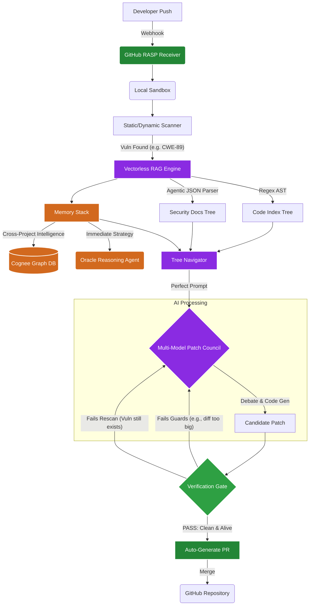

# Cyphex v3 Ultimate Architecture

Cyphex v3 is a fully autonomous, local-first cyber defense AI that operates as a Runtime Application Self-Protection (RASP) agent and an intelligent patching system. 

By utilizing local multi-models, agentic reasoning, memory graphs, and deterministic vectorless RAG, Cyphex provides 70B-parameter-level performance using highly optimized 7B-parameter local models.

Here is the complete end-to-end architectural workflow.

---

## 1. The Trigger: GitHub Auto-Remediation (RASP)
Cyphex runs a background webhook listener (`cyphex_cli.py github-hook`).
- **Event**: A developer pushes a commit or opens a Pull Request on a connected GitHub repository.
- **Action**: GitHub fires a payload to Cyphex. Cyphex instantly clones the specific commit into a secure local sandbox and runs its fast static/dynamic analysis scanners. 
- If no vulnerabilities are found, the system stays silent. If a vulnerability (e.g., `CWE-89 SQLi`) is detected, the remediation workflow activates autonomously.

---

## 2. The Knowledge Engine: Vectorless RAG
Instead of relying on lossy embeddings and expensive vector databases, Cyphex dynamically builds a **Hierarchical JSON Knowledge Tree**.

### A. The Code AST Tree (Zero-LLM)
- Fast Python regex/AST parsing instantly crawls the codebase.
- It maps all routes (e.g., `/api/users`), endpoints, parameters, and extracts exact function boundaries. It identifies potential "sinks" where vulnerabilities occur.

### B. Agentic Document Parsing (The KB Tree)
- Cyphex ingests security documentation (e.g., OWASP, internal best practices).
- Instead of dumb chunking, a **Security Parsing Agent** (local LLM) reads the documents and intelligently extracts structured JSON objects (`title`, `summary`, `cwes`, `content`), ensuring perfect boundary separation of security concepts.

### C. Tree Navigator & Prompt Assembly
- When a `CWE` is flagged, the deterministic **Tree Navigator** maps the vulnerability to the code tree.
- It pulls the exact function code, file imports, and the specific Security KB fix recipe.
- This creates a **perfect, zero-noise prompt** ensuring the LLM does not suffer from "lost in the middle" syndrome.

---

## 3. The Memory Stack: Cognee & Session Context
Cyphex utilizes a dual-memory system so that local agents learn from past mistakes and maintain cross-agent intelligence.

### A. Cognee Graph Memory (Global Intelligence)
- Built on top of Neo4j/Cognee, this is the persistent memory graph for the entire system.
- It stores past successful patches, architectural patterns, and framework specifics. 
- **Example**: If Cyphex learns how to patch SQL injection in an obscure ORM in Project A, the Cognee Graph allows the AI to instantly recall and apply that exact strategy to Project B.

### B. Session Reasoning Tree (Oracle Agent)
- Powered by the `oracle_adapter`, this handles immediate cognitive reasoning. 
- It uses strategies like **Reflexion** and **Tree-of-Thoughts**.
- If a patch is complex or spans multiple files, the Oracle agent generates a reasoning tree, evaluating multiple approaches before deciding on the final code structure.

---

## 4. The Brain: Multi-Model AI Patch Council
The enriched prompt (Code Context + KB Recipe + Cognee Memory) is handed to the **Patch Council**.
- **Generation**: A specialized local coding model (e.g., Qwen2.5-Coder:7B) drafts the initial patch based on the flawless context.
- **Debate**: Other models (e.g., Llama 3.1) review the patch. They debate its safety, syntax validity, and logic.
- **Consensus**: The council must vote and agree that the patch is secure and will not break application functionality.

---

## 5. The Guard: Verification Gate (`verifier.py`)
No patch is ever merged blindly. Before the code leaves the local machine, it must pass rigorous automated testing:
1. **Anti-Suppression Guards**: The system rejects patches that attempt to cheat by simply adding `eslint-disable` or `# noqa`.
2. **Blast Radius Limits**: The patch is rejected if the diff exceeds a set limit (e.g., 40 lines), preventing catastrophic over-writes.
3. **Static Rescan Verification**: The patched file is fed *back* into the static scanner. The patch is only approved if the scanner definitively proves the finding is gone.
4. **Dynamic Liveness (Sandbox)**: A benign request is sent to the patched endpoint to ensure the application didn't crash.

---

## 6. The Resolution: Automated Pull Request
Once the patch clears the Verification Gate, Cyphex finalizes the remediation:
- It commits the verified code.
- It automatically opens a Pull Request on GitHub against the developer's branch.
- The PR description contains the exact vulnerability details, the LLM’s reasoning, and the verified, safe code—ready to be merged with zero human intervention required.

---

## Complete End-to-End Diagram

