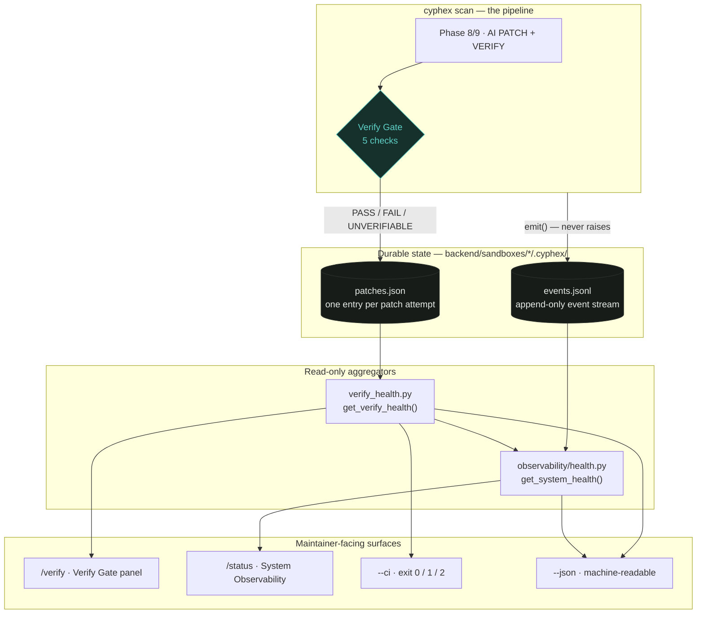
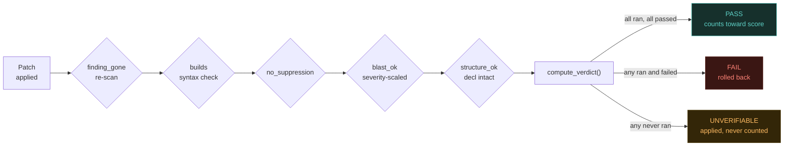

# Verification: Maintainability Panel

> **Problem statement.** *Improve the part of your existing MVP most related to verification so that it can show maintainers the configuration, status, or health of the modified capability. The experience should clearly show success, failure, current status, and next steps.*

**The part of CYPHEX most related to verification is the Verify Gate** — the component that decides whether an AI-generated patch counts as a fix. It is the single most load-bearing guarantee in the codebase: everything upstream produces *candidates*, and the Verify Gate decides which are *real*.

This document describes what was built to make that gate legible to a maintainer, why it was needed, and how each requirement of the problem statement is satisfied.

---

## Table of contents

| Section | What it answers |
|---|---|
| [1. Why a gate needs a panel](#1-why-a-gate-needs-a-panel) | The failure mode this fixes |
| [2. Requirement mapping](#2-requirement-mapping) | PS → implementation, line by line |
| [3. Architecture](#3-architecture) | How the pieces fit |
| [4. The Verify Gate itself](#4-the-verify-gate-itself) | The five checks and the verdict algebra |
| [5. `/verify` — the maintainability panel](#5-verify--the-maintainability-panel) | Configuration · Status · Next steps |
| [6. Live self-test](#6-live-self-test-presence--works) | Presence ≠ works |
| [7. `/status` — system observability](#7-status--system-observability) | What happened on the last scan |
| [8. CI integration](#8-ci-integration) | Machine-checkable exit codes |
| [9. Design decisions](#9-design-decisions) | The non-obvious calls and their rationale |
| [10. Verification of the verifier](#10-verification-of-the-verifier) | Test and CI evidence |

---

## 1. Why a gate needs a panel

The Verify Gate already worked. Every verdict it produced was durably recorded to `<sandbox>/.cyphex/patches.json`. The problem was that this state was **scattered one file per scan, with no command that ever showed it back to a maintainer**.

That creates a specific, silent failure mode:


The gate is *correct* here — refusing to claim an unverified fix is exactly right. But correctness without visibility means a maintainer sees a pipeline that quietly stopped producing verified fixes and has no way to learn that the cause is one missing binary.

**The panel closes that loop.** It answers four questions a maintainer actually has:

1. What is this gate configured to check?
2. Does the tooling each check depends on actually work?
3. How has it performed — across every scan, not just this one?
4. What should I do about it?

---

## 2. Requirement mapping

| Problem statement requirement | Implementation | Where |
|---|---|---|
| **Configuration** of the modified capability | Blast-radius caps per severity, count of tracked suppression patterns, per-check toolchain readiness with the gate each dependency serves | `CONFIGURATION` section, `/verify` |
| **Status** — current | Manifests found, patch attempts recorded, durability rate with bar, PASS/FAIL/UNVERIFIABLE counts | `STATUS` section, `/verify` |
| **Status** — historical | Per-CWE durability breakdown, scan-over-scan trend sparkline, recent verifications list | `STATUS` section, `/verify` |
| **Health** | Verdict lamp: `GATE HEALTHY` / `GATE DEGRADED` / `GATE UNUSED`; plus live functional self-test under `--selftest` | `/verify`, `/verify --selftest` |
| **Success** clearly shown | `PASS` counts in phosphor-green, durability-rate bar, `GATE HEALTHY` lamp, `✓` per working check | `/verify` |
| **Failure** clearly shown | `FAIL` counts in warn-bright, `why (evidence key → count)` breakdown naming the exact check that failed, `✗` per broken dependency, recent-errors tail | `/verify`, `/status` |
| **Current status** | Last-scan reconstruction: phase timings, agent outcomes, memory rates, completion state | `/status` |
| **Next steps** | Generated, specific, and conditional — never generic filler | `NEXT STEPS` section, both panels |

### Next steps are derived, not templated

The `NEXT STEPS` block is computed from the actual observed state. Each entry appears only when its triggering condition holds, and names the concrete action:

| Condition | Generated guidance |
|---|---|
| `tsc` missing | *Install TypeScript (`npm install -g typescript`) — TS/TSX patches currently verify as UNVERIFIABLE, not PASS, because the build check can't run.* |
| `cyphex.scanner` won't import | *Every static re-scan check is UNVERIFIABLE until this is fixed* (with the import error) |
| `httpx` missing | *`pip install httpx` — dynamic exploit-replay verification is fully disabled without it.* |
| Patches hit blast-radius cap | *N patch(es) exceeded the blast-radius cap and were rolled back — review those CWEs for an oversized fix strategy.* |
| Patches deleted a declaration | *N patch(es) deleted a route/function/class declaration and were rolled back — check `structure.py`'s false-negative rate.* |
| Suppression comments detected | *N patch(es) added a scanner-suppression comment and were rejected — a model is trying to game the scanner instead of fixing the bug.* |
| Legacy manifest schema found | Explains that `is_already_patched()`'s cache lookup won't see those entries, and how to migrate |
| No manifests at all | *Run a scan with patching enabled to generate Verify Gate history* |
| Nothing wrong | *Verify Gate is fully operable and no failure pattern stands out — nothing to action.* |

---

## 3. Architecture

Both panels are **read-only aggregators over durable state the pipeline already writes**. Neither mutates a manifest, and neither requires a scan to be running.



### Storage convention

Both durable stores share one convention, so a single glob discovers everything:

```
backend/sandboxes/cli_<8-hex-scan-id>/.cyphex/
├── patches.json     # Verify Gate verdicts   (backend/patch/manifest.py)
└── events.jsonl     # scan event stream      (backend/observability/events.py)
```

```
backend/sandboxes/*/.cyphex/*
```

### Module responsibilities

| Module | Responsibility |
|---|---|
| `backend/patch/verifier.py` | The gate: five checks, tri-state verdict algebra |
| `backend/patch/manifest.py` | Durable per-scan verdict record (`patches.json`) |
| `backend/patch/verify_health.py` | Cross-scan aggregation, live self-test, CI exit code |
| `backend/observability/events.py` | Append-only event emitter — contractually **never raises** |
| `backend/observability/health.py` | Event-log aggregation, last-scan reconstruction |
| `terminal_ui.py` | `render_verify_health()`, `render_observability()` |
| `cx.py` | `/verify` and `/status` commands, flag parsing, plain-text fallback |
| `scoring.py` | Sole source of truth for the 0-100 posture score |

---

## 4. The Verify Gate itself

The gate runs as the last stage of the per-vulnerability loop inside phase 8/9, after template matching, RAG context assembly, LLM generation, council review, and application.



### The five checks

| Check | Tri-state | What it prevents |
|---|---|---|
| `finding_gone` | ✅ `True`/`False`/`None` | Claiming a fix the scanner still flags |
| `builds` | ✅ `True`/`False`/`None` | Shipping a patch that doesn't compile |
| `no_suppression` | boolean | A model silencing the scanner (`nosemgrep`, `eslint-disable`, `# noqa`, `@ts-ignore`, …) instead of fixing the bug |
| `blast_ok` | boolean | An oversized rewrite smuggled in as a fix — capped per severity |
| `structure_ok` | boolean | A patch that parses cleanly but deleted the route/function/class it was supposed to fix |

### Blast-radius caps (severity-scaled)

| Severity | Max changed lines |
|---|---|
| Critical | 80 |
| High | 60 |
| Medium | 40 |
| Low | 30 |

### The verdict rule

Precedence is deliberate, and encodes one principle: **a check that ran and failed always outranks a check that never ran.**

1. Any tri-state check is `False` → **FAIL**
2. Else any boolean guard is `False` → **FAIL**
3. Else any tri-state check is `None` → **UNVERIFIABLE**
4. Else → **PASS**

`None` is never coerced into a pass. This is the property that makes the whole system honest, and it is what the panel exists to keep visible.

### Downstream consequence

Only `PASS` moves the security score. Remediation is tracked by **vulnerability object identity**, not file-path substring — so patching one finding in a file cannot silently clear that file's other findings.

> *Only VERIFIED patches (re-scanned + syntax-checked) affect the score.* — printed in the score panel itself

---

## 5. `/verify` — the maintainability panel

```bash
cyphex verify                      # sweep every scan ever run
cyphex verify ./path               # scope to one target
cyphex verify --selftest           # + live functional self-test
cyphex verify --ci                 # + machine-checkable exit code
cyphex verify --watch 5            # live refresh every 5s
cyphex verify --json report.json   # machine-readable dump
```

### Panel structure

```
⛨ VERIFY GATE — MAINTAINABILITY PANEL
├── CONFIGURATION
│   ├── blast-radius cap    Critical 80  High 60  Medium 40  Low 30
│   ├── suppression guards  7 patterns tracked
│   ├── toolchain readiness — what each check depends on to run at all
│   │   ✓ node            v20.20.0        gates: JS/JSX build check
│   │   ✗ tsc             not installed   gates: TS/TSX build check
│   │   ✓ py_compile      stdlib          gates: Python build check
│   │   ✓ static_scanner  importable      gates: static re-scan (finding_gone)
│   │   ✓ httpx           installed       gates: dynamic exploit replay
│   └── live self-test — actually drove each check, not just presence   [--selftest]
├── STATUS
│   ├── N scan manifest(s)  ·  M patch attempt(s) recorded
│   ├── ████████████████  100.0% durable-verified
│   ├── PASS  36   FAIL  0   UNVERIFIABLE  0
│   ├── why (evidence key → count)
│   ├── by CWE          per-CWE durability with bars
│   ├── trend           durability rate, oldest → newest scan
│   └── recent verifications
├── NEXT STEPS
│   └── → concrete, conditional guidance
└── ▐ GATE HEALTHY ▌
```

### Verdict lamp

| Lamp | Exact condition |
|---|---|
| `GATE HEALTHY` | `durability_rate >= 70` **and** `total_patches > 0` |
| `GATE DEGRADED` | `total_patches > 0` **and** `durability_rate < 70` |
| `GATE UNUSED` | `total_patches == 0` — no history yet |

### Report schema (`--json`)

| Key | Contents |
|---|---|
| `config.blast_radius_caps` | Per-severity line caps |
| `config.suppression_patterns_tracked` | Count of tracked suppression regexes |
| `config.toolchain` | Per-dependency `{ok, version, gates}` |
| `manifests_found` | Scan manifests discovered |
| `total_patches` | Patch attempts aggregated |
| `verdicts` | `{PASS, FAIL, UNVERIFIABLE}` counts |
| `durability_rate` | % of attempts that are durably PASS |
| `reason_tally` | Evidence-key → count (*why* things failed) |
| `cwe_breakdown` | Per-CWE totals + durability, most-attempted first |
| `trend` | Per-scan durability, oldest-of-recent-N first |
| `recent` | Newest N patch attempts |
| `next_steps` | Generated maintainer guidance |
| `selftest` | Present only under `--selftest` |

### Schema resilience

Two manifest schemas exist on disk: the current flat `{"file:line:cwe": {...}}` map, and an older `{"version": 1, "patches": [...]}` wrapper. `PatchManifest` has no migration path for the old shape — pointing it at one yields non-dict values and crashes downstream. The panel reads **raw JSON** and normalises both, so old scan history is reported rather than silently dropped, and flags the mismatch in `NEXT STEPS`.

---

## 6. Live self-test (presence ≠ works)

`probe_toolchain()` answers *"is this installed?"*. That is a weaker claim than *"does this work?"*, and the gap between them is exactly where silent degradation lives: a CLI flag renamed after an upgrade, a scanner API that changed shape, an outbound network block.

`--selftest` closes that gap by **driving each real check path against a synthetic fixture**:

| Check | What the self-test actually does | Pass means |
|---|---|---|
| `py_compile` | Compiles a valid file, then a deliberately broken one | Accepts good code **and rejects bad** |
| `tsc` | Type-checks a file with a known type error | Correctly flags the error (skipped, `ok=None`, when tsc absent) |
| `static_scanner` | Runs the real scanner over a known-vulnerable fixture | Finds what it should — proves `_rescan_file`'s matching still works |
| `httpx` | Issues a request to a closed loopback port | Client constructs and handles the connection-error path cleanly |

Each result carries `ok` (tri-state: `True`/`False`/`None`-for-skipped), a human `detail`, and `duration_ms`.

> A tool can report `ok: true` in the presence probe and still be broken for the check it gates. The self-test is the only thing that catches that — and it is opt-in because it costs real seconds (the scanner fixture run dominates).

---

## 7. `/status` — system observability

Before this existed, CYPHEX had three uncoordinated, ephemeral telemetry surfaces: Rich console prints that vanish on scroll, a cumulative session-memory JSON with no phase timings, and a pre-flight `doctor` with no runtime awareness. One failure path — a cognee memory recall failure — produced **zero signal at all**.

`/status` reads the append-only event log every scan now writes.

```bash
cyphex status                      # sweep every instrumented scan
cyphex status --watch 5            # live refresh
cyphex status --json report.json
```

### Event taxonomy

| Event | Fields | Emitted at |
|---|---|---|
| `scan_start` | `repo_url`, `local_path`, `judge_mode` | First statement of `run()` |
| `phase_start` | `num`, `title` | Every `_step()` — one hook covers all 14 phase banners |
| `deepagent_result` | `agent`, `vulns_found` | Per agent that returns |
| `deepagent_timeout` | `agent` | Per-agent timeout branch |
| `deepagent_error` | `agent`, `error` | Per-agent exception branch |
| `cognee_recall_result` | `ok`, `hits` / `error` | Per-vulnerability memory recall |
| `cognee_persist_result` | `ok`, `reason` / `error` | Per persisted fix |
| `patch_verdict` | `cwe`, `file`, `verdict` | Immediately after the Verify Gate |
| `scan_end` | — | First statement of `_final_banner()` |

### Panel structure

```
◈ SYSTEM OBSERVABILITY
├── EVENT LOG        N scan(s) instrumented · M event(s) recorded
├── LAST SCAN
│   ├── scan_id / status (COMPLETED · STARTED — no scan_end seen · UNKNOWN)
│   ├── phase timings     per-phase wall-clock
│   ├── DeepAgents swarm  N ok · N timed out · N errored
│   ├── cognee memory     recall N/M · persist N/M
│   └── patch verdicts    PASS n  FAIL n  UNVERIFIABLE n
├── RECENT ERRORS    (only when non-empty)
├── VERIFY GATE      one-line durability summary, cross-links to /verify
├── NEXT STEPS
└── ▐ SYSTEM NOMINAL ▌
```

### Verdict lamp

| Lamp | Exact condition |
|---|---|
| `SYSTEM NOMINAL` | Has history **and** last scan completed **and** no recent errors |
| `SYSTEM DEGRADED` | Has history, but last scan incomplete **or** any recent error |
| `NO TELEMETRY YET` | No event log found |

### An incomplete scan is a first-class state

Phases emit no end marker — durations are derived from consecutive `phase_start` timestamps, with the final phase running to `scan_end`. If a scan crashes before `_final_banner()`, no `scan_end` is written, and the panel says so explicitly rather than reporting a plausible-looking duration:

> *Most recent scan (cli_250714e8) has a scan_start event but no scan_end — it may have crashed or been interrupted before reaching the final banner.*

### The emitter cannot break the scan

`emit()` is contractually incapable of raising. A full disk, a read-only filesystem, or a non-serializable field degrades to a silent no-op. Three independent layers enforce this: a guarded import, a guarded call wrapper, and a blanket try/except inside `emit()` itself.

> Observability must never break the thing it is observing.

---

## 7b. Waypoint tracing — what the pipeline was *trying* to do

`/status` answers "what happened". The waypoint trace answers the question
underneath it: **"what was it trying to achieve at each step, and how far
did it get?"**

Every phase now opens a traced waypoint carrying an explicit **goal** — a
plain sentence naming what that phase is trying to establish — and records
its sub-operations underneath:

```
  ✓ 2/9  STATIC CODE ANALYSIS                     3.7s
        goal · Find candidate weaknesses in the code without running it
        ✓ detect framework      Node.js (Express) · 42 files      0.1s
        ✓ scan source files     42 files · 16 issues              3.4s
  ▲ 5/9  IMMUNE SYSTEM - BUILD GENOME             8.1s
        goal · Learn this app's normal behaviour well enough to spot an attack
        ✓ genome source         resumed from prior scan           0.0s
        ▲ generation 0          blocked 23/30 · 76.7% · red: raw  0.3s
        ✓ generation 1          blocked 20/20 · 100.0%            0.2s
        ✓ co-evolution          converged at generation 1         0.5s
```

The goal line is what makes this a trace of *intent* rather than a progress
bar: a reader who has never opened the codebase can tell what was being
attempted, not just how long it took.

### The buddy is bound to the trace, not decorative

The mascot renders at 8 columns *inside* the trace box, next to the thing
it is reacting to. Its animation is selected by waypoint (`uploading` while
fetching source, `searching` during scans, `thinking` during the genome
build, `working` while patching, `success`/`error` on outcome), and its
frame advances on real trace transitions rather than a decorative timer —
so it visibly works harder when the pipeline is doing more. A glance at the
buddy tells you what the text says.

The deck composes mascot rows directly from `mascot_anim` + the subcell
backend rather than going through `mascot.py`'s terminal-owning session, so
it nests inside a bordered box without competing for terminal rows.

### The genome build is highlighted

`EvolutionController.run_evolution()` had always accepted an
`on_generation_complete` callback, and nothing ever passed one — so the
adversarial co-evolution loop, the single most interesting thing CYPHEX
does, ran as an opaque wait behind a few emoji prints. Each generation is
now a traced step carrying the real measured numbers (block rate, blocked
/ bypassed counts, the red team's mutation tactics, whether the blue team
retrained), so the climb from a leaky first generation to a converged one
is visible live *and* survives into the event log. A generation that blocks
under 75% is marked `warn` rather than passing silently.

### Status propagation is honest

A waypoint is **as bad as its worst step** — one `FAIL` step marks the
whole waypoint failed, and `FAIL` outranks `WARN`. A step left open when a
phase ends is force-closed rather than left spinning, because a stuck
spinner in a finished trace is a lie.

This feeds the `/status` lamp: a scan whose patch-verify waypoint failed
now reads `SYSTEM DEGRADED`, where previously it read `SYSTEM NOMINAL`
because `recent_errors` only collected `*_error`/`*_timeout` events — a
rolled-back patch is neither, yet is exactly what a maintainer opened the
panel to find.

### Recording is decoupled from rendering

| | |
|---|---|
| **Recorder** | `backend/observability/trace.py` — the single source of truth |
| **Live view** | `trace_deck.py` — compact box, small mascot, one *view* |
| **Post-hoc view** | `/status` — reconstructs the tree from the event log |

A scan running in CI with no TTY records exactly the same trace as an
interactive one. Nothing in the recorder imports a renderer, and nothing in
it requires a terminal — which is the whole difference between
traceability and terminal scrollback.

Degradation is three-level and verified: animated mascot beside the trace
(TTY + Pillow) → text-only box (no mascot assets) → one static line per
completed step (no TTY, e.g. CI logs).

### Failure safety

Tracing must never break the scan it observes. `emit()` cannot raise; a
listener that throws is dropped rather than propagated; an unknown status
is coerced rather than trusted; a step opened with no active waypoint is a
no-op. Covered by `tests/test_trace.py` (17 tests).

---

## 8. CI integration

`--ci` turns the panel into a build gate:

| Exit | Meaning | Condition |
|---|---|---|
| `0` | **PASS — gate healthy** | Durability at/above threshold, no FAIL verdicts |
| `1` | **DEGRADED** | Durability below threshold, or ≥1 FAIL verdict |
| `2` | **UNUSABLE** | No scan history, or a required check (`py_compile`, `static_scanner`) cannot run |

```bash
cyphex verify --ci || echo "Verify Gate is not healthy — blocking release"
```

The thresholds are the same constants the terminal lamp uses, so the panel and CI can never disagree about gate health.

---

## 9. Design decisions

**Read-only by construction.** Neither panel mutates a manifest or event log. A diagnostic tool that can change the state it reports on is a tool you cannot trust during an incident.

**Aggregate across scans, not just the current one.** A single scan's output already scrolled past. The maintainer's real question is *"is this gate healthy in general?"* — which needs history.

**Next steps are conditional, never templated.** Generic advice trains people to ignore the section. Every entry appears only when its condition holds and names the specific action.

**Failure and un-measurability are visually distinct.** `FAIL` (a patch was bad) and `UNVERIFIABLE` (we couldn't tell) are different facts with different remedies, shown in different colours and tallied separately.

**Self-test is opt-in.** Correctness-by-default would cost seconds on every invocation. The presence probe is instant and usually sufficient; the functional self-test is there when you actually suspect degradation.

**Both panels degrade, twice.** Rich unavailable → plain-text renderer. Terminal can't render box-drawing/geometric glyphs (legacy Windows console, `TERM=dumb`, non-UTF-8 stream) → ASCII fallback (`+--+`, `[ GATE HEALTHY ]`, `!` / `*` / `+` / `o` severity pips). Verified by forcing ASCII mode and re-rendering every real panel.

**Cross-platform.** Binary resolution goes through `backend/platform_compat.py`, because a bare `tsc` is a `.cmd` shim on Windows that non-shell `subprocess` cannot launch — which had been making every TypeScript patch read UNVERIFIABLE on Windows despite a working install.

---

## 10. Verification of the verifier

The gate that proves patches are real is itself covered by tests and CI.

| Suite | Tests | Covers |
|---|---|---|
| `tests/test_verifier.py` | 27 | Verdict algebra (incl. *unrun check can never PASS* and *real failure outranks unverifiable*), anti-gaming guards, static re-scan, dynamic replay |
| `tests/test_scoring.py` | 17 | Score formula, band thresholds, single-source-of-truth delegation, two named regression tests for the score-collapse bug |
| `tests/test_patch_pipeline.py` | 18 | Applier fail-closed behaviour: syntax rollback, structural rejection, containment, tri-state `parse_valid` |
| **Full suite** | **320 passing** | 1 further test deselected by default (integration — needs a live Ollama) |

Two structural guards worth calling out:

- **`test_no_hand_copied_band_clamp_remains`** — walks the AST of every root-level `*.py` asserting no `min(score, <int>)` call survives outside `scoring.py`, so the hardcoded band clamp cannot regress. AST-based rather than text search, so docstrings explaining the old bug don't false-positive.
- **`test_unknown_file_type_leaves_parse_valid_none`** — pins the tri-state contract feeding the gate: an unvalidatable file type must report `None`, never a bare `True`.

### CI matrix

| Job | Legs | Proves |
|---|---|---|
| `test` | 9 (3 OS × 3 Python) | Installs and passes on Linux/macOS/Windows, Python 3.11–3.13; `cx` imports on Windows (catches an unguarded `readline`) |
| `linux-c-locale` | 1 | Unicode output survives a non-UTF-8 `LANG=C` locale |
| `alpine-smoke` | 1 | Imports hold on musl / minimal base image |
| `lint` | 1 | Entry point and public module APIs importable |
| `publish` | tag-gated | Builds and ships only after `test` + `lint` succeed |

---

## Appendix — command reference

| Command | Purpose |
|---|---|
| `cyphex verify` | Verify Gate maintainability panel |
| `cyphex verify --selftest` | + live functional self-test |
| `cyphex verify --ci` | + exit code `0`/`1`/`2` |
| `cyphex verify --watch [s]` | Live-refreshing panel |
| `cyphex verify --json <f>` | Machine-readable report |
| `cyphex status` | System observability dashboard |
| `cyphex status --watch [s]` | Live-refreshing dashboard |
| `cyphex status --json <f>` | Machine-readable report |
| `cyphex scan <target> --verbose` | Full pipeline detail (default is concise phase summaries) |

Inside the interactive workspace (`cyphex` with no arguments), the same commands are `/verify` and `/status`.
