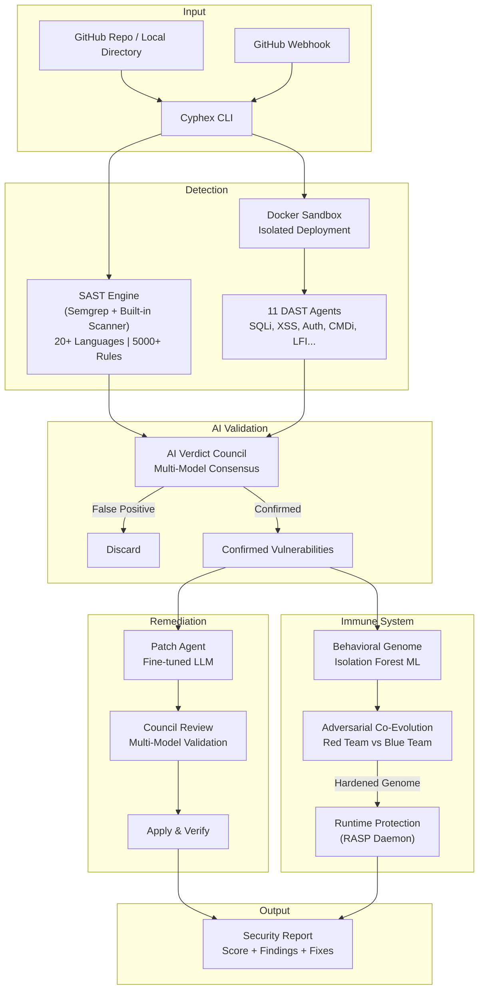

<p align="center">
  
  
  
  
  
</p>

<h1 align="center">
  <br>
  🛡️ CYPHEX
  <br>
  <sub>Autonomous AI Cyber Defense Platform</sub>
</h1>

<p align="center">
  <b>An offline-first, multi-agent security scanner with a self-evolving immune system.</b>
  <br>
  Cyphex doesn't just find vulnerabilities — it deploys your app in an isolated sandbox,<br>
  attacks it with 11 specialized AI agents, evolves its defenses through adversarial co-evolution,<br>
  and auto-patches the source code with AI-verified fixes.
</p>

<p align="center">
  <a href="#-key-features">Features</a> •
  <a href="#-system-architecture">Architecture</a> •
  <a href="#-tech-stack">Tech Stack</a> •
  <a href="#-installation">Installation</a> •
  <a href="#-usage">Usage</a> •
  <a href="#-how-it-works">How It Works</a> •
  <a href="#-project-structure">Structure</a> •
  <a href="#-future-roadmap">Roadmap</a>
</p>

---

## 🎯 The Problem

Modern web applications ship with vulnerabilities that static scanners alone cannot catch. Traditional security tools operate in isolation — they either scan code *or* test runtime behavior, never both. Developers are left with noisy false positives, no verified fixes, and zero adaptive defense.

## 💡 Our Solution

**Cyphex** is an autonomous, AI-powered cybersecurity platform that combines:

1. **Static Analysis (SAST)** — Scans source code across 20+ languages with 5,000+ rules via Semgrep + built-in patterns.
2. **Dynamic Analysis (DAST)** — Deploys your app in a Docker sandbox and attacks it with 11 specialized AI agents.
3. **AI Verdict Council** — A multi-model consensus system that debates findings to eliminate false positives.
4. **Behavioral Genome** — A self-evolving immune system using Isolation Forest ML that learns what "normal" looks like for *your* app and blocks everything else.
5. **Auto-Patching with Verification** — AI-generates fixes, validates them through council review, and verifies the vulnerability is actually resolved.

> **100% offline-capable.** Runs entirely on local hardware via Ollama. No data ever leaves your machine.

---

## ✨ Key Features

### 🔍 Multi-Agent Security Scanning
| Agent | Role | Techniques |
|-------|------|------------|
| **Recon Agent** | Discovers endpoints, technology stack, and attack surface | HTTP probing, header analysis, tech fingerprinting |
| **Crawler Agent** | Maps pages, forms, parameters, and API routes | HTML parsing, SPA detection, REST API discovery |
| **SQLi Agent** | Tests for SQL injection across all injection points | Union, Boolean, Time-based, Error-based, Stacked queries |
| **XSS Agent** | Tests for Cross-Site Scripting vulnerabilities | Reflected, Stored, DOM-based XSS with WAF bypass |
| **Auth Agent** | Tests authentication and session management | Brute-force, Session fixation, JWT attacks, IDOR |
| **CMDi Agent** | Tests for OS command injection | Shell metacharacters, encoding bypass, chained commands |
| **LFI Agent** | Tests for Local File Inclusion / Path Traversal | Directory traversal, null byte injection, encoding bypass |
| **Logic Agent** | Tests for business logic flaws | Race conditions, parameter tampering, privilege escalation |
| **Supply Chain Agent** | Audits dependencies for known CVEs | NPM/Pip/Go vulnerability databases, license compliance |
| **AI Fuzzer** | Generates intelligent payloads using mutation strategies | Grammar-aware fuzzing, encoding mutations |
| **Patch Agent** | Generates and applies security fixes | AST-aware patching, council-reviewed fixes |

### 🧬 Behavioral Genome — The Cyber Immune System

Cyphex's flagship innovation. Inspired by biological immune systems:

```
Generation 0: Red Team generates attack payloads
              Blue Team builds behavioral genome from scan data (Isolation Forest ML)
              
Generation 1: Blue Team scores payloads → blocks 60%
              Red Team mutates BLOCKED payloads to evade detection
              Blue Team retrains on BYPASSED payloads
              
Generation N: Block rate converges toward 99%+
              Both teams have evolved — the genome is now hardened
```

The genome uses a **15-dimensional feature vector** per request:
- Input length, Shannon entropy, special character ratio
- URL encoding detection, SQL/XSS keyword scoring
- Null byte detection, path traversal depth, bracket imbalance
- Unicode evasion detection, repetition analysis

### 🏛️ AI Verdict Council

A multi-model consensus system that eliminates false positives:

- **Multiple LLMs** (DeepSeek, Phi, Llama, Qwen) independently review each finding
- Each model votes **CONFIRM** or **REJECT** with a confidence score
- Findings require consensus to be reported — no single model can hallucinate a vulnerability
- Built-in anti-hallucination rules enforced across all models

### 🔧 Auto-Patching Pipeline

```
Vulnerability Found → AI Generates Fix → Council Reviews Patch → User Approves → Applied & Verified
```

- **Custom fine-tuned model** (`cyphex-patch`) trained on secure coding patterns
- Rule-based fallback patches for common CWEs (SQLi → parameterized queries, XSS → escaping, etc.)
- Patches require council approval before application
- Supports `--non-interactive` mode for CI/CD pipelines

### 🛡️ RASP Daemon (Runtime Protection)

```bash
cyphex watch --port 3004
```

Deploys a persistent daemon that:
- Receives real-time attack telemetry from your app's RASP SDK
- Scores requests against the trained behavioral genome
- Auto-patches vulnerable source code when attacks are detected
- Integrates with GitHub webhooks for continuous protection

---

## 🏗️ System Architecture



---

## 🛠️ Tech Stack

| Layer | Technology | Purpose |
|-------|-----------|---------|
| **CLI Engine** | Python 3.11+ | Core orchestration, scanning pipeline |
| **AI Inference** | Ollama (Local) | LLM-powered analysis, patching, and debate |
| **Fine-tuned Model** | Qwen 2.5 Coder 7B | Custom `cyphex-patch` model for secure code generation |
| **Static Analysis** | Semgrep + Custom Regex | 5,000+ rules across 20+ languages |
| **Dynamic Analysis** | Custom Agents + Nuclei | 11 specialized attack agents, 8,000+ Nuclei templates |
| **Machine Learning** | scikit-learn + NumPy | Isolation Forest for behavioral anomaly detection |
| **Sandboxing** | Docker / Docker Compose | Isolated app deployment for safe testing |
| **Frontend** | React 19 + TypeScript + Vite | Real-time dashboard with 3D visualizations |
| **Frontend UI** | TailwindCSS + Framer Motion | Animations, responsive design |
| **Visualization** | Three.js + Recharts | 3D genome visualization, security charts |
| **API Server** | FastAPI + WebSockets | Real-time scan progress streaming |
| **Terminal UI** | Rich | Premium terminal output with panels, tables, progress |

---

## 📦 Installation

### Prerequisites

| Tool | Required | Purpose |
|------|----------|---------|
| **Python 3.11+** | ✅ Yes | Core runtime |
| **Git** | ✅ Yes | Repository cloning |
| **Ollama** | ✅ Yes | Local AI model inference |
| **Docker** | ⚡ Recommended | Sandbox isolation for DAST |
| **Node.js 18+** | 📊 For Dashboard | Frontend GUI |
| **Semgrep** | 🔧 Optional | Enhanced SAST (5,000+ rules) |

### Step 1: Clone the Repository

```bash
git clone https://github.com/vedant91/Cyphex_CLI.git
cd Cyphex_CLI
```

### Step 2: Install Python Dependencies

```bash
pip install httpx rich numpy scikit-learn joblib
```

Or install from `pyproject.toml`:

```bash
pip install -e .
```

### Step 3: Install & Start Ollama

Download from [ollama.com](https://ollama.com), then pull the required models:

```bash
ollama pull qwen2.5-coder:7b
ollama pull deepseek-coder:1.3b
ollama pull phi3:mini
ollama pull llama3.2:1b
```

### Step 4: Create the Fine-Tuned Patch Model

```bash
ollama create cyphex-patch -f finetune/Modelfile
```

### Step 5: Verify Setup

```bash
python cyphex_cli.py doctor
```

This checks all tools (Git, Docker, Ollama, Semgrep, Nuclei) and reports readiness.

```bash
python cyphex_cli.py council-doctor
```

This verifies all 4 AI council models are loaded and responding.

---

## 🚀 Usage

### Scan a GitHub Repository

```bash
python cyphex_cli.py scan --repo https://github.com/user/vulnerable-app.git
```

### Scan a Local Directory

```bash
python cyphex_cli.py scan --path ./my-project
```

### Scan with Options

```bash
# Specify a branch
python cyphex_cli.py scan --repo https://github.com/user/app.git --branch develop

# Set number of evolution generations
python cyphex_cli.py scan --path ./app --generations 15

# Skip auto-patching (scan only)
python cyphex_cli.py scan --path ./app --no-patch

# Save report to file
python cyphex_cli.py scan --path ./app --output report.json

# Non-interactive mode (for CI/CD)
python cyphex_cli.py scan --path ./app --non-interactive

# Judge mode (deterministic, machine-readable output)
python cyphex_cli.py scan --path ./app --judge
```

### Start RASP Daemon (Runtime Protection)

```bash
python cyphex_cli.py watch --port 3004
```

### Start GitHub Webhook Receiver

```bash
python cyphex_cli.py github-hook --port 3005 --secret your_webhook_secret
```

### Zero-Click Onboarding

```bash
# Onboard a repo with automatic RASP integration + full scan
python cyphex_cli.py onboard --repo https://github.com/user/app.git --scan
```

### Launch Full Stack (GUI Dashboard)

```bash
# Windows
run_cyphex.bat

# Manual
cd backend && pip install -r backend/requirements.txt
cd frontend && npm install && npm run dev
```

- **Frontend Dashboard:** http://localhost:5173
- **Backend API:** http://localhost:8000

---

## ⚙️ How It Works

### The 8-Step Scan Pipeline

```
Step 1 → SOURCE ACQUISITION
         Clone repo or copy local directory

Step 2 → STATIC ANALYSIS (SAST)
         Semgrep (5,000+ rules) + Built-in regex scanner
         Covers: JS, TS, Python, Java, Go, PHP, Ruby, C/C++, Rust, C#, Swift, Kotlin, SQL, YAML, Docker

Step 3 → SANDBOX DEPLOYMENT
         Auto-detects framework → Deploys in Docker container
         Supports: Node.js, Python (Flask/Django), Docker Compose, Static sites

Step 4 → DYNAMIC VULNERABILITY SCAN (DAST)
         11 specialized agents attack the running application
         Confirms static findings + discovers runtime-only vulnerabilities

Step 5 → AI VERDICT COUNCIL
         Multi-model debate filters false positives
         Each finding requires consensus to be confirmed

Step 6 → BEHAVIORAL GENOME EVOLUTION
         Red Team (attack payloads) vs Blue Team (anomaly detection)
         N generations of adversarial co-evolution
         Genome converges toward 99%+ block rate

Step 7 → AUTO-PATCHING
         AI generates fixes → Council reviews → User approves → Verified

Step 8 → SECURITY REPORT
         Final score, all findings, patches applied, genome status
```

---

## 📁 Project Structure

```
Cyphex_CLI/
├── cyphex_cli.py              # CLI entry point — all commands start here
├── cli_engine.py              # Core orchestration engine (2400+ lines)
├── pyproject.toml             # Package configuration & dependencies
├── .env.example               # Environment variable template
│
├── cyphex/                    # Core scanning modules
│   ├── scanner.py             # SAST engine (Semgrep + regex, 20+ languages)
│   ├── dynamic_scanner.py     # DAST coordination
│   ├── daemon.py              # RASP auto-healing daemon
│   ├── github_hook.py         # GitHub webhook receiver
│   ├── onboarder.py           # Zero-click RASP integration
│   ├── hardware.py            # VRAM/GPU detection & tier classification
│   └── doctor.py              # System readiness checker
│
├── backend/
│   ├── council/               # AI Verdict Council
│   │   ├── council_orchestrator.py  # Multi-model orchestration & VRAM management
│   │   ├── patch_council.py         # Patch generation & review pipeline
│   │   ├── debate_protocol.py       # False-positive filtering via AI debate
│   │   ├── model_selector.py        # Automatic model assignment by hardware tier
│   │   └── route_tracer.py          # Route → handler mapping for context
│   │
│   ├── backend/
│   │   ├── agents/            # 11+ specialized DAST agents
│   │   │   ├── agent_01_recon.py        # Reconnaissance & fingerprinting
│   │   │   ├── agent_02_crawler.py      # Page & API discovery
│   │   │   ├── agent_03_sqli.py         # SQL Injection testing
│   │   │   ├── agent_04_xss.py          # Cross-Site Scripting testing
│   │   │   ├── agent_05_auth.py         # Authentication & session testing
│   │   │   ├── agent_06_cmdi.py         # Command Injection testing
│   │   │   ├── agent_07_lfi.py          # Local File Inclusion testing
│   │   │   ├── agent_08_logic.py        # Business logic flaw testing
│   │   │   ├── agent_09_analysis.py     # Vulnerability analysis & scoring
│   │   │   ├── agent_10_patch.py        # AI-powered patching agent
│   │   │   ├── agent_11_supply_chain.py # Dependency & CVE auditing
│   │   │   └── agent_ai_fuzzer.py       # Intelligent payload fuzzing
│   │   │
│   │   ├── immune/            # Behavioral Genome (Immune System)
│   │   │   ├── behavioral_genome.py     # Isolation Forest anomaly detector
│   │   │   ├── evolution_controller.py  # Red/Blue co-evolution orchestrator
│   │   │   └── mutation_engine.py       # Attack payload mutation strategies
│   │   │
│   │   ├── models/            # Data models (Vuln, ScanContext, Genome)
│   │   ├── sandbox_manager.py # Docker sandbox lifecycle management
│   │   ├── scan_orchestrator.py # Scan pipeline orchestration
│   │   └── api.py             # FastAPI server + WebSocket streaming
│   │
│   └── patch/                 # Patch pipeline modules (new)
│
├── finetune/                  # Custom model fine-tuning
│   ├── Modelfile              # Ollama Modelfile for cyphex-patch
│   ├── training_data.py       # Security-focused training data generation
│   ├── train.py               # Fine-tuning script
│   └── eval.py                # Model evaluation
│
├── frontend/                  # React 19 + TypeScript dashboard
│   ├── src/                   # React components, 3D visualizations
│   └── package.json           # Frontend dependencies
│
└── tests/                     # Test suite
```

---

## 🔮 Future Roadmap

| Phase | Feature | Status |
|-------|---------|--------|
| ✅ | Multi-agent DAST with 11 specialized agents | Complete |
| ✅ | AI Verdict Council with multi-model consensus | Complete |
| ✅ | Behavioral Genome with adversarial co-evolution | Complete |
| ✅ | Auto-patching with council review | Complete |
| ✅ | RASP daemon with GitHub webhook integration | Complete |
| ✅ | 20+ language SAST support | Complete |
| 🔄 | Verification gate — re-scan after patching to confirm fixes | In Progress |
| 🔄 | Vectorless RAG — full function context for smarter patches | In Progress |
| 📋 | Deterministic template transforms for common CWEs | Planned |
| 📋 | Patch memory — learn from verified fixes across projects | Planned |
| 📋 | Proof-carrying regression tests generated per fix | Planned |
| 📋 | CI/CD GitHub Action for automated PR scanning | Planned |
| 📋 | IoT device security scanning (Raspberry Pi, ESP32) | Planned |

---

## 🤝 Contributing

We welcome contributions! Here's how to get started:

1. **Fork** the repository
2. **Create** a feature branch (`git checkout -b feature/amazing-feature`)
3. **Commit** your changes (`git commit -m 'Add amazing feature'`)
4. **Push** to the branch (`git push origin feature/amazing-feature`)
5. **Open** a Pull Request

### Development Setup

```bash
# Install dev dependencies
pip install -e ".[dev]"

# Run tests
pytest tests/

# Check code
python cyphex_cli.py doctor
```

---

## 📄 License

This project is licensed under the **MIT License** — see the [LICENSE](LICENSE) file for details.

---

## 👥 Team

Built with 💜 for the security community.

---

<p align="center">
  <b>Cyphex</b> — Because your code deserves an immune system.
</p>
